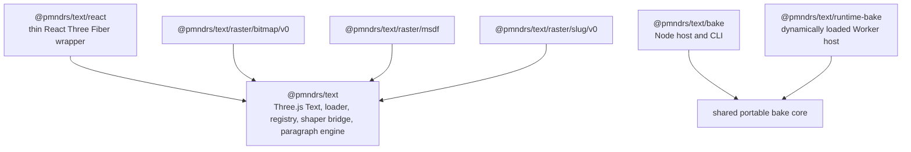

# Merged v0 runtime and bake API fixture

Status: merged v0 surfaces are implemented but unreleased; sections labeled deferred remain proposals
Scope: baked-first loading, lazy Worker baking, HarfRust Wasm shaping, JavaScript paragraph layout, and explicit raster loading

> [!NOTE]
> This page is retained for migration and regression comparison. The root [README](../../README.md),
> [core text API](core-api.md), and [engine integration contract](engine-integration-contract.md) define the
> authoritative extraction API.

## Milestone 0.1 acceptance evidence

This table reports contract evidence; it does not turn implementation or prose into maintainer acceptance. The [canonical roadmap checklist](../roadmap/roadmap.md#milestone-0--accept-contracts-and-versions) is the only closure gate, and the [decision register](decision-register.md#product-and-public-api) records approval state.

| Contract surface           |   Status    | Current evidence                                                                                                                                                                       | Remaining gate                                                                     |
| -------------------------- | :---------: | -------------------------------------------------------------------------------------------------------------------------------------------------------------------------------------- | ---------------------------------------------------------------------------------- |
| Framework-neutral core API | ✅ accepted | `packages/text` compiles the non-generic text, font, paragraph, raster, and baker seams.                                                                                               | Runtime behavior remains milestone-gated.                                          |
| React API                  | ✅ accepted | The thin wrapper, nested-span model, direct props, Suspense behavior, forwarded core ref, and distributive prop derivation are compile-checked against React 19 and React Three Fiber. | Runtime reconciliation belongs to 6.3.                                             |
| Typed raster capabilities  | ✅ accepted | Positive and negative fixtures preserve external literal kinds, resources, batches, options, runtime bakers, and baker descriptors.                                                    | Concrete first-party packages remain later milestones.                             |
| Canonical URL resolution   | ✅ accepted | String, `URL`, source/override, baked-only, and invalid combinations have type fixtures; normalization and fallback rules are specified below.                                         | Runtime behavior belongs to milestone 3.                                           |
| ESM-only package contract  | ✅ accepted | The existing `@pmndrs/text` root export is ESM-only and has no `require` condition.                                                                                                    | 0.2 must add a package-contract fixture without publishing unimplemented subpaths. |

## Benchmark consumer API discovery

The Milestone-10 benchmark cleanup treats every live workload as executable consumer evidence. A public API candidate is
admitted here only when the desired consumer snippet cannot be expressed through the merged v0 package, the missing
constraint has a distinguishing test, and runtime-size, Worker, renderer, and type consequences are stated. Benchmark
telemetry, fixture authentication, renderer ownership, and direct-ABI measurement do not become product APIs merely
because the harness needs them.

| Consumer surface                | Published API exercised                                                                                                   | Observed application-owned concern                                     | Decision                                                                          |
| ------------------------------- | ------------------------------------------------------------------------------------------------------------------------- | ---------------------------------------------------------------------- | --------------------------------------------------------------------------------- |
| Benchmark Ipsum                 | Technique adapter constructs public `Text` from a `RegisteredFont`, typed raster input, and authored paragraph properties | Corpus, expected Inter glyph count, and viewport anchor                | No API gap                                                                        |
| Advanced Shaping                | Technique adapter updates public `Text` with language, direction, features, width, and grapheme-safe content              | Authored case timeline, editing controls, and fixture selection        | No API gap                                                                        |
| Text Ladder                     | Public `Text` objects share one registered font/raster and retain Three.js transforms                                     | Size corpus, marquee layout, and completion timing                     | No API gap                                                                        |
| Zoom Text                       | Public `Text` objects retain pre-shaped phrases; opacity changes use `Text.setProperties`                                 | Phrase order, viewport-fit scale, and animation sequencing             | No API gap                                                                        |
| Icon Grid                       | A fixed public `Text` pool changes icon and label content through `Text.setProperties`                                    | Virtual window, recycling assignments, panning, smoothing, and metrics | No API gap; glyph replacement already uses retained raster capacity               |
| Off-axis / 3D                   | Public `Text` uses styled spans and retained span updates under ordinary Three.js transforms                              | Camera, group transform, and color-cycle animation                     | No API gap                                                                        |
| Dynamic Layout                  | Public `Text.setProperties` updates width and publishes through the Three.js matrix lifecycle                             | Three independent width curves and benchmark-only bounds geometry      | No API gap                                                                        |
| Paragraph Stress                | Public `Text` renders a workload-sized paragraph and retains camera-only scrolling                                        | Repeated corpus size and scroll motion                                 | No API gap; text-volume changes correctly replace topology                        |
| Paint & Effects                 | Public `TextSpan` values and `Text.setProperties` update fill, opacity, MTSDF outline, and shadow                         | Color animation and technique-specific control policy                  | No API gap                                                                        |
| Baked and runtime font delivery | Public `FontLoader`, `FontRegistry`, `defineRaster`, raster subpaths, and lazy `runtime-bake`                             | Fixture authentication, decompression, and payload accounting          | Keep instrumentation outside the thin runtime                                     |
| Direct baker/shaper ABI targets | Published Wasm/package entry points behind one lazily selected target adapter                                             | Exact ABI timing and byte-level conformance                            | Keep isolated under benchmark conformance/measurement targets                     |
| Retained MSDF / Slug comparison | Two independently transactional public `Text` objects coordinated by the scene                                            | Paired offscreen-target publication and rollback after a delayed peer  | Keep coordination local; no ordinary consumer proves a grouped public transaction |

The workload pass also tested three plausible additions and found no consumer failure that would justify merging them:

| Candidate                                | Evidence                                                                                                                                                                                                                                                                     | Decision                                                                                                                       |
| ---------------------------------------- | ---------------------------------------------------------------------------------------------------------------------------------------------------------------------------------------------------------------------------------------------------------------------------- | ------------------------------------------------------------------------------------------------------------------------------ |
| Public glyph-capacity or slack policy    | All three raster modules reuse compatible batches through the required `stageBatch(previous, …)` transaction, reserve bounded internal capacity, and complete the 1,402-glyph Icon Grid recycle sweep without consumer allocation controls                                   | Keep capacity package-owned; exposing the growth policy would couple callers to renderer storage without improving correctness |
| Public `Text.flush()` or `Text.commit()` | Resident `setProperties()` work publishes before child traversal through the ordinary Three.js `updateMatrixWorld()` lifecycle; authored workloads do not await readiness per frame, and Dynamic Layout can synchronously read the committed layout after matrix publication | Keep one lifecycle rather than adding a second publication path with ambiguous render ordering                                 |
| Public retained-update diagnostics       | Reuse, ranged upload, overflow, and replacement are covered by raster tests and benchmark-only telemetry; applications do not need those classifications to render correctly                                                                                                 | Keep investigation/profiling signals outside the thin runtime so production builds retain zero diagnostic cost                 |

This audit rejects new loader telemetry, generic raster-statistics, Three-specific, and React-specific APIs: each would add
coupling or merged code without a demonstrated consumer failure. It also rejects exporting the first-party capacity and dirty-
range helpers: the portable `stageBatch` contract already lets an external raster own an equivalent policy without inheriting
Three-specific storage. The delayed-peer failure is real, but its required atomicity belongs to one comparison product over
two independent render targets. The private retained-target solution closes that consumer failure without adding renderer-
wide grouped publication to the package.

## Package boundaries



A baked core-font hit does not load the runtime baker or any unselected raster engine. The core package has no React dependency. The React subpath has `react`, `three`, and `@react-three/fiber` as peer dependencies and adds no shaping, layout, baking, or rendering behavior.

### ESM-only package contract

All JavaScript entry points are native ESM. The package declares `"type": "module"`, publishes an explicit export map, and provides `types` and `import` targets without a `require` target or CommonJS compatibility build. Source examples, generated declarations, tests, the CLI host, Worker host, optional raster engines, and external plugins use ESM imports. Lazy boundaries use `import()`; browser workers are created as module workers.

The initial export-map shape is:

```json
{
  "type": "module",
  "exports": {
    ".": { "types": "./dist/index.d.ts", "import": "./dist/index.js" },
    "./react": { "types": "./dist/react.d.ts", "import": "./dist/react.js" },
    "./bake": { "types": "./dist/bake.d.ts", "import": "./dist/bake.js" },
    "./runtime-bake": {
      "types": "./dist/runtime-bake.d.ts",
      "import": "./dist/runtime-bake.js"
    },
    "./raster/bitmap": {
      "types": "./dist/raster/bitmap.d.ts",
      "import": "./dist/raster/bitmap.js"
    },
    "./raster/msdf": {
      "types": "./dist/raster/msdf.d.ts",
      "import": "./dist/raster/msdf.js"
    },
    "./raster/slug": {
      "types": "./dist/raster/slug.d.ts",
      "import": "./dist/raster/slug.js"
    }
  }
}
```

The exact output filenames may follow the selected build tool, but the public subpaths and ESM-only conditions are contract fixtures. Node-only behavior remains isolated behind `@pmndrs/text/bake`; importing the core in a browser must not expose Node built-ins. The CLI may use an ESM `bin` entry without creating a second CommonJS API.

### Type-system contract

Runtime capability values preserve the types they introduce. A raster module's literal kind, decoded resource, draw batch, and corresponding baker descriptor remain related through generic inference rather than being erased into a central registry. This follows Koota's value-oriented TypeScript pattern: users pass an ordinary runtime value, while conditional and generic types recover its associated data without requiring explicit type arguments.

The type system is strict at public composition seams and deliberately ordinary around runtime-sized binary data. `Text` and paragraph layouts do not become generic over fonts, glyph counts, or raster modules. Font-local glyph identity and typed-array lengths remain runtime invariants validated by the binary contract.

## Three.js text object

The normal framework-neutral API is one Three.js object. Lower-level loader, paragraph, and raster interfaces remain public for integrations that need them.

```ts
interface TextLayoutProperties {
  width?: number;
  height?: number;
  maxLines?: number;
  wrap?: 'none' | 'word' | 'character';
  overflow?: 'visible' | 'clip' | 'ellipsis';
  textAlign?: 'start' | 'center' | 'end' | 'justify';
}

interface TextShapingProperties {
  fontSize?: number;
  /** Unitless multiplier of fontSize. */
  lineHeight?: number;
  letterSpacing?: number;
  language?: string;
  direction?: 'auto' | 'ltr' | 'rtl';
  features?: readonly FontFeature[];
}

interface TextPaintProperties {
  color?: ColorRepresentation;
  opacity?: number;
  /** Width is in paragraph-local layout units. */
  outline?: { color: ColorRepresentation; width: number };
  /** Offset is in paragraph-local units; positive X is right, positive Y down. */
  shadow?: { color: ColorRepresentation; offset: readonly [number, number] };
}

interface TextRasterProperties {
  /** Physical device pixels represented by one paragraph-local CSS pixel. */
  rasterPixelRatio?: number;
}

interface TextSpan extends TextShapingProperties, TextPaintProperties {
  start: number;
  end: number;
  font?: AnyFontToken | FontInput | RegisteredFont;
}

type TextFontProperties =
  | { font: AnyFontToken; raster?: never }
  | {
      font: FontInput | RegisteredFont;
      raster: AnyRasterInput;
    }
  | { font?: undefined; raster?: undefined };

type TextContentProperties = { text?: string; spans?: never } | { text: string; spans: readonly TextSpan[] };

type TextProperties = TextLayoutProperties &
  TextShapingProperties &
  TextPaintProperties &
  TextRasterProperties &
  TextFontProperties &
  TextContentProperties & {
    onLayout?: (layout: ParagraphLayout) => void;
  };

declare class Text extends Group {
  constructor(properties?: TextProperties);
  readonly ready: Promise<void>;
  readonly layout: ParagraphLayout | undefined;
  setProperties(properties: TextUpdateProperties): void;
  dispose(): void;
}
```

`width` and `height` are local Three.js units. A supplied dimension maps to an `exactly` paragraph axis; an omitted dimension maps to `unconstrained`. Standard `Object3D` transforms remain standard Three.js/R3F properties rather than being duplicated in `TextProperties`. Direct text properties follow Drei and uikit conventions; there is no second CSS-like `style` object in V0. React users can create styled wrapper components with ordinary component composition. `lineHeight` is a unitless multiplier of the effective `fontSize`. `rasterPixelRatio` defaults to one, describes physical pixels per paragraph-local CSS pixel, and changes raster batch selection without changing shaping or logical layout. Browser/native integrations supply it explicitly; the core never reads a platform global.

`Text` owns a paragraph instance, the raster resources required by its font slots, and raster-specific Three.js draw objects. The normal `font` value is a composed `FontToken`; callers may instead provide a raw font input plus a raster definition for one-off use. Both forms normalize through the same caches. Because the framework-neutral `Text` class is deliberately non-generic, the raw form is runtime-validated; reusable `defineFont` tokens and `RasterRuntime.load` retain package-owned option types at compile time. The token's raster definition resolves a deterministic serialized raster key; callers never invent that key. `ready` observes every distinct root/span font, shared-shaper initialization, selected raster index, initial shape/layout, raster pages required by that layout, and any candidate queued for object-lifecycle publication; raw or registered span fonts inherit the root raster definition, while a span `FontToken` carries its own. React Suspense owns those genuinely cold dependencies. Once font, shaper, decoded raster, and required pages are resident, `setProperties` resolves handles, shapes, lays out, plans paint, and stages synchronously. The previous complete generation remains authoritative until `updateMatrixWorld` or `updateWorldMatrix` atomically publishes the candidate before traversing raster children, so React consumers do not await `ready` for ordinary warm updates; the React adapter explicitly invalidates the R3F root after changing core properties. Updating only transform does not reflow; updating paint reuses the resident layout, pages, and paint-index storage; updating width reflows; updating text or shaping styles invalidates the affected shaping cache. A later update that needs different pages retains the last complete draw generation until the replacement pages are ready; stale or cancelled preparation never replaces newer output. Synchronous validation, shaping, preparation, and staging faults throw from `setProperties` while preserving the prior state and any earlier candidate. Asynchronous preparation failures and defensive handling of a plugin that violates the infallible-commit contract reject `ready`; a plugin fault cannot stop unrelated Three.js sibling traversal.

`setProperties` uses an atomic `TextUpdateProperties` patch rather than `Partial<TextProperties>`. Replacing spans requires supplying their source `text`; replacing a raw font requires its raster in the same patch; a composed token replaces both together. The complete merged state, span ordering, UTF-16 ranges, and raster configuration are validated before any change is committed.

## React subpath

`@pmndrs/text/react` exposes a deliberately small declarative layer:

```tsx
import { Text, useFont } from '@pmndrs/text/react';
import { defineFont } from '@pmndrs/text';
import { msdf } from '@pmndrs/text/raster/msdf';

const Inter = '/fonts/Inter-Regular.ttf';
const TitleFont = defineFont(Inter, msdf);

function Label() {
  return (
    <Text
      font={TitleFont}
      width={4}
      maxLines={2}
      overflow="ellipsis"
      textAlign="center"
      fontSize={0.24}
      color="white"
      position={[0, 1, 0]}
    >
      Fast <Text color="#ff8a00">accurate</Text> text
    </Text>
  );
}
```

The outer `<Text>` creates and reconciles the core Three.js `Text` object. A `<Text>` nested inside another `<Text>` is an inline span: React children are flattened into one string plus ordered `TextSpan` records before they reach the paragraph engine. A nested text node does not create an `Object3D`, paragraph, shaper call, or draw object.

For a one-off label, the equivalent raw form is intentionally available:

```tsx
<Text font="/fonts/Inter-Regular.ttf" raster={msdf}>
  One-off label
</Text>
```

The raw form resolves through the same request, core, and raster caches. Reusable application typography should prefer `defineFont` so the source and raster configuration are declared once.

This deliberately adopts React Native's familiar nested-text and inherited-inline-style model while retaining Drei/uikit's direct props and Three.js object semantics. Text-style inheritance is restricted to the text subtree. Non-text R3F children are rejected in V0.

```ts
type TextChild = string | number | null | false | ReactElement<ReactTextProps>;

type DistributiveOmit<Value, Keys extends PropertyKey> = Value extends unknown
  ? Omit<Value, Keys & keyof Value>
  : never;

type ReactTextProps = Omit<ThreeElements['group'], keyof TextProperties | 'children'> &
  DistributiveOmit<TextProperties, 'text' | 'spans'> & { children?: TextChild | readonly TextChild[] };

interface UseFont {
  (input: FontInput, options?: FontLoadOptions): RegisteredFont;
  <Input extends FontInput, Module extends AnyRasterModule>(token: FontToken<Module, Input>): LoadedFont<Module, Input>;
  preload(input: FontInput, options?: FontLoadOptions): Promise<RegisteredFont>;
  preload<Input extends FontInput, Module extends AnyRasterModule>(
    token: FontToken<Module, Input>,
  ): Promise<LoadedFont<Module, Input>>;
  clear(input: FontInput | AnyFontToken): void;
}

declare const useFont: UseFont;

declare function lazyRaster<T extends AnyRasterModule>(load: () => Promise<T | { default: T }>): T;
```

`useFont` suspends on the core-font `FontLoader` promise and deduplicates through the registry. A `FontToken` additionally resolves, automatically runtime-bakes when necessary, and decodes its selected raster index into the same raster-runtime cache used by `<Text>`. A later hook or text object performs no second probe, bake, or index decode. Preloading also initializes the shared shaper module, but it does not shape or lay out a paragraph because text, inherited spans, and constraints are downstream inputs. It therefore cannot know which independently addressable raster pages a future layout will require; page preparation is deduplicated after layout and is included in the owning `Text` object's initial `ready` promise. Once dependencies are ready, shaping, line breaking, boundary reshaping, and positioning are computation rather than Suspense resources. `clear` removes the React preload/cache entry but does not dispose a registered font still owned elsewhere. `lazyRaster` preserves the configured raster value while deferring an engine's module graph. Static imports remain the simplest tree-shakable default. A forwarded ref exposes the core `Text` object; the React wrapper adds no parallel imperative handle.

## Identity

```ts
declare const brand: unique symbol;
type Brand<Value, Name extends string> = Value & { readonly [brand]: Name };

type FontKey = Brand<string, 'FontKey'>;
type RasterKey = Brand<string, 'RasterKey'>;
type Sha256Hex = Brand<string, 'Sha256Hex'>;
type FontHandle = Brand<number, 'FontHandle'>;
type RasterHandle = Brand<number, 'RasterHandle'>;

type LocalGlyphId = number;
type FontSlot = number;
```

`LocalGlyphId` is meaningful only with a font. Rasters attach only after matching the core font's shaping hash, glyph count, and ID width.

## Loader

```ts
type RasterKind = string;

interface FontSourceOverride {
  source: string | URL;
  baked?: string | URL | null;
}

interface BakedFontSource {
  baked: string | URL;
  source?: never;
}

type FontInput = string | URL | FontSourceOverride | BakedFontSource;

interface FontToken<Module extends AnyRasterModule, Input extends FontInput = FontInput> {
  input: Input;
  raster: RasterRequest<Module>;
}

interface AnyFontToken {
  input: FontInput;
  raster: {
    module: AnyRasterModule;
    options?: unknown;
  };
}

type FontInputOf<Token extends AnyFontToken> = Token['input'];

type FontRasterModuleOf<Token extends AnyFontToken> = Token['raster']['module'];

declare function defineFont<const Input extends FontInput, const Module extends AnyRasterModule>(
  input: Input,
  raster: Module & ([RasterOptionsOf<Module>] extends [never] ? unknown : never),
): FontToken<Module, Input>;

type RasterSource =
  | { type: 'embedded' }
  | { type: 'external'; uri: string; artifactHash: Sha256Hex }
  | { type: 'external'; artifactHash?: Sha256Hex };

interface RasterReference<Kind extends string = string> {
  rasterKey: RasterKey;
  kind: Kind;
  extension: string;
  version: number;
  source: RasterSource;
}

declare function defineFont<const Input extends FontInput, const Module extends AnyRasterModule>(
  input: Input,
  raster: RasterRequest<Module>,
): FontToken<Module, Input>;

interface RasterSelection<Kind extends string = string> {
  rasterKey: RasterKey | string;
  kind?: Kind;
}

interface RasterResolverContext {
  font: RegisteredFont;
  reference: RasterReference;
  signal?: AbortSignal;
}

type RasterResolver = (context: RasterResolverContext) => Promise<ArrayBufferView | undefined>;

interface FontLoadOptions {
  signal?: AbortSignal;
}

interface FontLoadDiagnostic {
  code: string;
  message: string;
  url?: string;
  cause?: unknown;
}

interface RuntimeFontBakeRequest {
  source: Uint8Array;
  sourceUrl: string;
  bakedUrl?: string;
  signal?: AbortSignal;
}

type RuntimeFontBake = (request: RuntimeFontBakeRequest) => Promise<ArrayBufferView>;

interface FontRegistryOptions {
  maxArtifactBytes?: number;
  maxBufferViews?: number;
  maxRasters?: number;
}

interface FontLoaderOptions {
  registry?: FontRegistry;
  baseUrl?: string | URL;
  fetch?: typeof fetch;
  development?: boolean;
  /** Host/test seam used only after the mandatory baked probe misses or fails. */
  runtimeBake?: RuntimeFontBake;
  onDiagnostic?: (diagnostic: FontLoadDiagnostic) => void;
  onWarning?: (diagnostic: FontLoadDiagnostic) => void;
}

interface RasterLoadOptions {
  resolve?: RasterResolver;
  signal?: AbortSignal;
}

declare class FontLoader {
  readonly registry: FontRegistry;
  constructor(options?: FontLoaderOptions);
  load(input: FontInput, options?: FontLoadOptions): Promise<RegisteredFont>;
  attachRaster(font: RegisteredFont, bytes: ArrayBufferView): Promise<RegisteredRaster>;
}

declare class FontRegistry {
  constructor(options?: FontRegistryOptions);
  registerAsset(bytes: ArrayBufferView): Promise<RegisteredFont>;
  get(key: FontKey): RegisteredFont | undefined;
  getByHandle(handle: FontHandle): RegisteredFont | undefined;
  attachRaster(font: RegisteredFont, bytes: ArrayBufferView): Promise<RegisteredRaster>;
}

declare class FontLoadError extends Error {
  readonly code: string;
  readonly url: string | undefined;
}
```

### Canonical URL resolution

The string/`URL` form is the normal API. Resolution is deterministic:

1. Normalize the URL against the caller's environment and remove its fragment from fetch/cache identity.
2. If its pathname ends in `.glb`, treat it as baked-only. Fetch and validate it; never infer or fetch a source font.
3. Otherwise treat it as the canonical source-font URL. Derive the baked sibling by replacing a final `.ttf`, `.otf`, `.woff`, or `.woff2` suffix, case-insensitively, with `.font.glb`. For another pathname, append `.font.glb`.
4. Preserve the source URL's query string on the derived baked URL so cache-busting/version parameters remain aligned.
5. Probe the baked sibling. A valid compatible core asset enters canonical registration immediately.
6. On a missing sibling, emit one development warning, fetch the canonical source URL, and dynamically load the Worker baker. An invalid or incompatible sibling emits a structured diagnostic before taking the same fallback. Production takes the same fallback without the missing-asset warning but retains invalid/incompatible diagnostics.
7. If the canonical source uses a non-hierarchical URL such as `data:` or `blob:`, skip sibling probing and enter fallback directly.

Examples:

| Input                    | Baked probe                 | Fallback source          |
| ------------------------ | --------------------------- | ------------------------ |
| `/fonts/Inter.ttf`       | `/fonts/Inter.font.glb`     | `/fonts/Inter.ttf`       |
| `/fonts/Inter.woff2?v=4` | `/fonts/Inter.font.glb?v=4` | `/fonts/Inter.woff2?v=4` |
| `/api/font/Inter`        | `/api/font/Inter.font.glb`  | `/api/font/Inter`        |
| `/fonts/Inter.font.glb`  | same URL                    | none                     |

The object form only overrides those rules. `{ source }` still derives a sibling. `{ source, baked }` probes the explicit baked URL—even on another path or origin—and falls back to `source` when that baked asset is missing, invalid, or incompatible. `{ baked }` is baked-only and rejects on any fetch or validation failure. An explicitly configured baked URL never changes the source URL used by fallback.

Probe, preload, and load share one normalized cache key containing the normalized source URL when present, the resolved or explicit baked URL, and relevant loader/format versions. Concurrent calls reuse the same promise, and a successful preload returns the same registered font generation as a later `load` or `useFont` call. Changing an explicit baked URL intentionally creates a different load key.

Registration has a second identity layer. Request keys deduplicate equivalent probes and fetches; after validation, `shapingHash` deduplicates the registered core resource. Consequently a string, equivalent `URL`, equivalent object input, and another load path that produce the same canonical shaping payload converge on one core resource within a registry. JavaScript object identity is never part of either key. Separate registries remain isolated ownership domains.

The loader and registry default to 64 MiB per fetched/attached artifact, 4,096 buffer views, and 256 raster references. Positive safe-integer overrides may lower or raise those deployment limits. `Content-Length` is rejected early when it exceeds the configured byte limit, but it is never trusted: response bodies are counted while streaming and registration checks `ArrayBufferView.byteLength` before making an owned copy. A limit failure has a distinct structured code and never publishes a partial registration.

The optional `runtimeBake` constructor value is dependency injection for alternate hosts and deterministic tests, not a per-request policy switch: it is unreachable until the baked probe has missed or produced a structured invalid/incompatible diagnostic. Item 3.2 supplies the standard dynamically imported module-Worker implementation when this option is absent. There remains no `forceRuntime` or `skipBaked` load option.

Resolution order for a selected raster is fixed:

1. use the companion extension already embedded in the loaded GLB;
2. fetch the directory entry's external URI;
3. call the application resolver when no URI exists or application policy intercepts it;
4. if no baked raster exists, call the selected module's lazy `runtimeBaker` capability, which bakes in its package-owned Worker and returns a canonical raster artifact;
5. reject when no conforming resource can be produced.

`FontLoader.load` registers only the core font. `RasterRuntime.load` accepts the selected module and resolves or generates its artifact later. Loading or attaching a raster never re-registers or reshapes the font.

`FontLoader.attachRaster(font, bytes)` is the validated byte-registration primitive. `RegisteredFont.loadRaster(selection, options)` resolves and attaches a directory entry by stable raster key but does not decode a module resource. `RasterRuntime.load(font, request, options)` is the module-typed path: it resolves or runtime-bakes the companion index, delegates attachment to the loader/registry, then calls that module's `decode`. Independently addressed page payloads remain lazy until a positioned layout reaches the module's `prepare` method. These are layered entry points, not competing loaders.

There is no `forceRuntime`, `skipBaked`, or equivalent option. A missing baked core asset warns once in development, loads `runtime-bake`, bakes in a Worker, and feeds the result through the same validator.

## Registered resources

```ts
interface FontMetrics {
  unitsPerEm: number;
  ascender: number;
  descender: number;
  lineGap: number;
}

interface RegisteredFont {
  readonly key: FontKey;
  readonly handle: FontHandle;
  readonly shapingHash: Sha256Hex;
  readonly glyphCount: number;
  readonly glyphIdWidth: 16;
  readonly metrics: FontMetrics;
  readonly rasterReferences: readonly RasterReference[];
  getRaster(rasterKey: RasterKey | string): RegisteredRaster | undefined;
  loadRaster(selection: RasterSelection, options?: RasterLoadOptions): Promise<RegisteredRaster>;
  dispose(): void;
}

interface RegisteredRaster<Kind extends string = string> {
  readonly rasterKey: RasterKey;
  readonly handle: RasterHandle;
  readonly font: FontHandle;
  readonly kind: Kind;
  readonly extension: string;
  readonly version: number;
  /** Validated companion-extension JSON; semantics remain module-owned. */
  readonly extensionData: JsonValue;
  /** Bounds-checked immutable access to an artifact bufferView. */
  view(bufferView: number): Uint8Array;
  dispose(): void;
}

interface LoadedFont<Module extends AnyRasterModule, Input extends FontInput = FontInput> {
  readonly input: Input;
  readonly font: RegisteredFont;
  readonly raster: LoadedRaster<Module>;
}

interface RasterDrawBatch {
  /** Renderer-owned resources; safe to call repeatedly. */
  dispose(): void;
}

interface RasterObjectDrawBatch<SceneObject> extends RasterDrawBatch {
  readonly object: SceneObject;
  /** Synchronous and infallible, including after retained commits. */
  setRenderOrderBase(base: number): void;
}

interface RasterBatchStage<DrawBatch extends RasterDrawBatch = RasterDrawBatch> {
  readonly batch: DrawBatch;
  /** Synchronous and infallible; transfers target-batch ownership to the caller. */
  commit(): void;
  /** Releases unpublished work without touching the live batch; safe to call repeatedly. */
  abort(): void;
}

declare class RasterRuntime {
  load<const Module extends AnyRasterModule>(
    font: RegisteredFont,
    request: RasterRequest<Module>,
    options?: RasterLoadOptions,
  ): Promise<LoadedRaster<Module>>;
  dispose(): void;
}
```

Every raster module's draw-batch type extends the renderer-neutral `RasterDrawBatch` ownership surface. It does not expose a scene object, shader system, or backend resource. The Three.js `Text` adapter separately requires and validates a Three-backed target batch before attaching it to its composite `Object3D`. That target uses a neutral `Object3D` root rather than a nested `Group`, so an enclosing caller-owned Group remains Three.js's primary `groupOrder`. `Text.renderOrder` is applied as the secondary base on each drawable while the raster preserves its run-local offset. `RasterRuntime` derives the request identity, reuses one decoded resource per font/module/key, evicts failed promises, detaches an aborted consumer without cancelling other consumers, and releases decoded resources when the registered font generation or runtime is disposed. Disposal increments the font generation and invalidates stale raster, shape, layout, and GPU-resource cache entries.

## Shared bake core

```ts
interface FontBakeRequestV0 {
  source: Uint8Array;
  descriptor: FontBakeDescriptorV0;
}

interface FontBakeDescriptorV0 {
  formatVersion: 0;
  fontFaceIndex: number;
}

interface BakeArtifactV0 {
  role: 'font' | 'raster' | 'raster-page';
  id: string;
  bytes: Uint8Array;
  sha256: Sha256Hex;
}

interface BakeResultV0 {
  artifacts: readonly BakeArtifactV0[];
  report: FontPayloadReport;
  warnings: readonly BakeWarning[];
}

interface BakeWarning {
  code: string;
  message: string;
  path?: string;
}

interface SerializedBakeError {
  code: string;
  message: string;
  path?: string;
}

interface RasterPagePayloadReport {
  width: number;
  height: number;
  format: string;
  gpuBytes: number;
  source: 'embedded' | 'external';
  encodedBytes: number;
}

interface RasterPayloadReport {
  metadataBytes: number;
  serializedBytes: number;
  gpuBytes: number;
  pages: readonly RasterPagePayloadReport[];
}

interface FontPayloadReport {
  source: { bytes: number };
  shared: Record<string, { rawBytes: number }>;
  rasters: readonly {
    kind: string;
    metadataBytes: number;
    serializedBytes: number;
    gpuBytes: number;
    pages: readonly RasterPagePayloadReport[];
  }[];
  containers: readonly {
    artifactId: string;
    role: BakeArtifactV0['role'];
    jsonBytes: number;
    paddingBytes: number;
    totalBytes: number;
  }[];
  transport: readonly { artifactId: string; format: string; bytes: number }[];
}
```

The font bake core owns only shaping data, shared metrics, glyph identity, provenance, and the read-only source-font context offered to raster bakers. It has no raster descriptor union. Bitmap, MSDF, Slug, and external packages each own their options, descriptor schema, generator, artifact schema, writer, validator, and diagnostics.

The Node and Worker hosts orchestrate selected raster baker modules and compose their returned artifacts. `RasterPackagingV0` belongs to that generic composition envelope, not to a raster's internal data schema. `artifact` controls whether the companion raster index is embedded in the core GLB or emitted separately; `pages` controls whether page payloads are embedded in that companion asset or emitted as independently addressable artifacts. Descriptor bodies remain opaque to core. For embedded composition, every integer glTF buffer-view reference in extension JSON is named exactly `bufferView` or ends in `BufferView`; the host range-checks and rebases those fields without interpreting package semantics.

## Node host

```ts
interface NodeBakeOptions<
  Rasters extends readonly RasterBakePlan<AnyRasterBakerModule>[] = readonly RasterBakePlan<AnyRasterBakerModule>[],
> {
  input: string | URL;
  output: string | URL;
  font: Omit<FontBakeDescriptorV0, 'formatVersion'>;
  rasters?: Rasters;
  signal?: AbortSignal;
}

interface NodeBakeExecutionReport {
  timingsMs: {
    read: number;
    coreBake: number;
    rasterBake: number;
    compose: number;
    validate: number;
    transport: number;
    write: number;
    total: number;
  };
  memory: {
    rssBeforeBytes: number;
    rssAfterBytes: number;
    /** Process-lifetime peak reported by Node, not isolated-operation allocation. */
    processMaxRssBytes: number;
  };
  outputs: readonly {
    role: BakeArtifactV0['role'];
    file: string;
    bytes: number;
    sha256: string;
  }[];
}

interface NodeFontBakeReport extends FontPayloadReport {
  execution: NodeBakeExecutionReport;
}

declare function bakeFont(options: NodeBakeOptions): Promise<NodeFontBakeReport>;

interface ProjectBakeOptions {
  entries?: readonly (string | URL)[];
  projectRoot?: string | URL;
  assetRoots?: readonly (string | URL)[];
  outputRoot?: string | URL;
  signal?: AbortSignal;
}

interface ProjectBakeReport {
  fonts: readonly NodeFontBakeReport[];
  mappings: readonly {
    expression: string;
    sourceFile: string;
    assetRoot: string;
    publicPathname: string;
    outputFile: string;
  }[];
  diagnostics: readonly BakeWarning[];
}

declare function bakeProject(options?: ProjectBakeOptions): Promise<ProjectBakeReport>;
```

`bakeProject` is the normal application command:

```ts
import { bakeProject } from '@pmndrs/text/bake';

const report = await bakeProject();
```

With no entries it analyzes the project's conventional `src` tree; explicit entries restrict the module graph. With no asset roots it uses an existing `public` directory. With no output root, each artifact is written as the canonical `.font.glb` sibling beside its matched source under that asset root. When `outputRoot` is present, the source's asset-root-relative path is reproduced there. `bakeFont` is the explicit low-level escape hatch for a known local input/output pair. For external packaging, `output` names the core artifact and raster artifact names deterministically bind the shaping hash and raster key. The host writes same-directory temporary files and renames them only after every artifact is ready; it rejects source/output overlap, duplicate targets, and package-owned artifact IDs that are not single filenames. Cancellation is checked between every asynchronous or coarse Wasm phase and before publication. The Node host owns filesystem work only.

The portable core reports authoritative raw byte counts. A completed Node report adds gzip and Brotli sizes for GLB transport, raw page bytes, phase and total timings, before/after RSS, Node's process-lifetime peak RSS, and the exact path/role/size/hash of every output. The peak is deliberately labeled as process-wide lifetime evidence rather than an isolated allocation measurement.

### CLI baker discovery

The programmatic Node API receives explicit `RasterBakePlan` module values. The CLI additionally resolves package-owned shorthand names through one manifest in the selected package's published `package.json`:

```json
{
  "name": "@pmndrs/text",
  "exports": {
    "./package.json": "./package.json",
    "./bakers/bitmap": "./dist/bakers/bitmap.js",
    "./bakers/msdf": "./dist/bakers/msdf.js",
    "./bakers/slug": "./dist/bakers/slug.js"
  },
  "pmndrs": {
    "text": {
      "bitmap": "./bakers/bitmap",
      "msdf": "./bakers/msdf",
      "slug": "./bakers/slug"
    }
  }
}
```

The CLI knows `@pmndrs/text` as its default first-party package, resolves `@pmndrs/text/package.json` through Node, validates the `pmndrs.text` baker map, converts a relative manifest value such as `./bakers/slug` to the public specifier `@pmndrs/text/bakers/slug`, and dynamically imports only that entry. Project discovery applies the same procedure to the exact package imported by a discovered raster factory. Values MUST begin with `./`, name an exported ESM subpath, and resolve within the same package. Duplicate kinds, malformed manifests, CommonJS entries, and package-name/path mismatches are errors. The package's own semantic version governs compatibility; the manifest does not carry a redundant version.

Naming a package with exactly one `pmndrs.text` entry selects that entry. A package with multiple entries requires an explicit `package#kind` selector. This keeps discovery deterministic without another manifest level.

There is no dependency-tree or `node_modules` walk. npm's `npm query` can inspect package metadata but is a package-manager-specific subprocess rather than a portable runtime API. A third-party package is considered only when it is imported by a discovered raster definition or explicitly named to the CLI; the same exported-package-json and `pmndrs.text` rules then apply. npm always includes `package.json` in a published package, so the custom field survives packing; the explicit `./package.json` export keeps access compatible with package encapsulation.

### Static project discovery

The default Node command accepts project entry points and discovers composed definitions rather than requiring users to repeat font and raster configuration in a second manifest:

```ts
const origin = getAssetOrigin();
const Inter = `${origin}/fonts/Inter-Regular.ttf`;
const ProseFont = defineFont(Inter, bitmap({ strikes: [16, 32] }));
```

The analyzer follows imports and `const` bindings, identifies the `defineFont` export by symbol rather than spelling, and statically evaluates the raster options as JSON. It resolves the selected raster package through `package.json#pmndrs.text` and lets that package canonicalize its descriptor. It does not execute application modules.

For the example above, the origin is dynamic but the pathname suffix is stable. The analyzer strips an absolute or dynamic origin and attempts `/fonts/Inter-Regular.ttf` against configured local asset roots. It likewise supports literal and concatenated paths and `new URL(relativeLiteral, import.meta.url)`. A local source is accepted only when one existing file matches; every successful mapping is printed in the bake report. Missing and ambiguous mappings are diagnostics, never guesses.

Dynamic font URLs remain valid. When discovery cannot establish a local source, it emits no baked file for that definition; the deployed loader follows the same baked-first request and mandatory Worker fallback as any other baked miss. The explicit Node `bakeFont` API remains available for pipelines that already know the local input and public output paths. The complete evaluator and path-safety contract is in [tooling fixtures](tooling-fixtures.md#static-font-discovery).

## Worker protocol

```ts
interface RuntimeBakeRequestV0 {
  type: 'bake-font-v0';
  id: number;
  source: ArrayBuffer;
  font: FontBakeDescriptorV0;
}

interface RuntimeBakeSuccessV0 {
  type: 'bake-font-result-v0';
  id: number;
  ok: true;
  artifacts: readonly {
    role: 'font';
    id: string;
    bytes: ArrayBuffer;
    sha256: Sha256Hex;
  }[];
  report: FontPayloadReport;
  warnings: readonly BakeWarning[];
}

interface RuntimeBakeFailureV0 {
  type: 'bake-font-result-v0';
  id: number;
  ok: false;
  error: SerializedBakeError;
}
```

Source and artifact buffers are transferred. This Worker bakes only `PMNDRS_font`; it never resolves a raster package name or interprets an external descriptor. A raster module that supports missing-artifact generation owns a separate lazy runtime-baker capability, including its Worker/import implementation. This is the only implementable extension boundary for arbitrary ESM packages because functions and imported module identities cannot be transferred through `postMessage`.

The standard host is cached behind the loader's `import('./runtime-bake.js')` boundary and creates a named module Worker with `{ type: 'module' }` only for an allowed fallback. It copies the source into a dedicated transfer buffer so the loader retains its authoritative bytes for provenance validation, transfers every returned artifact buffer, requires exactly one core-font artifact, and routes those bytes through the same validator as a baked hit. Shared loads reference-count active consumers. One caller can detach without corrupting another; when the last consumer detaches, the shared controller aborts fetch/stream/Worker work. A Worker with no remaining requests terminates immediately and is recreated by the next request. This lifecycle uses no timer or retry.

## Shaping API

```ts
interface FontFeature {
  tag: string;
  value?: number;
  start?: number;
  end?: number;
}

interface ResolvedFontFeature {
  tag: string;
  value: number;
  start: number;
  end: number;
}

interface ShapeRunRequest {
  font: FontHandle;
  textStart: number;
  textEnd: number;
  direction: 'ltr' | 'rtl';
  script: string;
  language?: string;
  clusterLevel: number;
  flags: number;
  featureStart: number;
  featureCount: number;
}

interface ShapeBatchRequest {
  textUtf16: Uint16Array;
  runs: readonly ShapeRunRequest[];
  features: readonly ResolvedFontFeature[];
}

interface ReshapeRange {
  run: number;
  itemStart: number;
  itemEnd: number;
  contextStart: number;
  contextEnd: number;
  flags: number;
}

interface ReshapeBatchRequest extends ShapeBatchRequest {
  ranges: readonly ReshapeRange[];
}

interface RuntimeShaper {
  readonly registry: FontRegistry;
  registerFont(font: RegisteredFont): void;
  disposeFont(font: RegisteredFont): void;
  shapeBatch(request: ShapeBatchRequest): ShapedBatchViews;
  reshapeRanges(request: ReshapeBatchRequest): ShapedBatchViews;
  memoryReport(): {
    readonly fontCount: number;
    readonly retainedFontBytes: number;
    readonly planCount: number;
    readonly wasmMemoryBytes: number;
  };
  dispose(): void;
}

interface ShapedBatchViews {
  readonly fontHandles: Uint32Array;
  readonly runFontSlots: Uint16Array;
  readonly runGlyphStarts: Uint32Array;
  readonly runGlyphCounts: Uint32Array;
  readonly glyphIds: Uint16Array;
  readonly clusters: Uint32Array;
  readonly xAdvances: Int32Array;
  readonly yAdvances: Int32Array;
  readonly xOffsets: Int32Array;
  readonly yOffsets: Int32Array;
  readonly glyphFlags: Uint16Array;
}
```

`RuntimeShaper` is scoped to one `FontRegistry`. It accepts only a still-active `RegisteredFont` owned by that registry and imports the exact validated shaping views retained at GLB registration; it does not accept raw source bytes or parse the container again. Re-registering the same object is idempotent. Font disposal automatically removes its Wasm state and cached plans; shaper disposal removes all remaining registrations.

`ShapedBatchViews` borrows the shaper's result arena. A view remains valid only until the next call on that `RuntimeShaper` instance; `shapeBatch`, `reshapeRanges`, font registration, or Wasm-memory growth may invalidate every earlier view. The paragraph engine MUST copy ranges it caches or exposes through `ParagraphLayout` into paragraph-owned SoA storage before making another shaper call.

Author-facing `FontFeature` defaults `value` to `1`, `start` to the containing root/span range start, and `end` to that range's exclusive end. Feature ranges are absolute UTF-16 paragraph offsets. Paragraph analysis intersects them with shaping runs and produces required `ResolvedFontFeature` records before packing. The implementation packs those resolved values into the exact 16-byte feature and 32-byte run records in the [shaping ABI](shaping-data-contract.md). One API call crosses into Wasm per batch.

For `reshapeRanges`, `itemStart..itemEnd` is the text returned for that output run while `contextStart..contextEnd` supplies surrounding shaping context inside the referenced broad run. The range's `flags` replace the broad run flags for that boundary operation, including `BOT`/`EOT`; output runs preserve range order. All text, feature, item, and context boundaries are absolute UTF-16 offsets and may not split a valid surrogate pair.

## Paragraph API

```ts
interface ParagraphStyle {
  fontSize?: number;
  /** Unitless multiplier of fontSize. */
  lineHeight?: number;
  letterSpacing?: number;
  language?: string;
  direction?: 'auto' | 'ltr' | 'rtl';
  features?: readonly FontFeature[];
}

interface ParagraphSpan extends ParagraphStyle {
  start: number;
  end: number;
  font?: FontHandle;
}

interface ParagraphInput {
  text: string;
  font: FontHandle;
  spans?: readonly ParagraphSpan[];
  style?: ParagraphStyle;
}

interface ParagraphEngine {
  create(input: ParagraphInput): Paragraph;
}

interface ParagraphEngineOptions {
  shaper: RuntimeShaper;
}

declare function createParagraphEngine(options: ParagraphEngineOptions): ParagraphEngine;

type ParagraphAxisConstraint =
  | { mode: 'unconstrained' }
  | { mode: 'at-most'; size: number }
  | { mode: 'exactly'; size: number };

interface ParagraphConstraints {
  width?: ParagraphAxisConstraint;
  height?: ParagraphAxisConstraint;
  maxLines?: number;
  wrap?: 'none' | 'word' | 'character';
  align?: 'start' | 'center' | 'end' | 'justify';
  overflow?: 'visible' | 'clip' | 'ellipsis';
}

interface ParagraphMeasurement {
  readonly width: number;
  readonly height: number;
  readonly contentWidth: number;
  readonly contentHeight: number;
  readonly firstBaseline: number;
  readonly lastBaseline: number;
  readonly overflowed: boolean;
}

interface ParagraphLayout extends ParagraphMeasurement {
  readonly fontHandles: Uint32Array;
  readonly glyphFontSlots: Uint16Array;
  readonly glyphIds: Uint16Array;
  readonly clusters: Uint32Array;
  readonly glyphFontSizes: Float32Array;
  readonly x: Float32Array;
  readonly y: Float32Array;
  readonly glyphFlags: Uint16Array;
  readonly lineTextStarts: Uint32Array;
  readonly lineTextEnds: Uint32Array;
  readonly lineGlyphStarts: Uint32Array;
  readonly lineGlyphCounts: Uint32Array;
  readonly lineBaselines: Float32Array;
  readonly lineAdvances: Float32Array;
}

interface Paragraph {
  measure(constraints?: ParagraphConstraints): ParagraphMeasurement;
  layout(constraints?: ParagraphConstraints): ParagraphLayout;
  update(input: ParagraphInput): void;
  dispose(): void;
}
```

Omitting an axis is equivalent to `{ mode: 'unconstrained' }`. `unconstrained` returns the maximum natural size on that axis, `at-most` returns no more than `size`, and `exactly` resolves the paragraph box to `size`. A constrained width participates in line breaking; a constrained height participates in clipping, max-line, and overflow resolution. Defaults are `wrap: 'word'`, `align: 'start'`, `overflow: 'visible'`, and no `maxLines` limit. Invalid sizes, negative sizes, and non-finite sizes throw `RangeError` before shaping or cache lookup.

The JavaScript engine selects breaks in UTF-16 source coordinates. Width changes always reflow. A simple reflow makes zero Wasm calls; all boundary-sensitive line ranges are reshaped in one batch. `measure` and `layout` are synchronous after font and shared-shaper dependencies are ready and share paragraph analysis, broad shaping, line breaking, and caches. `measure` returns only allocation-light box metrics; it does not materialize the parallel positioned-glyph arrays. `layout` materializes those arrays for the final box. The full output cache is keyed by paragraph revision plus the complete constraint value. A separate line-layout cache is keyed by paragraph revision, line policy, and effective break width; an exact final-box layout may reuse a measured line result only after proving its existing breaks fit the final width. Box sizing, clipping, and alignment are then recomputed for the exact constraints. The API never promises that differently modeled constraints return the same `ParagraphLayout` object.

`ParagraphSpan.start/end` and line text ranges are UTF-16 offsets. Glyph arrays are parallel and have identical lengths; line arrays are parallel and have identical lengths. `glyphFontSlots[i]` indexes `fontHandles` for glyph `i`. `glyphFontSizes[i]` is the effective em size in local layout units and lets a raster scale its em-relative plane bounds without inspecting spans. Paragraph-local coordinates originate at the box's top-left corner, with X increasing right and Y increasing down. `x`, `y`, line baselines, width, and height use those local layout units. `width` and `height` are the resolved paragraph box returned to the caller; `contentWidth` and `contentHeight` preserve the text's required extents before exact/at-most clamping. Non-empty lines are top-anchored even when an exact height exceeds `contentHeight`; `firstBaseline` and `lastBaseline` are the first and final entries in `lineBaselines`. An empty string produces zero lines and glyphs, zero intrinsic/content size, and both baselines equal to `0`; exact axes may still give its box nonzero dimensions. Paint is absent from the low-level paragraph input and output.

### Third-party layout systems

The paragraph contract has no dependency on Yoga, DOM layout, Preact Signals, React, or a scene graph. A host prepares asynchronous font/shaper resources first, then uses synchronous `measure` calls while resolving its boxes and one `layout` call when positioned glyphs are required. Both calls use the same neutral axis constraints and line policy.

This is a low-level integration surface. Ordinary Three.js and React consumers set `width`, `height`, and text properties on `Text`; they do not construct axis constraints or coordinate a measurement lifecycle themselves.

Hosts own padding, borders, transforms, clipping, invalidation scheduling, and coordinate conversion. They pass content-box constraints into the paragraph and must not derive measurement from raster artifacts. Text, font, span, shaping-style, or line-policy changes update the paragraph and invalidate host measurement. Paint, raster, transform, and clipping changes do not.

uikit is the first required third-party integration, but its `CustomLayouting`, Yoga modes, signals, and centered coordinate system remain in a uikit-owned adapter. The evidence from current uikit and its incremental migration are specified separately in [uikit integration](uikit-integration.md).

## Raster module boundary

External package authors should follow the focused [raster and baker plugin guide](raster-baker-plugin.md); the signatures
and invariants below remain authoritative.

```ts
interface RuntimeRasterBakeRequest<Options> {
  source: Uint8Array;
  font: RegisteredFont;
  fontFaceIndex: number;
  rasterKey: RasterKey | string;
  options?: Options;
  signal?: AbortSignal;
}

interface RuntimeRasterBakerModule<Kind extends string, Options> {
  readonly kind: Kind;
  bake(request: RuntimeRasterBakeRequest<Options>): Promise<RasterBakeArtifact<Kind>>;
}

type RuntimeRasterBakerLoader<Kind extends string, Options> = () => Promise<
  RuntimeRasterBakerModule<Kind, Options> | { default: RuntimeRasterBakerModule<Kind, Options> }
>;

interface RasterModule<Kind extends string, Resource, DrawBatch extends RasterDrawBatch, Options = never> {
  readonly kind: Kind;
  readonly extension: string;
  readonly version: number;
  readonly runtimeBaker?: RuntimeRasterBakerLoader<Kind, Options>;
  descriptor(options: RasterOptionsArgument<Options>): JsonValue;
  decode(font: RegisteredFont, raster: RegisteredRaster<Kind>, signal?: AbortSignal): Promise<Resource>;
  prepare(layout: ParagraphLayout, resource: Resource, fontSlot: FontSlot, signal?: AbortSignal): void | Promise<void>;
  stageBatch(
    previous: DrawBatch | undefined,
    layout: ParagraphLayout,
    resource: Resource,
    fontSlot: FontSlot,
    paint: GlyphPaint,
    rasterPixelRatio: number,
  ): RasterBatchStage<DrawBatch>;
  validatePaint?(paint: GlyphPaint): void;
  dispose(resource: Resource): void;
}

type LinearRgba = readonly [number, number, number, number];

interface ResolvedPaint {
  color: LinearRgba;
  /** Width is in paragraph-local layout units. */
  outline?: { color: LinearRgba; width: number };
  /** Offset is in paragraph-local units; positive X is right, positive Y down. */
  shadow?: { color: LinearRgba; offset: readonly [number, number] };
}

interface GlyphPaint {
  /** One palette index per ParagraphLayout glyph. */
  paintIndices: Uint16Array;
  palette: readonly ResolvedPaint[];
}

type AnyRasterModule = RasterModule<string, any, any, any>;

type JsonValue = null | boolean | number | string | readonly JsonValue[] | { readonly [key: string]: JsonValue };

type RasterOptionsArgument<Options> = [Options] extends [never] ? undefined : Options;

type RasterKindOf<M extends AnyRasterModule> = M extends RasterModule<infer Kind, any, any, any> ? Kind : never;

type RasterResourceOf<M extends AnyRasterModule> =
  M extends RasterModule<any, infer Resource, any, any> ? Resource : never;

type RasterBatchOf<M extends AnyRasterModule> = M extends RasterModule<any, any, infer Batch, any> ? Batch : never;

type RasterOptionsOf<M extends AnyRasterModule> =
  M extends RasterModule<any, any, any, infer Options> ? Options : never;

declare function defineRaster<const M extends AnyRasterModule>(module: M): M;

type RasterRequest<M extends AnyRasterModule> = {
  module: M;
} & ([RasterOptionsOf<M>] extends [never] ? { options?: never } : { options: RasterOptionsOf<M> });

type RasterInput<M extends AnyRasterModule> = [RasterOptionsOf<M>] extends [never]
  ? M | RasterRequest<M>
  : RasterRequest<M>;

type AnyRasterInput = AnyRasterModule | { module: AnyRasterModule; options?: unknown };

interface LoadedRaster<M extends AnyRasterModule> {
  module: M;
  artifact: RegisteredRaster<RasterKindOf<M>>;
  resource: RasterResourceOf<M>;
}
```

Each raster package owns its configuration surface and returns a typed raster definition. A raster with no required configuration may export a ready-made module value. A module whose options are optional may be passed bare for its canonical defaults or paired with an options object; a module with required options cannot be passed bare. `prepare` is the residency boundary: it returns `void` when the layout's required pages are already resident and one Promise only while genuinely cold work remains. Core carries that Promise forward under the generation's abort signal rather than probing or restarting it. Concurrent unpublished stages against one prior batch own independent staging state, so aborting one candidate cannot release another candidate's scratch or mutation plan. Bitmap exposes only its factory because its strike set is mandatory. MSDF exposes a ready-made module whose optional quality controls default to 64 px/em and a full eight-pixel range:

```ts
type StaticNumberTuple<Values extends readonly [number, ...number[]]> = number extends Values[number] ? never : Values;

interface RasterCoverage {
  /** Sorted, non-overlapping inclusive Unicode scalar ranges after normalization. */
  readonly unicodeRanges?: readonly { readonly start: number; readonly end: number }[];
  /** Authored Unicode scalar text; every scalar must map through the selected face. */
  readonly text?: string;
  /** Expert font-local `u16` glyph IDs. */
  readonly glyphIds?: readonly number[];
}

declare function bitmap<const Strikes extends readonly [number, ...number[]]>(options: {
  strikes: StaticNumberTuple<Strikes>;
  readonly coverage?: RasterCoverage;
}): RasterRequest<BitmapModule>;

interface MsdfOptions {
  /** Atlas texels per font em; integer 1..=1022, default 64. */
  readonly emSize?: number;
  /** Full encoded signed-distance range; integer 1..=1020, default 8. */
  readonly pixelRange?: number;
  readonly coverage?: RasterCoverage;
}

export const msdf: MsdfModule;

const compactMsdf = {
  module: msdf,
  options: { emSize: 32, pixelRange: 6 },
} satisfies RasterRequest<MsdfModule>;

declare const opaqueSnapshotBrand: unique symbol;

interface BitmapGlyphPositionSnapshot {
  readonly glyphCount: number;
  readonly [opaqueSnapshotBrand]: true;
}

interface BitmapGlyphPositionTransition {
  readonly matchedGlyphs: number;
  readonly targetGlyphs: number;
  readonly progress: number;
  setProgress(progress: number): void;
  finish(): void;
  dispose(): void;
}

declare function captureBitmapGlyphPositions(object: THREE.Object3D): BitmapGlyphPositionSnapshot;

declare function createBitmapGlyphPositionTransition(
  object: THREE.Object3D,
  from: BitmapGlyphPositionSnapshot,
): BitmapGlyphPositionTransition;

export const slug: SlugModule;
```

Inline values such as `bitmap({ strikes: [16, 32] })` infer a literal tuple. A broad `number`, `number[]`, user input, environment value, calculation, or other runtime-only strike fails the TypeScript contract. JavaScript and untyped boundaries receive the same validation at runtime: the tuple must be non-empty, finite, positive, integral, no greater than the exported `MAX_BITMAP_PPEM` value of 1022, and duplicate-free. The package-owned `descriptor` sorts the values in ascending order and canonicalizes every other payload-changing option; it is shared by the runtime loader and the Node analyzer. This restriction makes the bitmap payload discoverable before the application executes and makes its raster key reproducible.

MSDF option normalization fills a missing field from the 64/8 defaults, then authenticates both effective fields in every non-default descriptor. Explicit 64/8 canonicalizes to the legacy fieldless descriptor and raster key so old baked assets remain compatible. The generated resource sets `planeUnitsPerEm` equal to `emSize` and pads each glyph by `ceil(pixelRange / 2)` texels. These controls allow callers to trade atlas cost against field resolution; they do not change the recommended default without separate quality and payload evidence.

Coverage seeds are normalized, bounded, and authenticated in the raster descriptor. Their union selects atlas generation only: it retains the complete shaping font, dense source-local glyph namespace, and original glyph IDs and does not claim transitive shaping closure. Unicode ranges ignore unmapped scalars, authored text rejects them, and exact IDs reject values outside the selected face. A sparse artifact carries an exact little-endian glyph-selection bitset; runtime preparation reports omitted shaped IDs through `RasterCoverageError` before a replacement batch can publish.

The optional bitmap presentation helpers snapshot copied font handles, glyph IDs, UTF-16 clusters, exact font-size bits, occurrence ordinals, and currently displayed instance origins without retaining a `Text`, batch, texture, or geometry. A transition matches only the same complete glyph identity and updates the target batch's existing origin arrays. New or reshaped glyphs remain at their authoritative target positions; sizes, UVs, paint, shaping, line breaks, and `ParagraphLayout` never interpolate. Progress is finite and bounded to `[0, 1]`, stale or disposed batches reject mutation, and `finish`/`dispose` are idempotent. Target-origin storage is allocated only when a consumer creates a transition. The existing TSL graph still performs the final physical-pixel snap.

The resource and draw-batch types are owned by their optional raster packages. `defineRaster` captures the literal `kind` and associated types from the module value; consumers do not supply generic arguments. Core has no closed raster-kind union and does not assume which raster packages are installed or present. Each optional package owns its literal kind and companion data contract. Adding a first-party or external raster requires no change to the core type declarations. The shared package depends only on `RasterModule` and never imports concrete engines.

`RasterDrawBatch` is the portable disposal contract. Renderer adapters refine it without changing that core boundary:
`RasterObjectDrawBatch<Object>` adds one host scene object, and the public `ThreeRasterDrawBatch` alias binds that object to
Three.js for modules rendered through `Text`. It also requires `setRenderOrderBase(base)`: the adapter calls it before cold
publication and when the retained `Text.renderOrder` changes. `Text` itself is a composite `Object3D`, so a caller-owned parent
Group remains the primary Three.js `groupOrder`; drawable children use `Text.renderOrder + raster-local order` as their
secondary key. A Three raster batch must use a non-`Group` `Object3D` root so it does not replace the inherited primary key.
The adapter rejects nested `Group` roots at the untrusted plugin boundary. This makes object attachment and layering
statically visible to external adapters without importing Three.js into the renderer-neutral raster contract.

The private `@pmndrs/text-glyph-example-raster` workspace package is the accepted external proof. Its `glyphExample` factory,
literal kind, `PMNDRS_text_glyph_example` extension, descriptor, baker, standalone companion GLB, embedded/external record
payload, decoder, runtime generator, retained TSL adapter, overflow, abort, and disposal are package-owned. Its source imports
only the root and public Node-bake entry points from `@pmndrs/text`, plus its own Three.js dependency. Static discovery maps
the imported factory export name through `package.json#pmndrs.text[exportName]`; that key and the default baker's `kind` must
equal the imported export name. Multiple descriptors may share an extension, but project bake embeds only the first and emits
later companions externally.

The proof exposed one functional forwarding defect: `RasterRuntime.load` accepted `resolveResource` but omitted it from the
cache-owned options passed to `RegisteredFont.loadRaster`. The runtime now carries both artifact and resource resolvers through
the shared load, and an authenticated external-record test proves the resource resolver is invoked exactly once. It also
exposed artifact-authoring friction rather than a closed core assumption: external/runtime companion GLBs must be ordinary
standalone-valid glTF because attachment runs the pinned Khronos validator. The proof package owns a minimal one-point witness
and encoder. A future package-neutral artifact helper is an ergonomic opportunity, not a prerequisite or private-import escape
hatch.

Raster module values and package-created raster definitions are the only public selection mechanisms. The API does not accept `raster="msdf"`, maintain a built-in name registry, or automatically replace the caller's selected module. External packages implement the same interfaces and own their option types. The built-in MSDF module consumes one MTSDF resource and one batch: fill coverage uses the median of RGB, while outlines and other true-distance effects may use alpha. It never creates parallel MSDF and MTSDF batches.

```ts
const deferredMsdf = lazyRaster(() => import('@pmndrs/text/raster/msdf').then((module) => module.msdf));
```

`decode` validates the raster binding, page directory, and flat records without requiring every external page to become resident. `prepare` examines only glyphs belonging to the supplied font slot, resolves the logical pages they reference, and deduplicates fetch/decode/transcode/upload work. Eager Latin-sized modules may complete it immediately; paged CJK and icon resources may load only the pages required by the positioned run. Core awaits every participating module's `prepare` call before staging a new draw generation.

Bitmap and distance-field records remain CPU-side typed-array inputs for bulk instance generation; they are not repacked into a second GPU metadata format. Slug's integer grids and every texture payload are direct-upload resources. A module may dynamically import a KTX2 transcoder when the chosen variant requires one. Logical page indexes do not imply texture-array layers, binding slots, or draw counts; each module owns residency and backend batching while preserving glyph order and blending semantics. It cannot alter shaping metrics, glyph identity, line breaks, or layout positions.

### Raster baker capability

Runtime raster modules and their dynamically loaded generators remain separate modules, but their literal kind connects their contracts:

```ts
interface RasterBakerModule<Kind extends string, Options, Descriptor> {
  readonly kind: Kind;
  readonly extension: string;
  readonly version: number;
  descriptor(options: Options): Descriptor;
  bake(request: RasterBakeRequest<Descriptor>): Promise<RasterBakeArtifact<Kind>>;
}

interface RasterBakeFontContext {
  source: Uint8Array;
  fontFaceIndex: number;
  glyphCount: number;
  shapingHash: string;
}

interface RasterBakeRequest<Descriptor> {
  font: RasterBakeFontContext;
  rasterKey: string;
  packaging: RasterPackagingV0;
  descriptor: Descriptor;
  signal?: AbortSignal;
}

interface RasterPackagingV0 {
  artifact: 'embedded' | 'external';
  pages: 'embedded' | 'external';
}

interface RasterBakeArtifact<Kind extends string = string> {
  rasterKey: string;
  kind: Kind;
  extension: string;
  version: number;
  artifacts: readonly BakeArtifactV0[];
  report: RasterPayloadReport;
}

declare function defineRasterBaker<const Kind extends string, Options, Descriptor>(
  module: RasterBakerModule<Kind, Options, Descriptor>,
): RasterBakerModule<Kind, Options, Descriptor>;

interface RasterBakePlan<M extends AnyRasterBakerModule> {
  baker: M;
  packaging: RasterPackagingV0;
  options: RasterBakeOptionsOf<M>;
}
```

The raster module does not statically import its baker. Its optional `runtimeBaker` function is the dynamic boundary and returns a package-owned browser host that MUST execute generation off the main thread. It may reuse `@pmndrs/text/runtime-bake` Worker utilities, but core never resolves a package specifier or transfers a module/function through `postMessage`. If an artifact is absent or its descriptor does not satisfy the configured raster definition, the loader emits one development warning and invokes that package's runtime baker automatically. For bitmap, a baked artifact missing any statically declared strike is therefore an incompatible miss, not a partial success. If the selected module has no runtime-baker capability—or the font was loaded baked-only and has no source bytes—loading rejects with a structured missing-raster error. `options` describes the raster itself and participates in its deterministic key; it is not a fallback policy switch. It is required in `RuntimeRasterBakeRequest` whenever the module's option type is not `never`.

Core resolves root/span paint into a palette and a per-glyph `paintIndices` array by mapping shaped clusters back to source spans. Paint never enters paragraph measurement. Core invokes required `stageBatch` once for each `(fontSlot, raster resource)` represented in the paragraph and supplies both the previous compatible batch, when present, and the complete next `GlyphPaint`. A module MUST emit only glyphs whose `glyphFontSlots` equal the supplied slot. It performs every fallible validation and allocation while staging without mutating the previous batch. Only after every participant stages successfully does core call the synchronous infallible commits and transfer target ownership; failure, cancellation, or stale completion aborts every stage and preserves the live generation. The target may be the previous batch for a retained update or a replacement batch for overflow or incompatible topology. Optional synchronous `validatePaint` remains an early public-input rejection seam, not a second mutation path. This makes span fonts and future fallback fonts compatible with one non-generic `ParagraphLayout`, including paragraphs whose slots select different raster modules; raster code never interprets another font's local glyph IDs. Bitmap V0 accepts fill and opacity but rejects outline and shadow; Milestone 8's MTSDF module owns those distance-based effects.

First-party adapters allocate bounded deterministic instance slack and keep logical glyph count separate from capacity. A retained stage may replace every glyph identity and parallel field without replacing its batch, geometry, material, texture, attribute, or backing array when the compatible ordered page-run topology fits. Shrink and growth publish an authoritative draw count; overflow and incompatible Bitmap or Slug page-run topology return a replacement stage. Dirty instances are bucketed into bounded upload ranges, with fragmented updates falling back to one logical full-range upload. Pending Three.js upload ranges are part of the live adapter state and must be carried into a later stage until the renderer consumes them. This is per-batch storage reuse, not renderer-wide batching across independent `Text` objects.

The Node host receives explicit `RasterBakePlan` values and imports no unselected baker. Matching literal kinds make incorrect pairings visible to TypeScript without merging runtime and Node dependency graphs. External page packaging produces one companion index artifact plus deterministic `raster-page` artifacts whose IDs become relative URIs in the page directory; runtime fallback may request embedded pages while using the same generator and records. Raster-specific descriptor fields do not appear in core. Shader systems also do not appear here: first-party packages use TSL internally, while external packages may use TypeGPU or another implementation.

## Type-contract fixtures

Public inference is tested as API behavior. Compile-only fixtures must prove that built-in and external raster modules retain literal kinds, resources, batches, page-preparation methods, and baker descriptors; lazy loading preserves the exact module type; mismatched artifacts fail; raw fonts without a raster fail; dynamic bitmap strikes fail through a concrete bitmap module fixture; invalid source/baked combinations fail; atomic `TextUpdateProperties` rejects span-only and raster-only patches; and React props remain derived from core properties. Positive assertions and intentional `@ts-expect-error` cases are required before runtime implementation. The deliberately non-generic raw `Text` form receives runtime validation for package-owned raster options; the compile-time required-options claim applies to `defineFont`, `RasterRuntime.load`, and statically typed raster requests.

## Cache keys

- core loads: normalized source URL/hash when present + resolved/explicit baked URL + core format + baker version;
- runtime bakes: source hash + descriptor hash + baker/generator versions;
- shape plans: font generation + direction + script + language + features;
- shaped runs: font generation + text range/content + run properties;
- layouts: paragraph version + constraints;
- rasters: font generation + raster key + artifact hash + device capability key.

Persistent storage is not required in the first slice; in-flight and completed in-memory deduplication is required.
