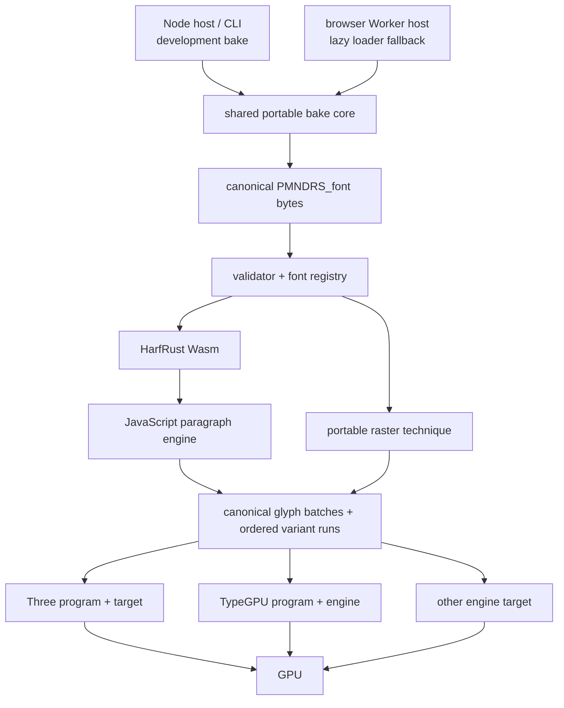
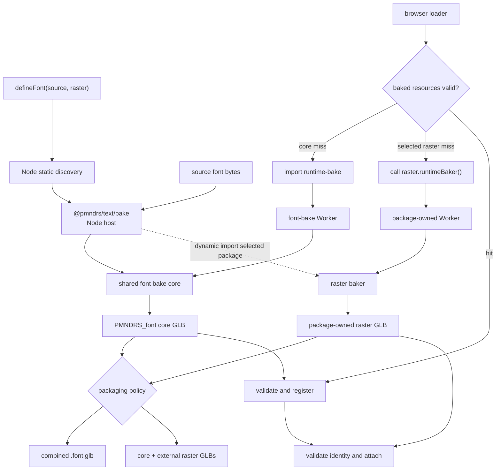
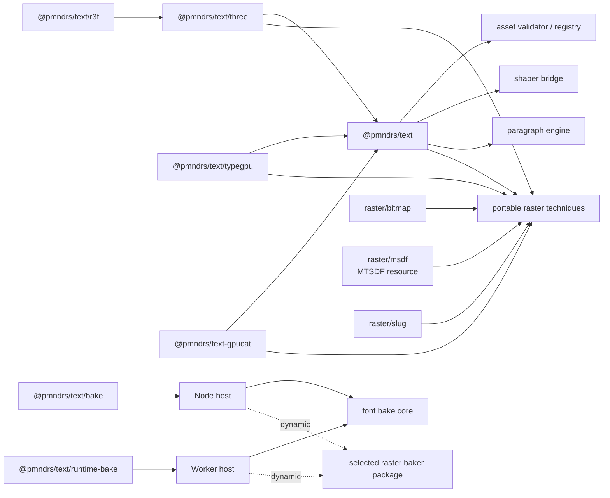
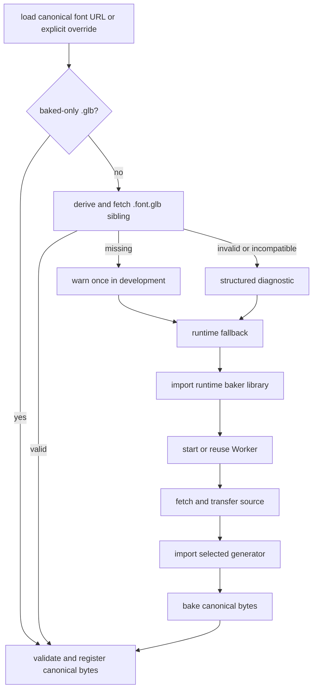
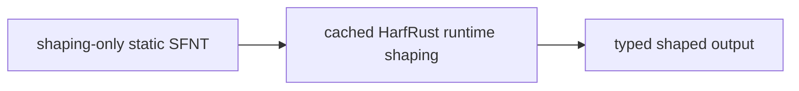
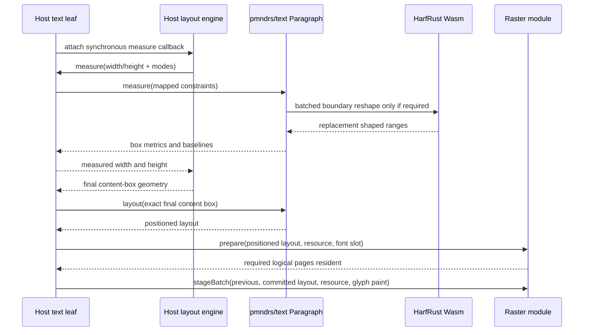

# Proposed architecture

Status: proposed; the [core API](core-api.md), [engine contract](engine-integration-contract.md), and engine-specific API
specifications own exact public interface shapes.

## System boundaries

The loader first probes the canonical baked core font. Only a core miss dynamically imports the runtime baker library and its font-bake Worker. Rasters may be embedded in that GLB or loaded as independently addressable GLBs. A selected raster with no artifact invokes that raster module's optional lazy runtime-baker capability; the raster package owns its Worker/import details. The Node host and runtime libraries use the same bake cores and emit the same records. Subsetting, remapping, compiled IR, and SIMD specialization remain later compiler units.

## Terminology

- **Baked font asset**: canonical `PMNDRS_font` GLB data produced ahead of time or during loader fallback.
- **Bake core**: host-independent font transformation library shared by Node and browser builds.
- **Node baker library**: Node host/API and CLI adapter around the bake core.
- **Runtime font-baker library**: dynamically imported browser module that owns the Worker host and loads only the shared Wasm font-bake core.
- **Raster runtime-baker capability**: optional lazy function on a selected raster module; its package owns the Worker host, generator, defaults, and artifact contract.

The runtime baker is a shared library/module, not an auxiliary process or adjacent data-file category.

## Module format

The complete JavaScript surface is ESM-only. `@pmndrs/text` and every public subpath publish ESM exports without a CommonJS build or `require` condition. Static ESM imports define tree-shakable boundaries; `import()` is the only lazy-loading mechanism for the runtime baker, generators, optional raster engines, and transcoders. The browser fallback uses a module Worker. Node-only imports remain reachable only from the bake host and CLI subpath, never from the browser-safe core graph.

The Node CLI discovers baker entry points from the published `pmndrs.text` package.json map and matching ESM subpath exports. Package semver governs the manifest contract. It resolves only the first-party package, a package imported by a statically discovered raster definition, or a package named explicitly on the CLI; it never scans the dependency filesystem. No npm/pnpm/Yarn tree query or global plugin registry participates in correctness.

### Portable Wasm ABI

The shared font bake core ships as one `wasm32-unknown-unknown` module with a small C ABI. It does not ship platform-native binaries, require WASI, or depend on Embind, `wasm-bindgen`, or another generated binding runtime. The TypeScript shim reads and writes Wasm linear memory directly.

Rust generates the versioned ABI description as JSON at compile time from the constants used by the response encoder. The same generated bytes are embedded in the Wasm module and published beside it. Two fixed bootstrap exports expose that JSON's pointer and byte length, and the built-in `generate-abi` program emits the compiled contract for package tooling. The artifact names the remaining function and memory exports and defines the response-envelope offsets, so the TypeScript shim does not duplicate the complete layout contract. ABI changes require a new version rather than silent offset drift.

The Wasm build uses `no_std + alloc`, aborting panics, and an ABI-private dynamic Talc global allocator selected by the [allocator experiment](font-baker-allocator.md). Allocation stays behind the ABI, so later allocator experiments cannot change callers or artifact bytes. Transport compression measurement is host work: the portable Wasm result reports authoritative raw bytes, while the Node/reporting host adds gzip and Brotli measurements.

## TypeScript capability boundary

Raster modules are runtime capability values with an inferred literal kind and associated resource and batch types. An optional lazy runtime-baker capability carries the same kind and its option type. Separate Node baker modules carry the kind plus their option and descriptor types. Generic extraction helpers preserve those relationships through loader and plugin APIs without a central string registry or required user-written generic arguments.

The public kind type is open. Core has no built-in raster union, no requirement that any particular first-party raster package ship with it, and no registry that must be edited when a raster is added. Bitmap, MSDF, Slug, and external packages each own their literal kind and companion contract. A registered raster is generic over its kind, so a decoder cannot accept an artifact from another technique. Invalid property combinations such as a raw font without a raster are represented as uninhabitable unions.

This precision stops at runtime-shaped data. The mutable Three.js `Text` object, paragraphs, font-scoped glyph IDs, and typed-array lengths remain non-generic and are validated by runtime contracts. The React layer derives props from core properties and preserves module inference rather than defining another capability model. The exact signatures live in the [API contract](api-shapes.md).

## What we retain from Three Flatland Slug

- a single loader that derives and probes a baked sibling;
- no application code change between baked and fallback delivery;
- a browser-safe main surface;
- Node tooling behind a separate bake subpath and thin CLI;
- heavy runtime generation reachable only through dynamic import;
- development-only, deduplicated guidance to pre-bake.

## What we change

- remove `forceRuntime` and similar policy switches;
- move fallback parsing/generation into a Worker;
- make fallback return canonical bytes instead of a distinct in-memory model;
- run those bytes through the same validation, registration, and raster paths as a baked asset;
- make raster generators independently importable.

## Bake and fallback flow

Offline baking and runtime fallback produce the same core and raster contracts, but they do not force every generator into one module or Worker. The Node host may compose all statically discovered artifacts in one command. At runtime, a missing core font and a missing selected raster are independent lazy events with separate package-owned import boundaries.

The arrows back into the shared bake units express code and record parity, not a shared live process. Browser hosts transfer source/result buffers and perform expensive work off the main thread. A valid baked hit reaches neither Worker path.

## Ownership

### Shared bake core owns

- source-font validation and face selection;
- canonical shaping payload, shared metrics, glyph identity, and provenance;
- a read-only font/outline context that raster bakers may consume;
- `PMNDRS_font` writing and validation;
- deterministic core-font diagnostics.

The shared core does not define, generate, serialize, validate, decode, or render raster artifacts. The merged v0 implementation emits the closed shaping-only static SFNT profile and exposes the font context used by separately imported Bitmap, MTSDF, and Slug bakers. The target v1 work separates their portable techniques from engine realization before any public release. Subsetting, closure, dense remapping, compiled lookups, and color-emoji/SVG-icon extensions remain separate later work.

### Each raster package owns

- its literal module kind and companion glTF extension name/version;
- bake options and serialized descriptor schema;
- generator, artifact writer, and deterministic diagnostics;
- companion extension schema, binary records, texture/resource formats, and validator;
- renderer-neutral runtime artifact decoding, resource selection, canonical glyph storage layout, and packing;
- reusable backend-specific canonical technique shaders where appropriate;
- engine-specific programs/targets for resources, variants, pipelines/materials, final draws, and disposal;
- technique-specific fixtures, payload reports, and visual/performance gates.

The generic Node and Worker hosts dynamically load raster packages, pass them the read-only font context, and compose
returned artifacts into embedded or external delivery. They treat descriptor and artifact bodies as opaque package-owned
values. Portable technique entry points name no TSL, TypeGPU, WebGPU, WebGL, shader-node, or pipeline type. First-party
packages may expose native TSL or TypeGPU shader/program subpaths without pulling those dependencies into baking, loading,
shaping, or core batching. An external package may use any implementation that satisfies the portable technique and target
contracts.

### Node host owns

- filesystem reads/writes;
- CLI and JavaScript API;
- static project-source discovery for `defineFont` calls and literal raster descriptors;
- conservative mapping from application URLs to configured local asset roots;
- output naming and process diagnostics;
- invoking the shared core.

### Worker host owns

- transferred source input and result output;
- dynamic generator imports;
- cancellation, resource limits, and serialized errors;
- invoking the same shared core without main-thread font work.

### Loader and registry own

- canonical font-URL normalization and deterministic baked-sibling probing;
- the automatic hit/miss state machine;
- development warnings;
- canonical asset validation;
- in-flight/result caching;
- font handles, raster ranges, and lifetime.

### Wasm shaper owns

- UTF-16 decoding and clusters;
- HarfRust script behavior and GSUB/GPOS;
- reusable font/shaper data and shape plans;
- glyph flags and packed outputs.

### JS paragraph engine owns

- paragraph-level UAX #9 bidi analysis and line-level visual reordering;
- UAX #24 script itemization, UAX #14 break opportunities, and UAX #29 grapheme boundaries;
- versioned JS Unicode property tables pinned to the same Unicode version recorded by `PMNDRS_font.provenance.unicodeVersion`;
- text/styles, region constraints, and break selection;
- alignment, clipping, max lines, ellipsis, and reflow caches;
- batching boundary-sensitive reshapes.

The item-5.1 implementation pins Unicode 17 throughout this boundary: generated
Script/Script_Extensions ranges come from `@unicode/unicode-17.0.0` 1.6.17,
extended grapheme boundaries come from `unicode-segmenter` 0.15.0, and line
break opportunities come from `@cto.af/linebreak` 4.0.3. Generated tables and
official conformance fixtures are build/test inputs; application code does not
consult ambient `Intl` or a browser-dependent ICU version.

### Engine targets own

- synchronization from canonical technique CPU storage into engine buffers;
- GPU resource creation and direct upload;
- shaders/programs, transforms, scene/pass placement, renderer submission, fences, and retirement.

### Three.js integration owns

- the public `FontLoader`, `TextGroup`, and `Text` lifecycle over private core handles;
- standard `Object3D` transforms, scene attachment, bounds, visibility, and disposal;
- target synchronization through the Three render lifecycle;
- TSL materials and program-owned draw compilation.

### React Three Fiber integration owns

- Suspense-backed font loading through the Three integration loader;
- reconciling props onto the Three integration's retained text objects;
- flattening nested `<Text>` children into one source string and inline spans;
- ref forwarding and React lifecycle disposal.

The React integration owns no shaping, line-breaking, baking, raster decoding, shaders, or GPU formats.

## Dependency and import graph

A baked asset hit must not make the main module graph reach the runtime baker library or generator modules.

Package-graph tests inspect native ESM entry points directly. They must prove that the core imports in browser and Node ESM environments, that module-worker URLs survive bundling, that optional graphs remain absent until imported, and that no CommonJS artifact or `require` export is published.

## Canonical identity and coordinates

- Public clusters are UTF-16 offsets; Unicode logic uses scalar values.
- Glyph identity is `(FontHandle, LocalGlyphId)`.
- V0 local IDs may preserve source glyph IDs; later packed IDs remain font-local.
- Shared metrics and shaping positions use design units.
- Raster plane bounds use a documented design-unit/fixed-point space.
- World/screen scaling occurs after shaping.

## Font loading state machine

There is no public branch that intentionally bypasses the baked asset probe.

For a source pathname ending in `.ttf`, `.otf`, `.woff`, or `.woff2`, the sibling replaces that suffix with `.font.glb`; other hierarchical pathnames append `.font.glb`. Query parameters are preserved and fragments are excluded from identity. A direct `.glb` input or `{ baked }` object is baked-only. `{ source, baked }` is the explicit override for unrelated paths. The [API contract](api-shapes.md#canonical-url-resolution) is authoritative for edge cases, preload behavior, and examples.

## `PMNDRS_font` extension family

The names are provisional vendor-extension names. `PMNDRS` must be registered with Khronos before the format is published as stable; internal code uses neutral asset/section type names so serialization naming remains isolated.

`PMNDRS_font` contains one font face, version/provenance, the closed shaping-only SFNT for HarfRust, authoritative metrics, and a raster directory.

Each raster package owns its companion extension, records, and GPU payloads. `PMNDRS_font_bitmap`, `PMNDRS_font_distance_field`, and `PMNDRS_font_slug` are the three companion packages currently planned here. External packages may define different extensions without changing `PMNDRS_font`. No companion repeats advances, kerning, or shaping behavior. Each may be embedded in the core GLB or delivered as its own GLB and attached after reciprocal shaping-hash validation.

The companion asset contains dense glyph records and a logical page directory. Each page payload may be embedded or independently addressed by URI plus length and content hash. A glyph's page value does not prescribe a GPU array layer, binding, draw, or residency policy. Raster modules decode the index first, prepare only pages required by a positioned layout, and own device-specific caching and batching. The Latin-first implementation may eagerly prepare every embedded page; that behavior is an implementation choice rather than a format invariant.

The asset supports multiple raster sections; the first implementation emits one. Applications support multiple fonts by registering multiple one-face assets. Large-coverage CJK and icon work shares the same page contract later without changing font identity, shaping output, paragraph layout, or the public raster-module type.

## Binary rules

1. JSON locates top-level views; authoritative numeric records remain flat binary.
2. Sections meet typed-view alignment; GPU ranges meet backend upload constraints.
3. Registration bounds-checks offsets and lengths once.
4. Shaping and layout outputs use structure-of-arrays.
5. GPU data records final formats, strides, dimensions, row layout, and alignment.
6. No platform-sized values appear on disk.
7. Unknown optional sections are skipped; unknown required sections reject.
8. Every serialized structure receives golden-byte and corrupt-input tests.
9. Resource page identifiers remain logical and independently addressable; no serialized value is derived from a device binding limit.

## Shaping and reflow

Initial reference path:

Width changes reuse broad shaping where safe. JS recomputes line breaks and batches only boundary-sensitive line ranges into one reshape call. Raster data never participates in text measurement.

### External layout handoff

Retained layout systems own box resolution and provide content constraints; they never receive shaping rules and never measure from raster artifacts. A host-owned adapter uses the layout-system-neutral synchronous `Paragraph.measure` contract during box resolution and requests `Paragraph.layout` only for the authoritative box that needs positioned glyphs.

The core modes are `unconstrained`, `at-most`, and `exactly`; each host translates its own constraint vocabulary. Adapters install only after asynchronous font/shaper readiness when their measurement callbacks are synchronous. Final host geometry is authoritative even when measurement was skipped or produced a different candidate. Paragraph positions remain local to the content box; the host applies node transforms and clipping afterward.

Invalidation is directional: text, font, spans, font size, language, direction, features, letter spacing, or line policy update the paragraph and invalidate host measurement. Parent constraint changes cause the host to remeasure. Raster selection and paint-only changes rebuild or update draw batches without paragraph invalidation. The [API contract](api-shapes.md#third-party-layout-systems) owns the generic constraint and output shapes. The current uikit source mapping and incremental adoption plan are isolated in [uikit integration](uikit-integration.md).

## Caching

V0 requires:

- baked asset/load promise deduplication;
- in-memory runtime-bake result keyed by source identity, descriptor, and versions;
- registered HarfRust state and shape plans;
- broad-run, line-shape, paragraph-analysis, and width-layout caches;
- GPU resources by font, raster, logical page, selected variant, and device.

Persistent runtime-bake caching is deferred, but the key shape is reserved for source hash, descriptor hash, format/baker/generator versions, and selected raster.

## Failure and warning model

- A missing baked asset is recoverable and warns once in development.
- An invalid baked asset yields a structured diagnostic before any allowed fallback.
- Unsupported source fonts, output/resource limits, Worker failures, and unsupported required sections are distinct errors.
- External raster-page fetch, length, hash, decode, capability, and budget failures identify the raster and logical page and never publish a partial draw generation.
- HarfRust shaping never silently falls back to approximate shaping.
- Production fallback remains functional but does not emit the development pre-bake warning.

## Central invariant

> The loader may obtain core and raster bytes from one GLB, several GLBs, an application resolver, or a lazy Worker bake, but identity validation and downstream shaping/layout/raster records are identical.
