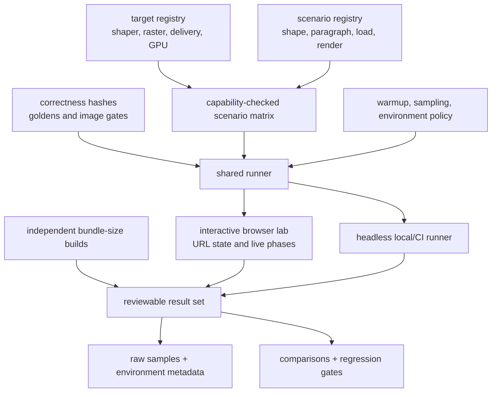

# Benchmark plan

Status: accepted; implementation status is tracked by gate below
Purpose: replace performance and payload estimates with reproducible evidence.

## Principles

1. Report whole-product outcomes and isolated kernels separately.
2. Measure cold and warm behavior; startup is part of runtime cost.
3. Separate shaping data, raster data, JavaScript, and Wasm bytes.
4. Never compare outputs that differ semantically or in font coverage.
5. Store raw samples and environment metadata, not only summary charts.
6. Treat variance and regression thresholds as part of the benchmark definition.
7. Use the current browser's HTML/CSS text renderer as the visual reference for every rendering scenario; use structured shaping oracles separately.

## Required benchmark product

The project's first executable artifact is an interactive benchmark lab modeled on the architecture of [isaac-mason/js-physics-benchmarks](https://github.com/isaac-mason/js-physics-benchmarks), together with a headless runner that executes the same scenarios. It is built before production font components and extended by every implementation milestone. The first real bitmap rendering proof lands inside this lab; no separate demo or alternate benchmark definition precedes it. This is a first-class repository artifact, not a collection of unrelated microbenchmark scripts.

The useful precedent is:

- one browser application for selecting a target and scenario;
- a stable adapter contract shared by all compared targets;
- independent scenario modules with configurable controls;
- explicit capability declarations and visible unsupported combinations;
- URL-encoded target, scenario, and control state for reproducible links;
- live measurements split into meaningful pipeline phases;
- a separate, reproducible bundle-size build whose results appear beside runtime measurements;
- static deployment suitable for maintainer and contributor review.

The pmndrs/text lab extends that pattern with correctness hashes, image diffs, cold-start automation, raw sample export, GPU/device metadata, and font/raster byte accounting.

The application has two explicit modes over the same implementation, workload, fixture, and result contracts:

| Mode        | Purpose                                                                 | Visible product                                                                                                                                                          | Measurement boundary                                                                                                                                                                          |
| ----------- | ----------------------------------------------------------------------- | ------------------------------------------------------------------------------------------------------------------------------------------------------------------------ | --------------------------------------------------------------------------------------------------------------------------------------------------------------------------------------------- |
| Conformance | Prove that an implementation is correct and explain failures.           | Browser/reference output, candidate output, raw difference view, structured shaping/layout comparison, tolerances, hashes, pixel statistics, and validation diagnostics. | May include readback, reference composition, byte/perceptual comparison, clipping probes, and hashing; these costs are labeled as test execution and never presented as renderer performance. |
| Benchmark   | Explain the cost a consumer pays in a real continuously rendered scene. | Live text, workload controls, cold-phase breakdowns, warm CPU-ms/FPS/GPU-ms sparklines, memory/payload data, and raw samples.                                            | Measures named bake/startup/shape/layout/upload/first-draw phases and a steady render loop with no readback, hash, diff, screenshot, or conformance oracle inside the timed frame.            |

The product UI exposes four independent axes: **mode** (`Benchmark` or `Conformance`), **technique** (`Bitmap`, `MTSDF`, `Slug`, or another admitted implementation), **backend** (`WebGPU` or `WebGL2 fallback`), and **workload** (benchmark ipsum, text ladder, paragraph reflow, glyph stress, advanced shaping, and so on). Benchmark is the default because this application is primarily a human control plane for real-world cost. Internal target adapters may bind a technique/backend pair, and internal scenarios define workloads, but those implementation terms do not appear in the primary UI. Every axis is encoded in the shareable URL and exported result. “Run conformance” captures the current finite correctness case; “Capture window” records the current live performance window. A passing conformance result admits a combination to benchmarking; it does not make conformance duration a benchmark metric.

`Bitmap text frame` is a conformance case: its exact full/clipped readback, CPU reference composition, hash, and mismatch scan are valuable because a maintainer can inspect what was proved. `Benchmark ipsum`, `Text ladder`, `Off-axis / 3D`, `Dynamic layout`, and `Paragraph stress` are live visual workloads. The first live workload is the paragraph-scale benchmark ipsum at a native bitmap strike; later workloads add controlled scale, transforms, reflow, and volume without changing this classification.

Status key: ✅ specified or available · 🟡 partial or conditional · ⬜ not started

| Harness gate                                 | Status | Evidence required to advance                                                                                                                                                                                                                                                                                                                                                                                                                                                                                                                                                                                                                                                                                                               |
| -------------------------------------------- | :----: | ------------------------------------------------------------------------------------------------------------------------------------------------------------------------------------------------------------------------------------------------------------------------------------------------------------------------------------------------------------------------------------------------------------------------------------------------------------------------------------------------------------------------------------------------------------------------------------------------------------------------------------------------------------------------------------------------------------------------------------------ |
| Canonical architecture and scenario contract |   ✅   | This plan owns one target registry, one scenario registry, and one runner contract for interactive and headless surfaces.                                                                                                                                                                                                                                                                                                                                                                                                                                                                                                                                                                                                                  |
| Portable baker target                        |   ✅   | `packages/font-baker` and the app run immutable Inter 4.1 bytes through the direct-memory Wasm API with deterministic GLB evidence.                                                                                                                                                                                                                                                                                                                                                                                                                                                                                                                                                                                                        |
| Lab shell under `apps/benchmarks`            |   ✅   | The responsive token/component shell defaults to the human-facing live benchmark with mode, technique, backend, and workload URL state; finite visual conformance is separate. Fixed histories report renderer-callback CPU time, FPS, and real WebGPU/WebGL2 GPU timestamps when supported, while capture/export snapshots the live contract on demand. Causal product checks own label fit, control density, horizontal overflow, and mobile/tablet/desktop flow at 390, 1,024, and 1,280 CSS pixels.                                                                                                                                                                                                                                    |
| Headless product E2E                         |   🟡   | A browser CLI, Vitexec, and Playwright call the same strict registry execution module. The bounded CI-safe conformance suite includes synthetic, forced-WebGL2 TSL and bitmap rendering, public React `Text` reconciliation, direct-baker, loader/Worker, HarfRust, paragraph, bidi/policy/uikit, and item-5.4 CJK lanes. Hardware-WebGPU and pending-Suspense probes remain maintainer-local, and Milestone 6 awaits its closure review.                                                                                                                                                                                                                                                                                                  |
| Package-size lane                            |   ✅   | Independent library-mode entries produce nonzero raw/minified/gzip/Brotli initial-core, Unicode 17 analysis, lazy-validator, runtime-host, runtime-Worker, baker, and shaper JavaScript sizes plus raw/gzip/Brotli Wasm. Rollup static closures exclude dynamic chunks; the browser-core lane externalizes declared `three`, React, and R3F peers, while Worker and shaper JavaScript exclude separately measured Wasm assets. The record names its measurement host: same-host output stays exact, while every foreign-host entry must satisfy the shared complete reviewed budgets. Unicode analysis is 139,936 bytes minified and the Darwin arm64 shaper record is 32,778 bytes minified JavaScript plus 680,312 bytes optimized Wasm. |
| Browser visual reference                     |   🟡   | Exact font/text/style/viewport inputs, Chromium 149.0.7827.55, Playwright 1.61.1, PNG hash, and regeneration command are pinned; renderer candidates and diffs land with rendering.                                                                                                                                                                                                                                                                                                                                                                                                                                                                                                                                                        |
| Stable regression baselines                  |   ⬜   | Correctness gates pass first; then reviewed raw samples establish noise-aware thresholds.                                                                                                                                                                                                                                                                                                                                                                                                                                                                                                                                                                                                                                                  |

The lab is both the benchmark product and the canonical product-level test harness described by the [test ownership ladder](conformance-plan.md#test-layers-and-ownership). A scenario first validates semantic output, artifact hashes or schema, lifecycle cleanup, and visual output where relevant; only a passing sample may contribute performance numbers. Synthetic scenarios protect contracts and stress limits, but every user-facing milestone also needs a real-font scenario through public package surfaces. A separate demo, private test hook, or mocked adapter cannot close that end-to-end gate.

The harness does not wait for a raster implementation to become useful. Its deterministic synthetic target first proves registry, runner, validation, URL-state, export, and interactive/automated parity. The existing portable font-baker target then contributes real cold/warm Wasm startup, source-to-GLB correctness, payload, memory, diagnostics, and deterministic-artifact scenarios without claiming that it renders text. Bitmap, MSDF, and Slug remain visible but capability-gated and unsupported until their real adapters exist; the UI never fills unavailable panels with fabricated metrics.

The completed paragraph-policy scenario consumes the generated `paragraph-bidi-layout-v0.json` contract through the same registry used by the interactive and automated surfaces. Chromium 149 repeats two complete Amiri mixed-direction layouts, nine Inter line-policy layouts, and one current-uikit-shaped final layout three times with the same twelve hashes and 8,098-byte aggregate output. The completed item-5.4 scenario adds thirteen exact Noto CJK shaping cases and twelve exact layouts across four paragraphs; Chromium and GPU-enabled Vitexec both report the same composite hash and 10,622-byte output. Neither lane claims a rendered GPU frame before Milestone 6.

## Application stack

| Concern                | Settled harness choice                                                                                                                                                                                                                                                                                                     |
| ---------------------- | -------------------------------------------------------------------------------------------------------------------------------------------------------------------------------------------------------------------------------------------------------------------------------------------------------------------------- |
| Application            | A Vite browser application under `apps/benchmarks`; it remains locally runnable and statically publishable.                                                                                                                                                                                                                |
| UI runtime             | React 19 with the React Compiler enabled from the first implementation.                                                                                                                                                                                                                                                    |
| Async React            | Suspense-backed resources, `use`, transitions, and action-style mutations where they match the lifecycle. Async target/scenario loading is modeled as explicit resources rather than effect-driven fetch orchestration.                                                                                                    |
| Components             | The project-owned custom shadcn-derived component set represented by the Figma design. Existing components and tokens are reused; generic generated replacements are not accepted.                                                                                                                                         |
| Source design          | The node-specific [benchmark harness Figma wireframe](../assets/benchmark-harness-wireframe.png) and its extracted component/token context. The file is visual and token input, not a product contract; the implemented information architecture may diverge to make consumer cost and correctness legible.                |
| Formatting and linting | Oxfmt and Oxlint are authoritative. Oxlint runs React Compiler analysis, Rules of Hooks, accessibility checks, and the Oxlint-compatible `react-you-might-not-need-an-effect` rules as errors; effect-only event logic uses `useEffectEvent` instead of render-time refs.                                                  |
| Tests                  | Vitest covers contracts and reusable assertions; a committed erasable-TypeScript Vitexec probe exercises the live Vite runner; Playwright exercises fixed mobile viewports and remains reusable for representative headed/GPU lanes. Browser console errors fail the wrapper even when the Vitexec CLI exits successfully. |
| TypeScript             | Strict project references extending the repository base configuration. App and probe code remains erasable TypeScript unless a build-tool configuration explicitly requires otherwise.                                                                                                                                     |

The visual shell reuses the Figma token system and appropriate project-owned shadcn-derived primitives without treating the mockup hierarchy as immutable. Semantic CSS variables feed Tailwind utilities, so visual values remain centralized instead of becoming scattered literals. Target adapters, scenarios, runner state, validation, and result schemas stay UI-independent. React components subscribe to those contracts; they do not own benchmark execution policy or create a second result model.

## Harness architecture

One registry and runner definition feeds every human and automated surface:



The planned repository keeps target adapters, scenarios, harness policy, UI, bundle-size entries, and result schemas as separate modules under `apps/benchmarks`; the exact directory names are implementation details rather than a second architecture contract.

The interactive application and headless runner import the same target registry, scenario registry, fixtures, controls, validation rules, and result schema. Conformance and benchmark modes own distinct runner policies and timing boundaries over those shared definitions. Every measured target call receives its real zero-based sample index; warmups are excluded from that sequence. The V0 result envelope records its schema version and exact controls, and invalid counts fail before target loading. A visually convenient browser path must not become a separate benchmark definition.

### Target adapters

A target is one implementation choice on a declared axis:

- shaping: pinned HarfRust reference or a later optimized path;
- raster: browser HTML reference, bitmap, MSDF, or Slug;
- graphics API: WebGPU or WebGL2;
- delivery: pre-baked hit or automatic Worker fallback;
- bake host: Node or Worker Wasm where parity is being measured.

The exact TypeScript is accepted with the API fixture, but the contract must express:

```ts
interface BenchmarkTarget<Prepared, Output> {
  id: string;
  label: string;
  kind: 'shaping' | 'paragraph' | 'baker' | 'loader' | 'raster';
  capabilities: ReadonlySet<BenchmarkCapability>;

  load(context: BenchmarkContext): Promise<void>;
  prepare(scenario: BenchmarkScenario): Promise<Prepared>;
  run(prepared: Prepared, sample: SampleContext): Promise<Output>;
  validate(output: Output, oracle: ScenarioOracle): ValidationResult;
  dispose(): Promise<void>;
}
```

Adapters normalize lifecycle and measurement boundaries; they must not hide technique-specific costs or coerce unsupported behavior into a misleading approximation.

### Scenario modules

Each scenario declares:

- stable ID, category, description, and default controls;
- required target kind and capabilities;
- pinned font, text, constraints, viewport, DPR, and transforms;
- cold/warm setup and sample policy;
- phase markers and primary metric;
- semantic oracle or visual reference;
- output hash inputs;
- teardown and leak checks.

Unsupported target/scenario pairs remain visible with their missing capabilities. They are not scored as failures and are never silently removed from comparison tables.

### Reference hierarchy

Every rendering scenario captures an HTML/CSS reference in the same browser, using the same font bytes, text, language, direction, OpenType features, font size, constraints, DPR, foreground/background colors, and viewport. Browser output is the primary authority for visual shaping and rendering deltas. The harness retains the browser image, candidate image, perceptual score, and raw difference image.

The cross-technique source-outline workload fixes the authored lines and paragraph baselines from the candidate layout, then gives Canvas2D the original pinned font bytes and the same physical ppem. Bitmap is inspected at its native 16-device-pixel strike and MTSDF at its 64-device-pixel base level; these are two independently reviewed fidelity envelopes against one source family, not a claim that the two raster techniques should produce identical pixels or be compared at mismatched intended scales.

Structured shaping correctness remains a separate comparison against pinned HarfRust and HarfBuzz output: glyph IDs, clusters, advances, offsets, and flags cannot be recovered reliably from a browser screenshot. A candidate must pass both the structured shaping gate and the browser visual gate.

Current Three Flatland Slug may be included as a historical performance or payload target when an equivalent workload can be constructed. It is never the visual or shaping oracle and is not required in every benchmark run.

### Interactive lab

The browser UI must provide:

- target, scenario, font, raster, GPU backend, and parameter controls;
- a shareable URL encoding the selected configuration;
- live current, median, p95, minimum, maximum, and sample count;
- separate shaping, layout, upload, render, and total panels where applicable;
- rolling sparklines for CPU frame milliseconds, frames per second, and GPU milliseconds, integrated into the full desktop and mobile design rather than exposed as a debug overlay;
- correctness/visual status adjacent to performance;
- payload cards separating JS, Wasm, core font, raster, decoded texture, and GPU bytes;
- environment details and downloadable raw JSON.

Frame rate alone is not an accepted metric. CPU phase timings, GPU timings where supported, first-frame latency, memory, and quality remain separate. WebGPU targets use timestamp queries only when the adapter exposes the `timestamp-query` feature; WebGL2 targets use `EXT_disjoint_timer_query_webgl2` and discard samples from a disjoint interval. Unsupported GPU timing is displayed as unavailable and is never replaced with CPU submission time. The live render loop records frame cost independently from conformance capture: GPU readback, byte comparison, image scanning, hashing, and test-only resize probes remain correctness costs and do not contribute to the user-facing render-technique median.

For raster workloads, one preflight draw records CPU submit, wall-clock completion through timestamp resolution, and the render pass's GPU timestamp before the steady loop begins. The wall value is labeled upload-frame completion because this is the first consumption of the newly decoded atlas; it includes compilation, queue completion, and timestamp resolution and is not mislabeled as isolated texture-copy time. The GPU timestamp remains the narrower render-pass duration. Both remain distinct from texture decode, `Text.ready`, total startup, and the steady GPU median, and are omitted when the backend cannot supply the causal completion rather than replaced with a CPU proxy.

### Automation and publication

- Pull requests run deterministic smoke scenarios, schema/output validation, and public-surface assertions for capabilities the CI environment actually provides.
- The benchmark app exposes its scenario drivers and pure assertion/result helpers to Vitest. Maintainers run committed erasable-TypeScript Vitexec probe files against the visible Vite app for stateful, visual, multi-frame, WebGL2, and WebGPU behavior that is not soundly represented by ordinary headless CI.
- Vitexec and headed or remote Playwright runs reuse the same target/scenario contracts, not a second E2E corpus. A probe may import real app modules, drive input, await named lifecycle/GPU completion signals, inspect runtime state, and retain screenshots, traces, profiles, or heap evidence without adding a production debug API.
- Canonical probes follow the [live-probe determinism contract](conformance-plan.md#live-probe-determinism-contract): no timer-based readiness, arbitrary frame counts, retries, mutable network inputs, test-order dependence, or screenshot-only assertions. Runner timeouts are failure watchdogs only.
- Scheduled or manually approved runs capture longer browser/device matrices because noisy GPU results should not block every pull request. A headless or software-rendered pass never substitutes for a milestone's required hardware-GPU result.
- The static lab can be published from the default branch after maintainers approve the workflow.
- Committed summaries point to raw run artifacts and the exact commit/environment; hand-edited headline numbers are not authoritative.
- The lab must operate locally without publication, and this planning branch does not authorize deployment.

### Bundle-size pipeline

Like the reference project, bundle sizes are produced from independent import entries. Required entries include:

- browser core;
- lazy font-asset validator;
- HarfRust shaper JavaScript glue and Wasm;
- runtime baker loader and bake Wasm;
- each raster runtime;
- each raster generator;
- combined target v1 application path.

Report raw, minified, gzip, and Brotli JavaScript; raw, gzip, and Brotli Wasm; and every substantial dynamically imported validator, Worker host, generator, or transcoder separately. The initial entry measurement follows only static chunk imports and never adds dynamic chunks merely because they are reachable. The interactive lab reads generated result JSON rather than estimating sizes from the development bundle.

## Benchmark environments

Record:

- operating system and version;
- CPU model/core count;
- RAM;
- GPU and driver;
- browser and exact version;
- JavaScript engine/Wasm feature set;
- power mode and thermal state where available;
- Rust/toolchain and optimization flags;
- dependency commits;
- font and fixture hashes.

Initial environments should include one current Chromium desktop reference, one Firefox reference, one Safari/macOS reference, and at least one constrained/mobile-class device before release claims.

## Workload corpus

### Text shapes

| Workload                             | Purpose                                                                          |
| ------------------------------------ | -------------------------------------------------------------------------------- |
| 8–16 character Latin label           | boundary overhead and common UI latency                                          |
| 40–80 character mixed-style line     | feature ranges and normal app text                                               |
| 500 character Latin paragraph        | throughput, wrapping, and caches                                                 |
| 5,000 character Latin document       | steady-state bulk kernels and memory                                             |
| Arabic short label and paragraph     | joining, cursive, marks, RTL                                                     |
| Devanagari short label and paragraph | syllable/reorder/context workload                                                |
| mixed LTR/RTL paragraph              | run segmentation and line ordering                                               |
| emoji/ZWJ list                       | supplementary decode and sequence substitution                                   |
| repeated private-use icon labels     | simple cmap/advance and cache ceiling                                            |
| sparse standalone-SVG icon set       | name lookup, selected/full-library paging, and residency                         |
| CJK paragraph without spaces         | pre-render line fitting, `locl`, supplementary clusters, and variation sequences |
| CJK page-walk document               | first-use fetch/upload, cache reuse, eviction, and page churn                    |

Each workload has unique-text and repeated-text variants.

### Font shapes

- small ASCII/Latin subset;
- feature-heavy Latin Extended;
- Arabic;
- Devanagari or another USE-heavy font;
- emoji-capable font subset;
- private-use icon font and manifest-backed standalone SVG set;
- one pinned pan-CJK face exercised as a complete shaping source in item 5.4 and as small, medium, large, and complete raster-coverage tiers in Milestone 13;
- one font with class kerning and one with many explicit pairs.

## Shaper benchmarks

Measure:

- Wasm module download bytes: raw, gzip, Brotli;
- compile and instantiate time;
- font registration time;
- shape-plan cold creation and warm reuse;
- UTF-16 copy/decode time;
- total shape time per request;
- glyphs and source code units per second for long runs;
- output-buffer growth/allocation;
- peak and retained Wasm memory;
- JS/Wasm calls per operation;
- cache hit latency and memory.

Variants:

1. pinned HarfRust over reference font data;
2. direct baked cmap/metrics only;
3. each compiled operation family independently;
4. scalar versus SIMD module;
5. one coarse request versus deliberately repeated small calls;
6. debug verification off versus on, clearly labeled.

## Paragraph benchmarks

Measure:

- initial analysis and broad shaping;
- greedy line fitting;
- final boundary reshape;
- total initial layout;
- width-only reflow at several widths;
- height/max-lines/ellipsis update;
- cache memory;
- changed lines and reshaped lines;
- Wasm call count and transferred/written bytes;
- allocation-light host measurement versus final positioned layout;
- the current-uikit-shaped `CustomLayouting` path, reported separately for repeated measurements, compatible final-box reuse, and changed-width reflow.

Resize scenario:

```text
wide → narrow in 20 steps → wide in 20 steps
```

Report latency distribution per step and the percentage of steps requiring boundary reshaping. Do not report only the average.

## Baker benchmarks

Measure native and worker Wasm independently:

- source decode/parse;
- variation instancing;
- subset and shaping closure;
- dense ID remap;
- shaping-section compilation;
- canonical outline extraction;
- Slug generation;
- MSDF-module MTSDF generation and atlas packing;
- each bitmap strike rasterization/packing;
- GLB assembly;
- total time;
- peak memory;
- output section sizes;
- main-thread long tasks during worker operation;
- transfer time;
- persistent-cache write/read time.

Run with shaping-only, each raster individually, and the combined package. Large-font tests must include cancellation and configured limit failures.

## Loader and GPU benchmarks

Measure:

- fetch/decode excluded and included variants;
- GLB JSON parse and extension validation;
- typed-view registration;
- any copy into Wasm memory;
- GPU buffer creation/upload;
- texture decode/transcode/upload;
- JS allocations and retained object count;
- first drawable frame;
- warm cache load.

Loader scenarios compare baked-hit and Worker-fallback behavior against the declared loader contract. Current Three Flatland Slug may be measured as a labeled historical target, but it does not define correctness for loading, shaping, or visual output.

### Pre-render CJK universality

Item 5.4 is complete through one shared-registry CJK shaping and paragraph scenario before any raster work. It records exact source/reduced HarfRust and HarfBuzz hashes, 208 UTF-16 source units, 64 oracle glyphs, eight plans, one direct batch, four paragraph shapes, zero reshapes, 1,539,372 retained font bytes, 4,587,520 Wasm-memory bytes, and 1,539,372 / 654,925 / 514,547 raw/gzip/Brotli shaping-payload bytes. The scenario passes Node integration, Chromium 149 headless, and the committed GPU-enabled Vitexec lane. It reports no first draw, texture pages, upload, GPU memory, or residency because those outputs do not exist yet.

The correctness gate includes language-tagged Chinese, Japanese, and Korean cases, supplementary Han, supported standardized/ideographic variation sequences, mixed Latin/CJK, and no-space paragraph reflow. Timings are admitted only after every structured shaping field and positioned-layout hash matches the pinned contract.

### Large-coverage paging

CJK and icon benchmarks share one page-stress lane. The same pinned sources are baked at 256, 2,048, 8,192, and complete selected-glyph coverage, with the final tier determined by the fixture manifest rather than assumed to fit one atlas. Report:

- dense record bytes separately from page payload bytes;
- page count, occupancy, padding, and glyph distribution;
- index-only load and validation time;
- pages and bytes required for the first visible layout;
- cold page fetch, hash validation, decode/transcode, upload, and first draw;
- warm page reuse and concurrent request deduplication;
- resident bytes, peak bytes, eviction count, and re-fetch rate during a deterministic page walk;
- draw/batch count without assuming page index equals texture-array layer;
- cancellation and stale-generation behavior when text changes during preparation;
- selected icon subset versus complete icon-library stress case.

The synthetic maximum-cardinality contract fixture runs early to protect the format. Full-face raster generation, long page walks, and device residency measurements belong to scheduled/manual jobs and Milestone 14; they do not block the Latin-first target v1 renderer gate. Item 5.4 consumes the complete CJK source for shaping but does not create these raster tiers.

## Raster benchmarks

### Slug

- raster bytes by glyph count;
- curve/band generation time;
- atlas/texture occupancy and padding;
- current R32F bands versus exact u32-header/u16-local-reference packing;
- RGBA16F curves versus each quality-gated UASTC/native compressed target, including dynamic transcoder bytes and selected device format;
- curves per glyph and curves per band distribution;
- glyphs per draw and GPU frame time;
- extreme scale/perspective quality and cost.

### MSDF

- MTSDF generation time;
- atlas occupancy/page count;
- raw and compressed texture bytes;
- GPU upload/decode time;
- frame time by projected pixel height;
- perceptual error at small/normal/large sizes;
- fill-only, outline, shadow, and glow paths over the same atlas and batch;
- draw/batch count proving that an enabled effect does not create parallel MSDF/MTSDF resources.

Plain RGB MSDF is excluded from the product matrix. A compression campaign may include it as a counterfactual target, but must count lost alpha effects, texture variants, shader/module bytes, platform coverage, batch changes, and visual error before proposing a contract change.

### Bitmap

- time and bytes per strike;
- cold bake, Wasm compile/instantiate, font registration, shaping, paragraph layout, raster decode/upload, and first-draw time as separate phases;
- warm per-frame CPU submission, GPU timestamp duration, and FPS distributions over a stable scene with no readback or conformance oracle inside the measured interval;
- fixed-capacity, allocation-free telemetry rings allocated before the live loop; snapshot/export may allocate only after the user requests capture;
- hinted versus unhinted/oversampled experiment;
- atlas occupancy/page count;
- quality at native and off-size scaling;
- technique-switch threshold experiments.

The human bitmap benchmark is an interactive scene. Rendered device size and proportional paragraph width are live controls, and canvas resizing drives the same retained paragraph reflow path a consumer uses. The benchmark copy describes the workload positively; reference, difference, and comparison language belongs to the separate conformance surface.

## Payload report

The initial measured baselines, modeled atlas envelopes, and required report schema live in the [font payload budget](payload-budget.md). Benchmarks replace its modeled values; they do not mix shared font bytes, transport bytes, and GPU texture allocation into one total.

Every font configuration reports sections separately:

```text
shared header/directory
cmap
metrics/properties
reference shaping data
compiled shaping data
Slug metadata and texture bytes
MSDF metadata and MTSDF atlas bytes
bitmap metadata and per-strike atlas bytes
GLB JSON/alignment overhead
shaper Wasm
runtime baker library and Wasm core
JavaScript by export/chunk
```

For each: raw, gzip, and Brotli. Image/KTX payloads are not recompressed in misleading ways; report their transport representation.

## Allocation and memory report

At minimum record:

- peak worker memory during baking;
- peak/retained Wasm linear memory;
- number and bytes of copies between fetch buffer, worker, Wasm, JS views, and GPU upload staging;
- per-font JS object/array counts where tooling permits;
- shaped-run and paragraph cache bytes;
- GPU resource bytes.

The desired architecture can still regress memory through oversized scratch buffers or duplicate GLB/Wasm copies; typed arrays alone do not prove zero-copy behavior.

## Methodology

- Warm up until compilation/tiering no longer dominates steady-state samples.
- Preserve a separate true cold-start measurement in a new context/process.
- Use enough iterations to report median, p90, p95, and dispersion.
- Randomize variant order where thermal/tiering drift could bias results.
- Consume benchmark outputs so dead-code elimination cannot remove work.
- Validate output hashes before accepting timing comparisons.
- Keep tracing/profiling runs separate from headline timing runs.
- Store raw JSON/CSV artifacts with the tested commit and environment manifest.

## Go/no-go gates for optimized lookup work

An optimized representation should proceed only if it demonstrates at least one material benefit without correctness loss:

- meaningful end-to-end latency or throughput improvement on target workloads;
- meaningful compressed shared-runtime reduction;
- meaningful total font-asset reduction;
- materially lower startup allocations or peak memory;
- a capability required by the canonical format or direct GPU path.

The exact numeric thresholds are a maintainer decision after Phase 1 establishes baselines. Kernel-only improvements do not qualify if total shaping or package outcomes regress.

## Regression gates before release

Candidates for CI gates after baselines stabilize:

- compressed shaper and normal-path JS size;
- cold Wasm instantiate time;
- short-label p95 shape latency;
- long-paragraph throughput;
- Latin width-only reflow p95 and Wasm call count;
- Arabic boundary-reflow p95;
- worker bake time/peak memory for one reference font;
- canonical section sizes;
- first drawable frame for one pre-baked Slug and MSDF font.

Thresholds must include expected measurement noise and require confirmation before blocking a change.

## Phase 1 benchmark deliverable

The first benchmark milestone delivers the lab shell, target/scenario contracts, shareable configuration, result schema, headless smoke runner, bundle-size pipeline, and a synthetic 65,535-glyph multi-page contract target without rasterizing a real CJK font. The first real benchmark report must answer:

1. What is the minimal HarfRust Wasm size and cold-start cost under the intended build settings?
2. What does one coarse batched shaping call cost compared with repeated calls?
3. How much time is Unicode/script/buffer work versus font-table access for the selected corpus?
4. What are the size and registration costs of shaping-only reference data?
5. Does the proposed shaped-buffer ABI cause copying or allocation that dominates short strings?
6. What baseline will later compiled lookup and SIMD experiments be required to beat?
