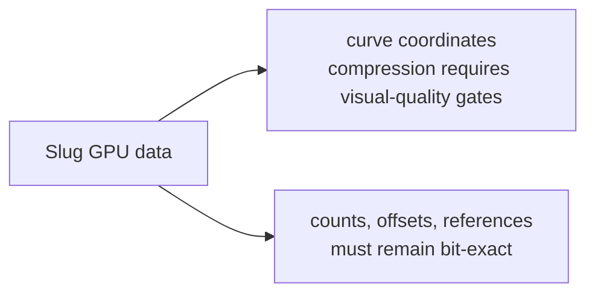
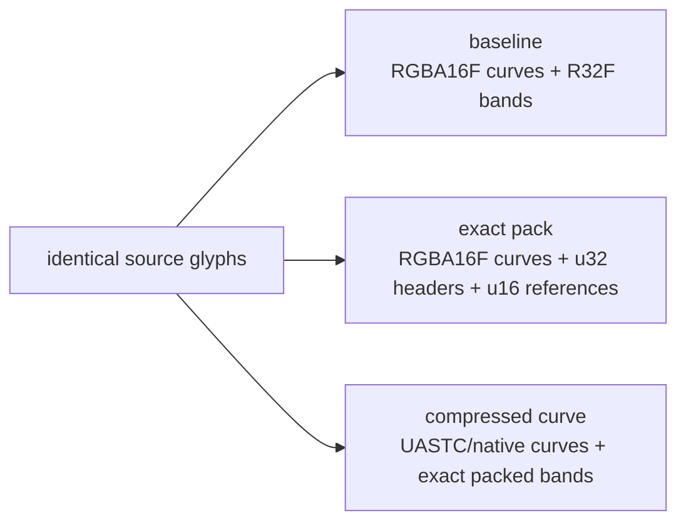

# GPU compression and compact Slug storage

Status: exact band packing adopted by the V0 raster contract; lossy curve and atlas compression remain experiments
Purpose: distinguish smaller downloads from smaller GPU resources and identify which font-raster data can tolerate GPU-native compression.

## Position

GPU compression is valuable for bitmap, color-emoji, and potentially the MTSDF atlas used by the MSDF raster. It is also worth testing for Slug curve control points. It must not be applied indiscriminately to Slug band data.

The Slug textures are random-access data structures rather than ordinary images:



The primary Slug optimization should therefore combine:

1. lossless transport compression for serialized assets;
2. exact structural packing for band data;
3. optional GPU-native block compression for curves only when it passes the project’s visual gates;
4. an uncompressed high-fidelity fallback.

## Rust container-library evaluation

The project should continue to use maintained implementations for parsing, data-format descriptors, and independent validation, while retaining its restricted GLB and KTX2 serializers. The serializers own package policy rather than attempting to model either complete specification.

### Decision summary

- **GLB:** own only the checked 12-byte header, JSON/BIN chunk framing, and four-byte padding around already-serialized package JSON plus one binary payload. Do not import a general scene/document model into the baker.
- **KTX2:** own only one lossless linear 2D level in `R8_UNORM` or `R8G8B8A8_UNORM`. Continue deriving the data-format descriptor from `ktx2` and parsing completed output with that maintained crate.
- **Validation:** keep the serializer and its oracle independent. Rust parser checks, pinned JSON Schemas, Khronos tooling, golden identities, and malformed-input tests must agree before bytes are admitted.
- **Expansion trigger:** move compression, transcoding, mip generation, arrays, cubemaps, or general glTF composition into a maintained library or separately lazy tool when one of those capabilities becomes a real requirement. Do not grow the thin writer into an informal full implementation.

This division is deliberate: generation encodes the package's small canonical subset, while independent implementations prove that the emitted bytes satisfy the wider standards. A general library is not automatically safer if most of its surface is unused and the project-specific extension, resource limits, identities, and ownership rules still require local code.

| Candidate            | Useful coverage                                                                             | Fit for the runtime baker                                                                                                                                                             | Decision                                                                                                                                                          |
| -------------------- | ------------------------------------------------------------------------------------------- | ------------------------------------------------------------------------------------------------------------------------------------------------------------------------------------- | ----------------------------------------------------------------------------------------------------------------------------------------------------------------- |
| `gltf` 1.4.1         | Mature glTF/GLB loader; `Glb` can split and write the binary container                      | Its typed scene graph, `gltf-json`, macros, and general extension surface are much broader than a package-owned JSON extension plus one BIN chunk; the normal crate is `std`-oriented | Keep as reference/host tooling candidate, not a Wasm baker dependency                                                                                             |
| `gltf-json` 1.4.1    | Typed core glTF JSON with Serde serialization; MIT OR Apache-2.0                            | Adds the entire core document model and derive graph while custom PMNDRS extensions still require package-owned values; it does not remove our four-byte framing policy               | Do not add to the baker unless a future general glTF composition feature demonstrates a measured correctness or maintenance win                                   |
| `ktx2` 0.5.0         | Apache-2.0, `no_std` parser/validator, Vulkan format model, and canonical DFD generation    | Excellent match for authoritative DFD construction and independent host validation, but it intentionally exposes no general KTX2 writer                                               | Retain the existing dependency exactly where used                                                                                                                 |
| `ktx2_writer` 0.2.1  | Writes BC6H, Zstd-supercompressed cubemaps                                                  | Its one public encoding path is unrelated to linear R8/RGBA8 one-level font atlas pages                                                                                               | Reject for this use case                                                                                                                                          |
| Khronos KTX-Software | Official full read/write/validate/transcode implementation and tools, including Wasm builds | Comprehensive native/Wasm codec surface is disproportionate for uncompressed one-level pages and would duplicate a large optional module inside the runtime baker                     | Keep as external validation/advanced compression tooling; reconsider only when Basis, Zstd, mip, array, or native block encoding becomes a production requirement |

This matches Khronos guidance that KTX2 is a relatively simple binary container that may be written directly from the specification.[^ktx-developer-guide] Our KTX2 writer is intentionally limited to linear `R8_UNORM` and `R8G8B8A8_UNORM`, one 2D image, one level, no key/value data, no arrays or cubemaps, and no supercompression. Its DFD bytes come from `ktx2`, and `std` builds parse the completed artifact through that maintained implementation.[^ktx2-rs] The GLB writer similarly accepts already-serialized package JSON and one binary payload, then owns only checked lengths, required four-byte padding, and the two standard chunks. The general `gltf` ecosystem remains available for host tools, but its published dependency graph includes the complete `gltf-json` model and `serde_json` rather than a smaller framing primitive.[^gltf-rs][^gltf-json]

The admission rule is therefore capability-based rather than line-count-based: replace either serializer when a maintained Rust crate supports the exact required write subset, preserves `no_std + alloc`, keeps fallible allocation and typed errors, and produces an equal or smaller optimized Wasm graph. Before the subset expands, validate every emitted artifact through the maintained parser, pinned schemas, Khronos validator, golden identity tests, malformed-container tests, and the official KTX tooling where available. Advanced texture encoding belongs in an offline tool or separately lazy baker module until measured evidence justifies its cost.[^ktx-software]

## Three different meanings of compression

| Mechanism                                         | Reduces download | Reduces GPU memory                             | Runtime work                                 | Suitable for exact band data                |
| ------------------------------------------------- | ---------------- | ---------------------------------------------- | -------------------------------------------- | ------------------------------------------- |
| HTTP Brotli/gzip over GLB                         | Yes              | No                                             | Browser inflates before upload               | Yes                                         |
| KTX2 Zstandard or other lossless supercompression | Yes              | No when inflated to an uncompressed GPU format | Inflate before sampling                      | Yes                                         |
| KTX2 Basis Universal                              | Yes              | Usually yes after transcoding to BC/ETC2/ASTC  | Worker/Wasm transcode                        | No; decoded values are lossy                |
| Native BC/ETC2/ASTC blocks in KTX2                | Sometimes        | Yes                                            | Capability selection; otherwise no transcode | No                                          |
| Custom integer/fixed-point packing                | Usually          | Yes                                            | Shader bit extraction/address reconstruction | Yes when the representation is proven exact |

KTX2 is a container, not one compression algorithm. Basis Universal payloads are portable transmission formats that are transcoded to a device-supported GPU format; they are not uploaded unchanged as universal blocks. A KTX2 payload already containing native BC, ETC2, or ASTC blocks can be uploaded directly only when the device supports that format.

The compressed-texture/transcoder module belongs behind the same optional dynamic-import boundary as its raster generator. The baked-first path must not pull KTX2/Basis code into an application whose assets and selected raster do not require it.

## Platform boundary

WebGPU exposes optional `texture-compression-bc`, `texture-compression-etc2`, and `texture-compression-astc` features. An adapter must provide either BC or both ETC2 and ASTC, which permits a universal runtime strategy after capability detection. WebGL2 exposes compressed formats through extensions, so it still requires an uncompressed or separately encoded fallback.

Three.js `KTX2Loader` already detects WebGPU/WebGL renderer capabilities and transcodes Basis Universal data to a supported GPU format. Using it for ordinary atlas/color payloads is established prior art. Slug data textures still require a compatibility spike because they use exact `textureLoad` access and custom linear-data semantics rather than color sampling.

All raster data is linear. No Slug, MTSDF, or grayscale-coverage payload may receive an sRGB conversion.

## Slug band data must remain exact

The reviewed uikit fork stores one packed integer in each R32F band texel:

```text
header    = curveCount << 14 | glyphRelativeListOffset
reference = curveTexelY << 12 | curveTexelX
```

Those values are exact because float32 represents integers through `2^24 - 1` exactly. A one-bit change can produce a wrong loop count, list address, or curve address. BC, ETC, and ASTC reconstruct approximate texel values and are therefore invalid for this data.

There is no portable lossless GPU block-compressed integer texture format in the target WebGPU/WebGL2 baseline. Lossless transport compression remains valid, but it does not reduce the resident resource after inflation.

### Adopted exact V0 representation

Instead of storing an absolute 24-bit curve-texture coordinate for every band reference, V0 stores a glyph-local `u16` curve-texel offset:

```text
headers:         R32UI or equivalent u32 storage
curve references: R16UI local texel offsets
glyph record:     curve base/address

resolved address = glyphCurveBase + localCurveTexelOffset
```

This keeps headers exact and reduces the dominant reference list from four bytes to two bytes per entry. The offset addresses the first/control texel and therefore remains valid across endpoint sharing, contour endpoints, and row padding. The serialized page declares R32UI/R16UI grid dimensions and includes zeroed tail texels, so WebGL2 can upload the bytes as integer textures without repacking and WebGPU can use the same grid bytes in integer textures or storage buffers.

V0 overflow behavior is fixed: a glyph whose curve span, local reference, band count, per-band reference count, or reference offset exceeds `u16` fails baking. It never truncates.

## Slug curve compression experiment

The current optimized curve resource uses RGBA16F:

```text
texel N:     p0.x, p0.y, p1.x, p1.y
texel N + 1: p2.x, p2.y, ...
```

Endpoint sharing makes the next curve’s first point reuse the preceding endpoint texel. RGBA16F costs 64 bits per texel. A high-quality BC7 or ASTC 4×4 target commonly costs 8 bits per texel, suggesting an 8× texture-memory reduction for the curve page before padding and layout changes.

This is not automatically safe:

- BC7/ordinary ASTC are normalized low-dynamic-range formats, so curve coordinates need an explicit normalization and scale/bias contract;
- block compression is lossy and neighboring texels influence reconstruction;
- block boundaries must not accidentally couple unrelated glyph ranges without being tested;
- small coordinate errors can become visible at extreme magnification or alter roots near a contour;
- BC6H retains floating-point range but has only RGB channels, is BC-specific, and would require a different curve layout; it is not a universal default;
- Slug uses exact texel fetches and no mip filtering, so a compressed path must preserve that shader behavior.

Candidate order:

1. UASTC transcoded to BC7 on BC devices and ASTC 4×4 on ASTC devices;
2. a normalized per-page or per-glyph-group coordinate encoding with explicit scale/bias;
3. a BC6H-specific relayout only as an optional desktop experiment;
4. RGBA16F as the required reference/fallback.

ETC1S prioritizes very small transmission size and is not the first candidate for geometric control data. UASTC is the appropriate initial Basis mode because curve and distance-field data require the highest available fidelity.

If the project’s “no quality loss” rule means bit-identical curve coordinates, standard GPU block compression cannot pass. If it means no output difference outside a predeclared pixel/error tolerance over the supported rendering envelope, the experiment may pass only after visual and geometric evidence establishes that result.

## Measured Lucide opportunity

The uikit fork’s checked-in 1,594-shape Lucide asset currently derives to:

```text
curve texture    1,048,576 B  RGBA16F
band texture     2,097,152 B  R32F, power-of-two padded
-------------------------------------------------------
total             3,145,728 B  3 MiB
```

Compressing only the curve page to an 8-bits-per-texel target gives a modeled result:

```text
compressed curve   131,072 B
unchanged bands   2,097,152 B
--------------------------------
total             2,228,224 B  ~2.125 MiB
```

That is approximately a 29% total reduction. Curves are not the dominant Lucide allocation, so curve compression alone cannot deliver an 8× total Slug reduction.

The measured band content contains:

```text
51,008 headers
441,996 deduplicated curve references
```

Modeling headers as u32 and references as u16 gives:

```text
headers      51,008 × 4 =   204,032 B
references 441,996 × 2 =   883,992 B
-----------------------------------
exact band representation         1,088,024 B  ~1.04 MiB
```

Combining that exact representation with an 8-bits-per-texel curve target yields roughly:

```text
curve      131,072 B
bands    1,088,024 B
-------------------
total    1,219,096 B  ~1.16 MiB
```

This is a modeled reduction of approximately 61% from the 3 MiB baseline, before texture-row alignment, headers/directories, or glyph-boundary padding. It is an experiment target, not a payload claim.

Even without lossy curve compression, exact band packing models at about 2.04 MiB total—roughly one third below the current 3 MiB resource. That is the quality-preserving opportunity to pursue first.

## Bitmap, emoji, and distance-field payloads

| Raster                  | Compression stance                                                                                                                        |
| ----------------------- | ----------------------------------------------------------------------------------------------------------------------------------------- |
| Grayscale bitmap strike | Test R/EAC/ASTC-capable targets where the loader can select a compatible single-channel format; retain R8 fallback.                       |
| Color bitmap/emoji      | Strong KTX2 Basis candidate. Use UASTC for quality-sensitive artwork and measure ETC1S where smaller transport matters more.              |
| MSDF (MTSDF RGBA)       | Test UASTC and high-quality native targets only. Channel errors move reconstructed edges and can reduce the usable distance/effect range. |
| Slug curves             | Experimental UASTC/BC7/ASTC path with RGBA16F fallback.                                                                                   |
| Slug bands              | Never use lossy block compression; use exact integer structural packing.                                                                  |

The generated atlas and reference images must be compared after GPU decoding, not merely before KTX2 encoding. The benchmark must report the actual transcode target selected on each device.

## Required experiment and acceptance gates

The compression spike must produce variants from identical source glyphs:



Measure:

- serialized raw, Brotli, and KTX2 bytes;
- transcode module/chunk bytes;
- Worker transcode and main-thread cost;
- upload bytes and time;
- resident GPU bytes including padding;
- additional bindings and shader instructions;
- texture-cache/bandwidth effects and GPU frame time;
- WebGPU and WebGL2 capability/fallback coverage;
- output at 8–64 px UI sizes, perspective/minification, 256–4096 px magnification, outlines, difficult curves, and icon fixtures.

Acceptance rules:

1. Band results and addressed curve sequences are bit-for-bit identical.
2. Exact packing cannot weaken overflow or malformed-data validation.
3. A compressed-curve variant cannot replace RGBA16F unless it passes the established visual/geometric gate on every supported target.
4. A device without the selected compressed format receives a declared fallback, never silently missing text.
5. Headline size claims include dynamic transcoder bytes and report transport and GPU savings separately.
6. No compression path is loaded when the selected raster/assets do not require it.

Plain RGB MSDF is not a merged v0 or target v1 storage option. A smaller RGB-native compressed variant is an experiment only: it must include the loss of true-distance effects, additional format/shader/batch complexity, platform coverage, transport bytes, and GPU bytes in the comparison. It cannot replace the MTSDF baseline from an isolated texture-size result.
