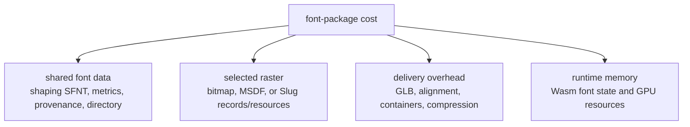
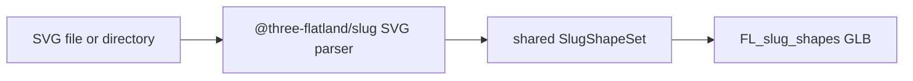

# Font payload budget

Status: measured baseline plus modeled raster estimates
Purpose: keep shaping, serialized raster data, transport bytes, and GPU memory distinct while the first baker is designed.

## What is being counted

A font package has costs that must not be collapsed into one number:



The payloads for Bitmap, MSDF, and Slug are alternatives unless an asset deliberately contains more than one raster. The shaping data is paid once and is shared by every raster. Merged v0 and target v1 MSDF resources are always MTSDF-encoded RGBA8.

The HarfRust Wasm shaper is shared application code, not repeated per font. Its current pre-build envelope is 250–600 KiB raw / 90–250 KiB compressed and must be replaced by the first compiled artifact report. Raster modules, KTX2 transcoders, and renderer adapters are likewise reported as independently loaded code chunks rather than charged to every font.

“Texture bytes” below means the uncompressed GPU-resident storage implied by dimensions and texel format. It is not a network-size estimate. Network bytes depend on the final PNG/KTX2/container choice and must be measured without applying lossy compression that changes rendering quality.

The [GPU compression design note](gpu-compression.md) separates lossless delivery compression, GPU-native block compression, and exact Slug band packing. Its Lucide experiment models roughly 2.04 MiB for quality-preserving curve-plus-band storage before glyph records and padding, or approximately 1.16 MiB on the same scope when combined with a still-unproven compressed-curve path.

## Representative fixtures

Measured source revisions:

- Three Flatland `main`: `c596ac2313e33cace825fe197a6d730269019175`;
- Three Flatland `feat/uikit-fork`: `2935a89fcd9999e8a8b3d3b733f7f7302285cd60`.

Measurements read the checked-in TTF/GLB bytes and their accessor ranges directly. Legacy/Latin fixture compression figures use gzip and Brotli quality 11 over the complete file; the full 16 MiB Noto lane uses explicit gzip 9 and Brotli 9 to keep generation memory bounded. Derived Slug GPU figures apply the texture formats and power-of-two packing rules in the reviewed fork; modeled atlas figures are identified separately.

| Fixture                | Kind                          |                             Coverage |
| ---------------------- | ----------------------------- | -----------------------------------: |
| Inter Regular 4.1      | UI font                       | 2,937 source; 907 legacy Slug glyphs |
| Noto Sans CJK JP 2.004 | Shaping/paragraph conformance |      65,535 source glyphs; no raster |
| Font Awesome Solid     | Icon font                     | 1,403 source; 350 legacy Slug glyphs |
| Lucide                 | SVG icons                     |                   1,594 baked shapes |

Inter exposes the difference between source/shaping coverage and a smaller raster artifact. Font Awesome combines trivial PUA shaping with substantial outline complexity. The checked-in Lucide bake is a realistic full-library Slug stress case.

The first rendering fixture remains pinned Inter. Noto is the pre-render CJK shaping/paragraph conformance fixture; Font Awesome and Lucide are payload/tooling fixtures and do not expand the first rendering slice into automatic icon discovery.

## Shared glyph and shaping data

V0 uses the closed [`opentype-sfnt-harfrust-v0`](shaping-data-contract.md) profile. It keeps the standard metrics and layout tables HarfRust consumes and removes outlines, hinting, font-authored raster data, variation data, names, AAT, and Graphite. It does not duplicate cmap, advances, or kerning into another serialized representation.

| Fixture                               | Full source font | Canonical shaping SFNT | Dense extents + availability | V0 raw shaping payload |
| ------------------------------------- | ---------------: | ---------------------: | ---------------------------: | ---------------------: |
| Inter 4.1, 2,937 glyphs               |        411,640 B |              147,192 B |                     23,864 B |  171,056 B (167.0 KiB) |
| Font Awesome, 1,403 glyphs            |        426,112 B |               24,624 B |                     11,400 B |    36,024 B (35.2 KiB) |
| Noto Sans CJK JP 2.004, 65,535 glyphs |     16,467,736 B |            1,006,900 B |                    532,472 B | 1,539,372 B (1.47 MiB) |

The Inter and Noto rows measure the canonical V0 SFNT plus font-function views outside the portable Wasm core. Font Awesome remains the earlier shaping-only proxy until that licensed fixture enters the canonical baker lane:

| Fixture                                    | Full source gzip | Full source Brotli | V0/proxy shaping gzip | V0/proxy shaping Brotli |
| ------------------------------------------ | ---------------: | -----------------: | --------------------: | ----------------------: |
| Inter 4.1                                  |        200,540 B |          157,517 B |              75,789 B |                55,586 B |
| Font Awesome                               |        172,729 B |          147,594 B |              11,234 B |                 8,017 B |
| Noto Sans CJK JP 2.004 (gzip 9 / Brotli 9) |     13,629,545 B |       12,365,597 B |             654,925 B |               514,547 B |

The canonical SFNT figures are reconstructed directly from the pinned source table directories using the V0 whitelist. Dense extents and the one-bit-per-glyph availability view are exact contract costs. Inter and Noto prove their complete checked-in HarfRust corpora are identical between source and reduced SFNT; Noto additionally agrees with HarfBuzz 13 on every field. Every bake report lists directory, per-table, extents, and availability bytes. The complete Noto core GLB is 1,540,480 raw bytes, 654,597 gzip-9 bytes, and 515,676 Brotli-9 bytes.

Lucide is not a font and has no shaping payload. Its shared records are icon identity, view box, fill/paint, and shape indexes. The existing artifact spends 237,704 B on GLB JSON, largely for named icon metadata; the pmndrs format should measure a compact binary name/index representation rather than inherit that JSON cost by default.

## Measured Slug raster data

### Existing font artifacts

| Fixture      | Slug CPU curve/band/index data | Current GLB GPU textures | Estimated uikit-fork texture layout | Complete current GLB | Brotli q11 |
| ------------ | -----------------------------: | -----------------------: | ----------------------------------: | -------------------: | ---------: |
| Inter        |                      368,722 B |      3,145,728 B (3 MiB) |                 2,097,152 B (2 MiB) |          3,553,932 B |  268,546 B |
| Font Awesome |                      158,130 B |    1,572,864 B (1.5 MiB) |                 1,048,576 B (1 MiB) |          1,746,192 B |  167,698 B |

The old font artifacts use an RG32F band texture. The uikit fork changed bands to R32F while retaining RGBA16F curves, halving band-texture storage for the same dimensions. The estimated optimized totals therefore use:

```text
curve texture: width × height × 8 bytes (RGBA16F)
band texture:  width × height × 4 bytes (R32F)
```

The source CPU columns and final GPU textures are shown separately. `PMNDRS_font_slug` V0 resolves this choice: it retains final GPU records, RGBA16F curve bits, u32 headers, and u16 references only. Editable/source-like curves and nested band data are baker intermediates and are not serialized.

### Existing uikit Lucide SVG bake

The Three Flatland uikit fork already implements:



The full checked-in Lucide artifact contains 1,594 named shapes and measures:

| Section                               |              Raw bytes |
| ------------------------------------- | ---------------------: |
| GLB JSON/name/paint/view-box metadata |              237,704 B |
| Binary index/bounds/offset columns    |               76,000 B |
| Float32 curve data                    |            2,780,856 B |
| Uint16 band data                      |            1,004,324 B |
| Complete GLB                          | 4,098,912 B (3.91 MiB) |
| Complete GLB, Brotli q11              |              997,999 B |

Using the fork’s actual packing rules—4096-wide, power-of-two height, RGBA16F curves and R32F bands—the same set implies:

| GPU resource        | Derived dimensions  |           GPU bytes |
| ------------------- | ------------------- | ------------------: |
| Curve texture       | 4096 × 32 × RGBA16F |         1,048,576 B |
| Band texture        | 4096 × 128 × R32F   |         2,097,152 B |
| Total Slug textures | —                   | 3,145,728 B (3 MiB) |

This proves SVG icon baking, shared shape packing, and realistic library scale already exist as prior art. It also makes subsetting important: shipping a handful of imported icons should not pay the full 1,594-icon library cost.

Relevant prior art:

- [Three Flatland uikit fork at the reviewed revision](https://github.com/thejustinwalsh/three-flatland/tree/2935a89fcd9999e8a8b3d3b733f7f7302285cd60)
- [SVG bake pipeline plan](https://github.com/thejustinwalsh/three-flatland/blob/2935a89fcd9999e8a8b3d3b733f7f7302285cd60/planning/superpowers/plans/svg-bake-pipeline.md)
- [Glyph paging design](https://github.com/thejustinwalsh/three-flatland/blob/2935a89fcd9999e8a8b3d3b733f7f7302285cd60/planning/perf/glyph-paging-design.md)
- [uikit Lucide package](https://github.com/thejustinwalsh/three-flatland/tree/2935a89fcd9999e8a8b3d3b733f7f7302285cd60/packages/uikit-lucide)

## Measured bitmap and MTSDF budgets

The Inter 16 ppem bitmap row and six full-face MTSDF fixtures are exact generator results. Rows explicitly labeled modeled remain capacity estimates.

Assumptions:

- one bitmap grayscale strike uses R8;
- color bitmap/emoji pages use RGBA8 and therefore cost four times an equal-sized R8 page;
- the MSDF engine uses MTSDF RGBA8: RGB is multi-channel distance and alpha is true signed distance;
- distance-field estimates use a representative 32–48 px/em generation range;
- per-glyph plane/atlas/page metadata is budgeted at approximately 20 B per represented glyph;
- atlas dimensions include normal padding but are rounded to plausible power-of-two pages.

| Fixture                                | Raster metadata | Bitmap R8, one representative strike | MSDF raster, MTSDF RGBA8 |
| -------------------------------------- | --------------: | -----------------------------------: | -----------------------: |
| Inter legacy subset, 907 glyphs        |        18,140 B |               ~1 MiB (modeled 1024²) |                 ~4–8 MiB |
| Font Awesome legacy subset, 350 glyphs |         7,000 B |               ~1 MiB (modeled 1024²) |                 ~4–8 MiB |
| Lucide, 1,594 SVG icons                |         ~31 KiB |               ~4 MiB (modeled 2048²) |  ~16 MiB (modeled 2048²) |

The distance-field ranges span a 1024² to 2048×1024 page for the font fixtures. Icon shapes are often near-square and consume more atlas area per entry than proportional text glyphs, so glyph count alone is not a reliable predictor.

Bitmap strikes scale independently. A `[16, 24, 32]` R8 set is not “one 32 px atlas times three”: smaller strikes pack into smaller pages. The baker must report every strike and page separately. RGBA color emoji must likewise be reported separately from grayscale glyph strikes.

The canonical full-face Inter 4.1 bitmap at 16 ppem measures:

| Component                           |                                                                         Exact result |
| ----------------------------------- | -----------------------------------------------------------------------------------: |
| Dense records                       | 58,740 B; SHA-256 `06af881cc3c2b6df60abd4a946ad63f8bd12aed6541cca9b1d90826723ef798a` |
| Present / absent glyphs             |                                                                           2,915 / 22 |
| R8 page                             |                                                           1024 × 679 = 695,296 GPU B |
| Lossless KTX2                       |                                                                            695,444 B |
| Embedded raster GLB                 |                                                                            755,064 B |
| External raster index GLB           |                                                                             59,808 B |
| External index + page               |                                                                            755,252 B |
| Combined core + embedded raster GLB |                                                                            927,164 B |
| Core with external directory        |                                                                            172,476 B |
| Optimized bitmap baker Wasm         |                                  606,995 B raw; 226,695 B gzip; 174,100 B Brotli q11 |

The embedded and external forms have byte-identical records and KTX2 texels. External packaging costs 124 additional serialized bytes for the authenticated URI/length/hash directory.

Useful exact formulas:

```text
bitmap GPU bytes = Σ(pageWidth × pageHeight × bytesPerPixel)
MTSDF GPU bytes  = textureArrayWidth × textureArrayHeight × pageCount × 4
metadata bytes   = glyphRecordStride × representedGlyphCount + page directory
```

MTSDF uploads only its authenticated base level. Bilinear field sampling and screen derivatives reconstruct coverage without conventional mip generation. Reports present download bytes, decoded artifact bytes, unpadded page texels, layer padding, and exact base-array GPU memory separately. Independently authored size tiers remain strike atlases or texture-array layers rather than conventional mip levels.

## Planning totals

For the non-subsetted 2,937-glyph Inter V0 face, the shared cost is fixed and the bitmap generator now supplies its first exact measurement:

| Selected raster           | Shared raw baseline |        Raster GPU storage | Notes                                                                                                       |
| ------------------------- | ------------------: | ------------------------: | ----------------------------------------------------------------------------------------------------------- |
| Generated bitmap, 16 ppem |           167.0 KiB |                 695,296 B | 58,740 B records; 755,064 B embedded companion GLB.                                                         |
| MTSDF                     |           167.0 KiB |              41,943,040 B | 10-page full-face Inter padded base texture array; 6,798,412 B gzip transport and 39,347,712 B decoded GLB. |
| Slug                      |           167.0 KiB | generator report required | 40 B × 2,937 = 117,480 B records; legacy subset derived near 2 MiB.                                         |

For the non-subsetted 1,403-glyph Font Awesome V0 face:

| Selected raster              | Shared raw baseline |        Raster GPU storage | Notes                                                                                                                                  |
| ---------------------------- | ------------------: | ------------------------: | -------------------------------------------------------------------------------------------------------------------------------------- |
| Generated bitmap, one strike |            35.2 KiB | generator report required | 20 B × 1,403 = 28,060 B records.                                                                                                       |
| MSDF                         |            35.2 KiB |              36,347,904 B | Nine-page full-face MTSDF RGBA8 padded base texture array; 28,060 B records, 7,227,824 B gzip transport, and 32,580,900 B decoded GLB. |
| Slug                         |            35.2 KiB | generator report required | 40 B × 1,403 = 56,120 B records; legacy subset derived near 1 MiB.                                                                     |

## Large-coverage CJK and icon envelope

Dense records scale predictably even when page payloads are sparse or independently loaded. At the V0 maximum of 65,535 glyphs:

| Record family      | Exact bytes | Binary size | Notes                                                                            |
| ------------------ | ----------: | ----------: | -------------------------------------------------------------------------------- |
| Bitmap, per strike |   1,310,700 |    1.25 MiB | `20 × 65,535`; may contain mostly `page = 0xffff` records for a selected subset. |
| MSDF               |   1,310,700 |    1.25 MiB | `20 × 65,535`; independent of MTSDF atlas residency.                             |
| Slug               |   2,621,400 |    2.50 MiB | `40 × 65,535`; independent of curve/header/reference page residency.             |

These are metadata envelopes, not estimates of CJK texture cost. Item 5.4 reports only the complete pan-CJK shaping source, retained data, Wasm memory, output, and transport sizes; it creates no texture or residency result. Milestone 13 later reports the companion index separately from embedded/external page bytes, first-layout bytes fetched, peak/resident GPU bytes, page churn, and complete-library stress payload. A selected icon subset and complete icon library are always separate results.

These columns are intentionally not added into a fake single “download size.” Shared raw bytes, compressed transport, and GPU allocations have different lifetimes and compression behavior.

## Required measurement artifact

The first baker and every later raster generator must emit a machine-readable section report:

```ts
interface FontPayloadReport {
  source: { bytes: number };
  shared: Record<string, { rawBytes: number }>;
  rasters: Array<{
    kind: string;
    metadataBytes: number;
    serializedBytes: number;
    gpuBytes: number;
    pages: Array<{
      width: number;
      height: number;
      format: string;
      gpuBytes: number;
      source: 'embedded' | 'external';
      encodedBytes: number;
    }>;
  }>;
  containers: Array<{
    artifactId: string;
    role: 'font' | 'raster' | 'raster-page';
    jsonBytes: number;
    paddingBytes: number;
    totalBytes: number;
  }>;
  transport: Array<{ artifactId: string; format: string; bytes: number }>;
}
```

The benchmark corpus must eventually produce this report for:

1. the pinned Inter source and agreed subset;
2. Font Awesome as an icon-font fixture;
3. a selected subset and the full 1,594-shape Lucide SVG library;
4. each raster independently and an intentionally combined asset;
5. Node and Worker bakes, which must agree on canonical section sizes and pixels.
6. large-coverage index-only load, first-layout page working set, full page directory, and deterministic page-walk residency.

No modeled number becomes a product claim until a checked-in generator, descriptor, source hash, visual reference, and raw report reproduce it.

Plain RGB MSDF is not part of the merged v0 or target v1 totals. A later compression experiment may compare an RGB-capable native block format against the MTSDF baseline, including transport bytes, GPU residency, visual error, effect loss, and extra batch/module complexity. It becomes a supported encoding only if that complete comparison proves a material win.
