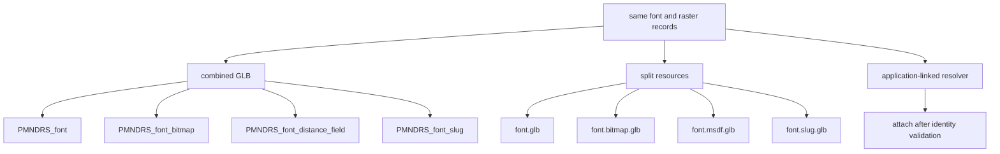

# Raster data contract V0

Status: settled V0; changes require an explicit companion-extension version revision
Scope: independently loadable Bitmap, MSDF, and Slug rasters sharing one font-local glyph space; merged v0 and target v1 MSDF resources use MTSDF encoding

## Logical resources, not a mandatory file split

The format defines one core font resource and zero or more raster resources. Packaging is deliberately orthogonal:



Bundling or splitting MUST NOT change the binary records. A raster is attached to a registered font by the SHA-256 of the canonical shaping payload plus the declared glyph count and ID width. A resource with a mismatched identity is rejected before GPU upload.

The core `PMNDRS_font.rasters` directory describes availability. Each entry contains:

```ts
interface RasterReference {
  rasterKey: string;
  kind: string;
  extension: string;
  version: number;
  source:
    | { type: 'embedded' }
    | { type: 'external'; uri: string; artifactHash: string }
    | { type: 'external'; artifactHash?: string };
}
```

`rasterKey` is the lowercase hexadecimal SHA-256 digest of the UTF-8 bytes of the [RFC 8785](https://www.rfc-editor.org/rfc/rfc8785.html) canonical JSON object below:

```json
{
  "descriptor": {},
  "extension": "PMNDRS_font_bitmap",
  "kind": "bitmap",
  "version": 0
}
```

The package supplies the actual `descriptor`. It MUST include every non-default option that changes required payload content and its generator compatibility version; a generator-versioned canonical default may remain implicit only when every producer and consumer resolves it identically. It MUST contain only JSON values and MUST reject non-finite numbers before canonicalization. For bitmap it includes the complete canonical strike tuple. For MTSDF, the legacy fieldless descriptor means 64 px/em with a full eight-pixel range; any non-default descriptor contains both effective `emSize` and `pixelRange` values, including a default filled for an omitted field. Explicit effective 64/8 canonicalizes back to the legacy descriptor. Object member order in source code is irrelevant because RFC 8785 defines the hashed serialization. Callers do not author keys. A baker, runtime module, and static source analyzer given the same definition MUST derive the same key. `kind` is an open module-owned identifier; core does not enumerate first-party or external raster techniques. `extension` names the companion glTF extension that defines that raster's payload, and `version` selects that companion contract. The three companion extensions below are the packages currently planned by this project, not a closed registry.

An external `uri` uses RFC 3986 URI syntax and glTF's relative-URI resolution rules, but remains a custom extension field rather than a core glTF resource property. Every URI-addressed artifact carries a lowercase SHA-256 `artifactHash` over the complete external artifact and is authenticated before registration. If `uri` is absent, the application must provide the raster through its resolver API; a hash may still be supplied to authenticate those bytes. glTF `extensionsRequired`, not a duplicated raster flag, determines whether unsupported embedded extensions invalidate a combined asset.

A combined GLB may embed at most one raster for a given companion extension name because a glTF root has only one value for each extension key. Additional raster definitions using that extension MUST be external. Registration verifies that the embedded extension root's `rasterKey` equals the elected directory entry; an unrelated root object never satisfies an embedded reference.

Every raster extension root contains the reciprocal binding:

```ts
interface RasterBindingV0 {
  version: 0;
  rasterKey: string;
  shapingHash: string;
  glyphCount: number;
  glyphIdWidth: 16;
}
```

## Shared conventions

- Glyph records are dense and indexed by font-local glyph ID.
- `page = 0xffff` means that glyph has no representation in that raster; all other fields are ignored and SHOULD be zero. Any other value is a logical index into the raster's page directory, never an implicit GPU texture-array layer, binding slot, draw call, or residency guarantee.
- Plane bounds use baseline-relative em coordinates: X increases right, Y increases up.
- A required `planeUnitsPerEm` integer declares fixed-point precision. Decode with `em = stored_i16 / planeUnitsPerEm`.
- Atlas coordinates are unsigned pixel-edge coordinates with upper-left origin, X right, Y down, and right/bottom exclusive.
- Texture data is linear. No grayscale, distance-field, or Slug data is sampled as sRGB.
- Shared advances, kerning, clusters, and line metrics never occur in a raster.
- Record buffer views are aligned to their widest member, tightly packed, and have exactly `glyphCount × recordStride` bytes. Bitmap/distance-field records are two-byte aligned with 20-byte stride; Slug records are four-byte aligned with 40-byte stride.
- Extension-owned record and texture buffer views MUST omit core glTF `byteStride` and `target`; their layout is defined only by the companion extension.
- Every integer property that references a glTF buffer view MUST be named exactly `bufferView` or end in `BufferView`. The generic Node/Worker composer uses this convention to range-check and rebase opaque package-owned extension JSON without maintaining a closed extension registry.
- Texture resources declare dimensions, mip count, exact GPU format, encoding, and an embedded or independently addressable KTX2 source.

## Texture resource

Bitmap and distance-field pages, and losslessly wrapped Slug textures, use the same descriptor:

```ts
interface TextureResourceV0 {
  width: number;
  height: number;
  mipLevelCount: number;
  colorSpace: 'linear' | 'srgb';
  variants: readonly TextureVariantV0[];
}

type ResourceSourceV0 =
  | { type: 'bufferView'; bufferView: number }
  | {
      type: 'external';
      uri: string;
      byteLength: number;
      artifactHash: string;
    };

interface BinaryResourceV0 {
  source: ResourceSourceV0;
}

interface TextureVariantV0 {
  source: ResourceSourceV0;
  container: 'ktx2';
  gpuFormat:
    | 'r8unorm'
    | 'rgba8unorm'
    | 'rgba16float'
    | 'r16uint'
    | 'r32uint'
    | 'bc4-r-unorm'
    | 'bc7-rgba-unorm'
    | 'eac-r11unorm'
    | 'etc2-rgba8unorm'
    | 'astc-4x4-unorm';
  requiredFeature?: 'texture-compression-bc' | 'texture-compression-etc2' | 'texture-compression-astc';
  quality: 'lossless' | 'quality-gated';
}
```

Embedded bytes occupy the complete referenced glTF `bufferView`. An external source URI resolves relative to the companion raster asset, declares its encoded byte length, and requires lowercase SHA-256 over the complete resource. Redirected or cross-origin bytes are accepted only after the same length and hash checks. The page directory and dense glyph records remain in the companion raster asset, so a raster module can determine required logical pages before fetching their payloads.

A variant whose KTX2 `vkFormat` names a native GPU format can be uploaded directly only when the device supports it. A Basis payload requires a dynamically imported transcoder and is not described as direct upload. The runtime selects the first supported variant in listed order. Page sources may be fetched, decoded, uploaded, cached, and evicted independently; all variants belonging to one logical page reconstruct the same declared texel content within their quality class.

Before decompression, transcoding, or upload, the raster module MUST validate the selected source length and hash, parse every KTX2 level, and prove that its decoded byte count equals the size implied by the declared dimensions, mip count, and GPU format. Dimensions MUST fit the active device limits and the configured per-font/per-raster GPU-byte budget. Reversible supercompression and Basis/native transcoding run off the main thread. A size mismatch, hash mismatch, unsupported dimension, arithmetic overflow, or budget excess rejects the page before allocation or GPU submission.

Every V0 raster MUST provide a lossless baseline variant. GPU-native block-compressed variants are additive. They cannot be the sole variant until the supported platform matrix guarantees them.

`quality: 'lossless'` means GPU sampling reconstructs the baseline texels exactly. An uncompressed Vulkan-format KTX2 payload and reversible KTX2 supercompression may use it. BC, ETC/EAC, ASTC, UASTC, and Basis-derived block payloads are lossy for these rasters and MUST be `quality-gated`, even when their source encoder is configured at its highest quality.

For a combined GLB, `extensionsUsed` lists the core and every embedded companion; `extensionsRequired` lists only those whose absence makes that GLB unusable. For a split raster GLB, that document lists its companion extension in both arrays. Merely naming an external companion in the core directory does not mean the companion extension object is used by the core GLB.

JSON Schema cannot express every cross-field requirement. The companion validator additionally enforces unique bitmap `(ppemX, ppemY)` pairs and requires `requiredFeature` to match compressed `gpuFormat` (`bc*` → `texture-compression-bc`, `eac`/`etc2` → `texture-compression-etc2`, `astc` → `texture-compression-astc`). Schema references to `glTFProperty.schema.json` resolve against the Khronos glTF 2.0 schema set.

## `PMNDRS_font_bitmap` V0

V0 bitmap raster contains one or more generated strikes. Each strike owns dense glyph records and one or more atlas pages.

The bitmap API accepts a non-empty, duplicate-free tuple of positive integer ppem values. Each public scalar produces a square `(ppemX, ppemY) = (value, value)` strike. Its package-owned descriptor sorts those values in ascending order before key derivation. The extension's `strikes` array MUST use that canonical order and contain exactly those declared pairs; an artifact missing a requested strike, containing a different strike tuple, or carrying a different `rasterKey` does not satisfy the configured bitmap raster. The loader treats it as a baked miss, emits the normal deduplicated development warning, and automatically invokes the bitmap package's runtime baker when source bytes are available. It never silently substitutes a nearby baked strike for one requested by the font token.

```ts
interface BitmapStrikeV0 {
  ppemX: number;
  ppemY: number;
  planeUnitsPerEm: number;
  recordBufferView: number;
  recordStride: 20;
  pages: readonly TextureResourceV0[];
}
```

### Bitmap glyph record — 20 bytes

| Offset | Type  | Field                  |
| -----: | ----- | ---------------------- |
|      0 | `i16` | plane left             |
|      2 | `i16` | plane bottom           |
|      4 | `i16` | plane right            |
|      6 | `i16` | plane top              |
|      8 | `u16` | atlas left             |
|     10 | `u16` | atlas top              |
|     12 | `u16` | atlas right            |
|     14 | `u16` | atlas bottom           |
|     16 | `u16` | page index or `0xffff` |
|     18 | `u16` | flags; zero in V0      |

For bitmap V0, `planeUnitsPerEm` equals the strike ppem and the four plane values are the rasterizer's integer mask placement converted from its upper-left pixel coordinates into the shared baseline-relative Y-up convention. Consequently, a glyph rendered at its native physical ppem has plane width/height exactly equal to its atlas rectangle width/height. Analytic outline bounds are not valid substitutes because they would rescale already rasterized coverage. Projected quad edges are snapped to physical framebuffer pixels before sampling.

Runtime selection keeps paragraph geometry in logical CSS units. The rendering integration supplies a positive `rasterPixelRatio`; for each font slot the bitmap module computes `targetPpem = maximum CSS font size × rasterPixelRatio` and selects the nearest declared strike, with the lower canonical strike winning an exact tie. This selection rebuilds raster batches while reusing the paragraph. Density strikes remain independent grayscale record/texture sets; they are not packed into RGB(A) channels. The [language and strike bundle plan](language-and-strike-bundles.md) owns external density delivery and display-change residency.

Grayscale strikes use a lossless `r8unorm` KTX2 variant. Optional BC4/EAC/native ASTC variants may reduce GPU residency; the lossless R8 variant remains the correctness baseline. Embedded color emoji uses a separate bitmap raster or strike with `rgba8unorm`, `colorSpace: 'srgb'`, and its own dense records; it is not mixed into a grayscale page.

Hinted grayscale strikes and optional four-phase coverage packing are bounded by the [bitmap hinting research note](bitmap-hinting-research.md). LCD/ClearType subpixel rendering is outside the format's scope.

Exact costs:

```text
records = 20 × glyphCount
R8 base level = Σ(width × height)
RGBA8 base level = Σ(width × height × 4)
```

For the non-subsetted V0 fixtures, records are 58,740 bytes for the pinned 2,937-glyph Inter 4.1 face and 28,060 bytes for 1,403-glyph Font Awesome. A 1024² R8 page is 1,048,576 GPU bytes; actual full-face page counts remain generator outputs.

## `PMNDRS_font_distance_field` V0

This extension is the serialized resource for the public MSDF raster module. Merged v0 and target v1 support one encoding: MTSDF in linear RGBA8. RGB stores the multi-channel signed-distance field and alpha stores true signed distance. The lossless GPU baseline is already four-channel because WebGPU has no ordinary `rgb8unorm` sampled texture format; discarding alpha would not reduce that baseline's GPU residency.

```ts
interface MsdfRasterV0 {
  encoding: 'mtsdf';
  emSize: number;
  pixelRange: number;
  planeUnitsPerEm: number;
  recordBufferView: number;
  recordStride: 20;
  pages: readonly TextureResourceV0[];
}
```

MSDF glyph records are the same 20-byte plane/atlas/page/flags layout as bitmap records. V0 flags are zero. `emSize` is an integer in `1..=1022`; `pixelRange` is an integer in `1..=1020` and denotes the full encoded signed-distance range in atlas pixels. `planeUnitsPerEm` MUST equal `emSize`. The baker surrounds the quantized outline rectangle with `ceil(pixelRange / 2)` texels on each side, including odd full ranges, and the authenticated `pixelRange` remains authoritative for shader reconstruction and effect limits.

The package default remains 64/8 and preserves its established raster key. These controls permit smaller or larger authored fields without implying that a lower-cost setting is universally preferable. Passing validation at 32/4 and 32/6 establishes format and implementation support; source-outline quality, transport, residency, and rendering evidence must select any future recommended default.

One resource and one batch family serve both ordinary text and distance effects. Fill coverage uses the median of RGB; outline, shadow, glow, or another effect may use alpha where true geometric distance is required. A fill-only shader may ignore alpha, but it consumes the same MTSDF atlas. Paint/material differences may still split draws; field encoding never creates separate MSDF and MTSDF batches. Merged v0 and target v1 do not generate or attach a second plain-MSDF atlas.

The required baseline is lossless linear `rgba8unorm` KTX2. UASTC/native BC7, ETC2 RGBA, and ASTC variants are allowed only as `quality-gated` variants because channel error moves reconstructed edges. Their post-GPU-decode images must pass the visual/error corpus; they do not replace the lossless baseline by declaration alone.

Exact costs:

```text
records = 20 × glyphCount
RGBA8 base level = Σ(width × height × 4)
```

The runtime pads every texture-array layer to the maximum page width and height, uploads only that base level, and reconstructs coverage through bilinear sampling plus screen derivatives. The older 4–8 MiB capacity estimates covered the 907/350-glyph raster subsets, not the non-subsetted V0 faces. V0 records are exactly 58,740 B for pinned Inter 4.1 and 28,060 B for Font Awesome; full-face texture bytes are generator outputs rather than extrapolations from an invalid coverage count.

## `PMNDRS_font_slug` V0

Slug is a separate raster GLB when loaded independently. It stores final GPU data only; source-like float32 curves, nested bands, and duplicate CPU/GPU representations are forbidden.

The quality-preserving V0 layout incorporates the existing uikit fork improvements and the exact structural packing already identified in the compression research:

- normalized quadratic curves in RGBA16F;
- endpoint sharing within each contour;
- no curve's first/control texel may be the final texel of a row;
- 16 horizontal and 16 vertical bands by default, declared per glyph;
- identical curve-reference lists deduplicated across all bands of a glyph;
- exact `u32` band headers;
- exact glyph-local `u16` curve-texel offsets;
- paging that never splits a glyph.

### Slug glyph record — 40 bytes

| Offset | Type  | Field                                                                |
| -----: | ----- | -------------------------------------------------------------------- |
|      0 | `i16` | plane left                                                           |
|      2 | `i16` | plane bottom                                                         |
|      4 | `i16` | plane right                                                          |
|      6 | `i16` | plane top                                                            |
|      8 | `u16` | page index or `0xffff`                                               |
|     10 | `u16` | horizontal band count                                                |
|     12 | `u16` | vertical band count                                                  |
|     14 | `u16` | flags; zero in V0                                                    |
|     16 | `u32` | glyph curve-base texel                                               |
|     20 | `u32` | glyph curve-span texels, including contour endpoints and row padding |
|     24 | `u32` | horizontal header base                                               |
|     28 | `u32` | vertical header base                                                 |
|     32 | `u32` | curve-reference base                                                 |
|     36 | `u32` | curve-reference count                                                |

### Curve texture

Each page has one RGBA16F curve texture. For a quadratic `(p0, p1, p2)`, the curve's texel contains `[p0.x, p0.y, p1.x, p1.y]`; the immediately following texel begins `[p2.x, p2.y, ...]`. Adjacent curves in a contour share the endpoint texel. The final endpoint texel stores zero in unused channels. Coordinates are em-space half floats.

The required curve variant is lossless `rgba16float`. KTX2 Zstandard supercompression is allowed because it reconstructs identical half-float bits before upload. Lossy UASTC/BC7/ASTC curve variants remain outside V0 until visual and geometric gates accept them.

### Band headers and references

Each header is one `u32`:

```text
header = (curveCount << 16) | glyphRelativeReferenceOffset
```

Both fields are `u16`. Header arrays contain all horizontal headers followed by all vertical headers for each glyph. A header's reference offset is relative to that glyph's `curveReferenceBase`.

Each reference is a `u16` texel offset relative to the glyph's `curveBaseTexel`:

```text
absoluteCurveTexel = glyph.curveBaseTexel + localCurveTexelOffset
```

The offset addresses the first/control texel for the referenced quadratic. This remains correct across endpoint sharing, contour endpoints, and row padding. A glyph whose curve span, band count, per-band curve count, reference offset, or local curve offset exceeds `u16` is rejected; values are never truncated.

Pages expose the curve payload as RGBA16F, headers as R32UI, and references as R16UI. A renderer may materialize the latter two as integer textures or storage buffers, but their serialized bytes and indexing remain identical.

### Slug page descriptor

```ts
interface SlugPageV0 {
  curve: TextureResourceV0;
  headerCount: number;
  headerWidth: number;
  headerHeight: number;
  headerResource: BinaryResourceV0;
  referenceCount: number;
  referenceWidth: number;
  referenceHeight: number;
  referenceResource: BinaryResourceV0;
}
```

The curve dimensions come only from `curve.width` and `curve.height`. Header and reference arrays use declared two-dimensional storage grids so the exact serialized bytes can be uploaded to WebGL2 `R32UI` and `R16UI` textures without padding or repacking. Their source lengths are exactly `headerWidth × headerHeight × 4` and `referenceWidth × referenceHeight × 2`. Counts MUST fit their grid capacities; unused trailing texels MUST be zero. All dimensions are at least one and within the target device limits. WebGPU implementations may upload the same grids to integer textures or copy the same bytes into storage buffers while preserving logical linear indexing. Embedded sources are four-byte aligned in the GLB; external sources carry the same exact bytes and integrity checks. Curve and integer-texture sampling is nearest and uses one mip level.

All three Slug resources for one logical page—curve, headers, and references—become resident as one page generation. A renderer MUST NOT expose a partially resident page to drawing. Concurrent requests deduplicate by raster identity, logical page index, selected variant, and device; cancellation or eviction of one generation cannot publish stale resources over a newer request.

The shader maps a logical index to `(index % width, index / width)` using the matching declared width. Slug plane bounds are the unpadded analytic glyph bounds used by the curve normalization/band domain; effects expand runtime geometry and do not mutate shaping metrics or these stored bounds.

Exact costs:

```text
glyph records = 40 × glyphCount
curves = Σ(curveWidth × curveHeight × 8)
headers = headerWidth × headerHeight × 4
references = referenceWidth × referenceHeight × 2
```

Measured/modelled evidence:

| Fixture                                |           Current optimized-fork GPU layout |                                                 Exact header/reference layout |           V0 quality-preserving target |
| -------------------------------------- | ------------------------------------------: | ----------------------------------------------------------------------------: | -------------------------------------: |
| Lucide, 1,594 shapes                   | 1,048,576 B curves + 2,097,152 B R32F bands | 204,032 B headers (797×64) + 884,736 B refs (4096×108, 372 zero tail entries) | 2,201,104 B including 63,760 B records |
| Inter legacy subset, 907 glyphs        |       2,097,152 B combined derived textures |                                                     generator report required |                    exact formula above |
| Font Awesome legacy subset, 350 glyphs |       1,048,576 B combined derived textures |                                                     generator report required |                    exact formula above |

The Lucide V0 target is about 2.10 MiB and is quality-preserving. It does not count the speculative lossy curve-compression experiment.

## Loader and API behavior

The caller explicitly selects a configured raster definition, normally through a composed font token. The loader:

1. loads and registers the core font GLB;
2. locates an embedded raster or resolves/fetches an external artifact;
3. dynamically imports only that raster's decoder/renderer module;
4. verifies `shapingHash`, glyph count, ID width, extension version, ranges, and texture capabilities;
5. selects a supported texture variant;
6. creates GPU resources in bulk without per-glyph object reconstruction;
7. attaches the resource to `(FontHandle, rasterKey)`.

Switching or attaching a raster does not reshape text and cannot change paragraph measurement. Multiple raster artifacts may be attached concurrently, but merged v0 and target v1 never attach both plain-MSDF and MTSDF versions of the same MSDF raster.

Bitmap and distance-field glyph records are CPU-consumed typed-array data used to gather quad/UV/page values during bulk instance generation. They require no per-glyph objects, but their 20-byte layout is not claimed as a direct GPU metadata format. Slug headers/references and all selected texture variants are upload-formatted resources.

## Validation fixtures

Every raster format requires golden-byte, range, and GPU-readback fixtures covering:

- bundled and external packaging producing identical records;
- rejecting two embedded raster references with the same companion extension name or an embedded root with the wrong `rasterKey`;
- application-resolved external bytes with no URI;
- missing or mismatched required external `artifactHash`;
- wrong shaping hash, glyph count, ID width, and raster key;
- bitmap artifacts missing a declared strike, containing an undeclared strike, or ordering a non-canonical strike tuple;
- missing pages and the `0xffff` sentinel;
- out-of-range atlas rectangles and page indexes;
- unsupported compressed variants with successful lossless fallback;
- embedded and external page sources, external length/hash failure, relative URI resolution, fetch deduplication, cancellation, eviction, and stale-generation rejection;
- logical page indexes that do not match GPU array layers or draw ordering;
- mismatched KTX2 decoded sizes, oversized dimensions, decompression bombs, format/feature mismatches, and configured GPU-budget overflow;
- misaligned bitmap/distance-field two-byte records and Slug four-byte records;
- Slug header/reference overflow, page-boundary, row-padding, and exact address reconstruction;
- Node/Worker bake parity for records and decoded texture pixels.
