# Canonical implementation roadmap

This is the only active execution order.

In this roadmap, **integration slice** means the internal bitmap proof in milestones 0–7. **v0** is the merged, unreleased
implementation completed through milestone 10. **Target v1** is milestone 11's renderer-neutral core and integration work;
**v1** becomes the first public release only after that API and its integrations pass their gates. The MSDF engine uses MTSDF atlas encoding.

Effort estimates are relative: **S** is one focused change, **M** is a multi-part change normally completed in one or two pull requests, **L** spans several coordinated pull requests, and **XL** is an epic that must be split before implementation.

## Target for the first integration slice

One pinned OpenType font must travel through Node pre-baking and automatic Worker fallback, register as one canonical core font, shape with HarfRust Wasm, reflow in the JavaScript paragraph engine, and render through one generated grayscale bitmap raster on WebGPU and WebGL2.

The architecture supports multiple one-face fonts and independently packaged rasters from the beginning, but the first slice proves one font and one raster.

This slice is an internal integration proof, not a release candidate. MTSDF and Slug subsequently completed the merged v0
renderer baseline. Their completion did not publish a release or freeze the public API; milestone 11 owns that target v1 gate.

> **First executable artifact:** build the shared interactive/headless benchmark harness before the baker, loader, shaper, paragraph engine, or raster. Each implementation milestone adds adapters and scenarios to that existing harness. The first rendered bitmap frame MUST appear there; the roadmap does not authorize a separate throwaway rendering demo that is benchmarked later.

## Implementation order

Status key: ✅ complete · 🟡 in progress · ⬜ not started · ⛔ blocked

| Order | Status | Milestone                                                             | Effort | Depends on          | Exit result                                                                                                  |
| ----: | :----: | --------------------------------------------------------------------- | ------ | ------------------- | ------------------------------------------------------------------------------------------------------------ |
|     0 |   ✅   | Accept contracts, type fixtures, and versions                         | S      | documentation audit | Public inference and identity, ownership, package, and version decisions cannot force a redesign.            |
|     1 |   ✅   | Build benchmark harness and pin fixtures                              | L      | 0                   | The first executable product surface runs shared interactive/headless smoke scenarios over pinned fixtures.  |
|     2 |   ✅   | Build font bake core, bitmap baker package, and Node host             | L      | 1                   | Node composes a valid core GLB and one package-owned bitmap artifact without advanced compiler work.         |
|     3 |   ✅   | Build baked-first loader and Worker fallback                          | L      | 2                   | Baked hits stay small; misses dynamically load the Worker path and reproduce canonical bytes.                |
|     4 |   ✅   | Integrate HarfRust Wasm shaping                                       | L      | 2–3                 | Coarse batch calls match pinned HarfRust fixtures and expose clusters, positions, and flags.                 |
|     5 |   ✅   | Implement paragraph reflow and validate universal shaping assumptions | L      | 4                   | Allocation-light layout passes Latin, bidi/complex-script, and focused CJK source/reduced-font evidence.     |
|     6 |   ✅   | Prove rendering with bitmap inside the benchmark harness              | L      | 3, 5                | The harness produces the first real font frame on WebGPU and WebGL2 with direct bulk upload.                 |
|     7 |   ✅   | Harden the integration proof                                          | L      | 1–6                 | Identity, cancellation, limits, invalid data, package separation, and baselines pass review.                 |
|     8 |   ✅   | Implement and validate MSDF                                           | XL     | 7                   | The MTSDF-backed general-purpose raster passes visual, payload, and GPU performance gates.                   |
|     9 |   ✅   | Port/rewrite and validate Slug                                        | XL     | 7                   | Outline-accurate text passes correctness, packing, visual, and GPU performance gates.                        |
|    10 |   ✅   | Harden the merged v0 renderer baseline                                | L      | 8–9                 | Bitmap, MSDF, and Slug merge as independent modules over one shaping/layout result; no release is published. |
|    11 |   🟡   | Extract the renderer-neutral batched core and engine target contract  | XL     | 10                  | One explicit batch renders through Three.js and Wayfare without renderer dependencies in portable core.      |

Milestones 0–10 are closed. Milestone 11 is the next additive workstream.

Do not start a milestone before its dependencies and exit evidence exist.

```mermaid
flowchart LR
  M0["0 Contracts"] --> M1["1 Benchmark harness first<br/>+ pinned fixtures"]
  M1 --> M2["2 Font core + bitmap baker"]
  M2 --> M3["3 Loader + Worker fallback"]
  M2 --> M4["4 HarfRust shaping"]
  M3 --> M4
  M4 --> M5["5 Paragraph + external layout boundary"]
  M3 --> M6["6 First rendering proof<br/>bitmap in benchmark harness"]
  M5 --> M6
  M6 --> M7["7 Harden integration proof"]
  M7 --> M8["8 MSDF / MTSDF"]
  M7 --> M9["9 Slug"]
  M8 --> M10["10 Shippable raster set"]
  M9 --> M10
  M10 --> M11["11 Renderer-neutral batched core<br/>+ engine targets"]
```

## Issue-sized implementation sequence

These rows replace the former separate backlog. Each is intended to become one focused issue or a short, explicitly linked PR sequence.

| ID    | Status | Work                                                                                                                                                                                                                                                                           | Size | Depends on |
| ----- | :----: | ------------------------------------------------------------------------------------------------------------------------------------------------------------------------------------------------------------------------------------------------------------------------------ | :--: | ---------- |
| 0.1   |   ✅   | Accept public core/React APIs, typed raster capabilities, URL resolution, and ESM-only exports.                                                                                                                                                                                |  S   | —          |
| 0.2   |   ✅   | Make the initial `@pmndrs/text` contract shim preserve font/raster literals and pass positive/negative composition fixtures.                                                                                                                                                   |  S   | 0.1        |
| 0.3   |   ✅   | Accept identity, GLB, Worker, and version contracts.                                                                                                                                                                                                                           |  S   | 0.2        |
| 1.1   |   ✅   | Build shared benchmark target/scenario/result contracts and a deterministic synthetic smoke target.                                                                                                                                                                            |  M   | 0.3        |
| 1.2   |   ✅   | Add the interactive lab, headless runner, raw result export, and package-size lane over the same registry.                                                                                                                                                                     |  M   | 1.1        |
| 1.3   |   ✅   | Pin the source font, HarfRust/HarfBuzz shaping oracles, and browser HTML/CSS visual reference as harness fixtures.                                                                                                                                                             |  M   | 1.2        |
| 2.1   |   ✅   | Implement static `defineFont` discovery, literal raster extraction, and conservative local source resolution.                                                                                                                                                                  |  M   | 1.3        |
| 2.2   |   ✅   | Implement the host-independent font bake request/result core.                                                                                                                                                                                                                  |  M   | 2.1        |
| 2.3   |   ✅   | Emit/validate the core font and declared package-owned bitmap strikes.                                                                                                                                                                                                         |  M   | 2.2        |
| 2.4   |   ✅   | Add the Node API, CLI, deterministic bytes, and report.                                                                                                                                                                                                                        |  M   | 2.3        |
| 3.1   |   ✅   | Implement baked probing, validation, and registration.                                                                                                                                                                                                                         |  M   | 2.4        |
| 3.2   |   ✅   | Add the dynamically imported Worker bake path.                                                                                                                                                                                                                                 |  M   | 3.1        |
| 3.3   |   ✅   | Prove Node/Worker parity, cancellation, and import isolation.                                                                                                                                                                                                                  |  M   | 3.2        |
| 4.1   |   ✅   | Register fonts and cache HarfRust data/plans in Wasm.                                                                                                                                                                                                                          |  M   | 2.2        |
| 4.2   |   ✅   | Implement batched shape/reshape ABI and conformance fixtures.                                                                                                                                                                                                                  |  M   | 4.1        |
| 5.1   |   ✅   | Build paragraph analysis, measured clusters, greedy breaks, and allocation-light `measure`.                                                                                                                                                                                    |  M   | 4.2        |
| 5.2   |   ✅   | Add final positioned `layout`, reflow caches, and batched boundary reshaping.                                                                                                                                                                                                  |  M   | 5.1        |
| 5.3   |   ✅   | Add alignment, clipping, max-lines, ellipsis, bidi, and current-uikit adapter fixtures.                                                                                                                                                                                        |  M   | 5.2        |
| 5.4   |   ✅   | Pin one redistributable pan-CJK face and prove source/reduced HarfRust, HarfBuzz, horizontal paragraph layout, fuzz, and Node/Chromium/Vitexec evidence without renderer or paging work.                                                                                       |  L   | 5.3        |
| 6.0   |   ✅   | Establish the current-repository TSL compiler, shader, and live WebGPU/WebGL2 baseline without broad type erasure.                                                                                                                                                             |  S   | 3.3, 5.4   |
| 6.1   |   ✅   | Upload/render bitmap records and textures as the harness's first real raster target on WebGPU/WebGL2.                                                                                                                                                                          |  M   | 6.0        |
| 6.2   |   ✅   | Implement the Three.js `Text` object over the bitmap proof.                                                                                                                                                                                                                    |  M   | 6.1        |
| 6.3   |   ✅   | Implement `@pmndrs/text/react` as a thin reconciliation layer.                                                                                                                                                                                                                 |  M   | 6.2        |
| 6.4   |   ✅   | Rework the harness into a benchmark-first human control plane with a separate visual conformance mode.                                                                                                                                                                         |  M   | 6.1–6.3    |
| 7.1   |   ✅   | Harden lifecycle, invalid input, limits, and package graphs.                                                                                                                                                                                                                   |  M   | 1–6        |
| 7.2   |   ✅   | Ship the advanced-shaping showcase and record end-to-end conformance/performance baselines.                                                                                                                                                                                    |  M   | 7.1        |
| 8.1   |   ✅   | Implement the repository-owned deterministic `no_std` Rust MTSDF core and pass panic, scalar/SIMD, Wasm, size, fuzz, and native-msdfgen quality gates.                                                                                                                         |  L   | 7.2        |
| 8.2   |   ✅   | Implement the fixed MTSDF baker, canonical 20-byte records, linear RGBA8 KTX2 payload, and embedded/external parity.                                                                                                                                                           |  XL  | 8.1        |
| 8.3   |   ✅   | Implement the optional MSDF runtime module, strict validation, one resource/batch family, paint effects, and disposal.                                                                                                                                                         |  L   | 8.2        |
| 8.4   |   ✅   | Implement one version-matched TSL MTSDF graph for WebGPU and WebGL2 with resize, transform, base-level minification, and effects scenes.                                                                                                                                       |  L   | 8.3        |
| 8.5   |   ✅   | Record visual-error, atlas, upload, memory, bundle-isolation, and steady-state rendering evidence.                                                                                                                                                                             |  XL  | 8.4        |
| 8.6   |   ✅   | Add configurable MTSDF quality, bounded runtime-atlas options, compiler-derived Wasm ABI layouts, and measured baker performance hardening before closing Milestone 8.                                                                                                         |  XL  | 8.5        |
| 9.1   |   ✅   | Port Slug outline conversion, exact normalization/bands, compact packing, deterministic baker, validator, and embedded/external resources.                                                                                                                                     |  XL  | 7.2        |
| 9.2   |   ✅   | Copy and adapt the version-matched analytic TSL fill runtime, batching, lifecycle, fail-closed paint boundary, and public `Text` integration.                                                                                                                                  |  XL  | 9.1        |
| 9.3   |   ✅   | Integrate Slug into the shared benchmark/conformance product, raster-role scenes, source-outline matrix, and complete two-axis icon-font grid.                                                                                                                                 |  XL  | 9.2        |
| 9.4   |   ✅   | Reproduce the applicable prior-fork performance baseline, evaluate retained challengers, and close payload, residency, frame-time, and bundle-isolation gates.                                                                                                                 |  XL  | 9.3        |
| 10.1  |   ✅   | Replace the optional Three-shaped plugin seam with one required renderer-neutral transactional raster lifecycle and retain Three.js as an adapter.                                                                                                                             |  L   | 8.6, 9.4   |
| 10.2  |   ✅   | Publish warm shaping, layout, paint planning, and raster staging through the Three.js object-update lifecycle without consumer `ready` waits.                                                                                                                                  |  L   | 10.1       |
| 10.3  |   ✅   | Add bounded glyph-capacity slack, complete in-place field replacement, authoritative shrink counts, overflow replacement, and coalesced dirty uploads to all three rasters.                                                                                                    |  XL  | 10.2       |
| 10.4  |   ✅   | Prove the public extension boundary with a private workspace raster/baker package that owns a new kind, artifact, adapter, retained updates, overflow, abort, and disposal.                                                                                                    |  L   | 10.1, 10.3 |
| 10.5  |   ✅   | Remove benchmark recycling workarounds and prove Icon Grid plus every Presentation workload through sequential, timed, allocation, cadence, dual-backend, and React Doctor gates.                                                                                              |  XL  | 10.2–10.4  |
| 10.6  |   ✅   | Complete raster switching, v0 conformance, public API review, recommendations, plugin authoring guidance, package-size evidence, and signed stacked merge.                                                                                                                     |  L   | 10.5       |
| 11.1  |   ✅   | Freeze the accepted README/API fixtures and capture current Three.js behavior, package graphs, rendering, allocation, and shaping baselines.                                                                                                                                   |  M   | 10.6       |
| 11.2  |   ✅   | Split portable raster decoding/bindings/packing from GPU realization; export reusable backend `RasterShader` algorithms and exact-typed programs, retaining native TSL and reusable TypeGPU paths.                                                                             |  L   | 11.1       |
| 11.3  |   ✅   | Implement `TextRuntime`, same-technique `FontStack`, batch-owned `Paragraph` handles, desired snapshots/font leases, typed `txt`/`span`, opaque batch/paragraph/span render variants, capacity, and origin overrides.                                                          |  XL  | 11.2       |
| 11.4  |   ✅   | Implement dirty-channel coalescing plus per-call `update()` and Promise/callback `updateAsync()` synchronization with cross-batch atomic publication, cancellation, and supersession.                                                                                          |  XL  | 11.3       |
| 11.5  |   ✅   | Move raster-resource partitioning, typed bindings, stable slots, overflow chunks, canonical CPU storage, dirty/live ranges, attachments, resolved variants, and ordered `PreparedGlyphRun` values into core.                                                                   |  XL  | 11.3–11.4  |
| 11.6  |   ✅   | Rebuild Bitmap, MTSDF, and Slug behind `FontLoader` → `TextGroup` → `Text`, including program-selected variants, reusable canonical shaders, optional TSL effects, late binding, native ordering, and renderer isolation.                                                      |  XL  | 11.5       |
| 11.7  |   ✅   | Rebuild React Three Fiber over the same retained `TextGroup`/`Text` lifecycle, letting Three synchronize once per batch during render while preserving nested spans.                                                                                                           |  L   | 11.6       |
| 11.8  |   🟡   | Run the TypeGPU-first capability gate, then implement reusable complete-stage TypeGPU raster programs and only the minimal direct pass encoder needed to prove the same public core batches/runs through TypeGPU and Wayfare.                                                  |  XL  | 11.5       |
| 11.9  |   ⬜   | Prove TypeGPU-authored Bitmap/MTSDF/Slug through pinned `@typegpu/three`, including real textures, dependent loads, loops, vertex work, generated shaders, forced WebGPU/WebGL2 capability, pixels, and isolated cost; retain native TSL unless every promised backend passes. |  L   | 11.6, 11.8 |
| 11.10 |   ⬜   | Prove an external gpucat package against public core and technique exports, including ordering limits, partial uploads, lifetime, TypeGPU/WGSL reuse, and an explicit GLSL companion or WebGPU-only scope, without a core change or private import.                            |  L   | 11.5, 11.8 |
| 11.11 |   🟡   | Reconcile implementation against the authoritative README and engine contract, remove the merged v0 surface, update package concepts/digests, and close package, browser, GPU, size, and OKF gates before declaring v1.                                                        |  L   | 11.6–11.10 |
| 11.12 |   ⬜   | Bake underline position/thickness and strikeout position/size into font metrics without implementing decoration rendering, so text decoration becomes an additive renderer feature instead of an artifact version bump and a re-bake of every shipped font.                     |  S   | 11.6       |
| 11.13 |   ⬜   | Prove the shaping and layout contract can represent a break-inserted hyphen glyph that has no source cluster, and fix the contract if it cannot. Language patterns, break selection, and justification quality controls remain later work.                                      |  M   | 11.6       |
| 11.14 |   ⬜   | Add the professional typography the editorial showcase requires: `wordSpacing`, first-line indent, paragraph space before/after, and justification controls covering minimum/maximum word-space ratio, letter-space expansion, and last-line policy.                            |  L   | 11.12–11.13 |
| 11.15 |   ⬜   | Settle Three material authority, so applications supply their own `NodeMaterial` and gain lighting, shadows, and depth-composited effects without implementing a raster program. Resolve the open edges in the [material authority concept](../planning/three-material-authority.md) first; it is a recorded proposal, not an accepted design. |  M   | 11.6       |

## Milestone 0 — accept contracts and versions

### 0.1 closure checklist

- [x] Candidate core and React surfaces are documented in the [API reference](../planning/api-shapes.md#milestone-01-acceptance-evidence).
- [x] Core font/raster capability inference and positive/negative composition cases have compile-only evidence.
- [x] Canonical URL forms and invalid source/baked combinations have compile-only evidence.
- [x] The current root package export is ESM-only and contains no CommonJS condition.
- [x] Maintainer explicitly accepted D-001, D-004–009, D-067, D-068, and D-070 for V0 in the [decision register](../planning/decision-register.md#product-and-public-api).
- [x] Item 0.2 adds the remaining React-prop and package/export contract fixtures after those public choices are accepted.

Item 0.1 is closed; the 0.2 evidence is recorded below.

### 0.2 closure checklist

- [x] Font, raster, resource, draw-batch, option, runtime-baker, and baker-descriptor literals survive composition.
- [x] Positive and intentional negative fixtures cover raw/composed fonts, raster options, static bitmap tuples, atomic updates, paragraph constraints, and invalid artifact pairings.
- [x] React props derive distributively from core properties, retain raw-font/raster coupling, and accept React Three Fiber group props.
- [x] `useFont`, preload, and lazy-raster contract types preserve exact font and raster types.
- [x] A package test rejects CommonJS fields, `require` conditions, or non-ESM JavaScript export targets.

Item 0.2 is closed; the 0.3 evidence is recorded below.

### 0.3 closure checklist

- [x] The maintainer accepted the identity, GLB, shaping payload, Worker boundary, loading, package-ownership, and version contracts through item 3.3.
- [x] Font-local glyph identity is `(FontHandle, LocalGlyphId)` with one selected face per core artifact and `u16` V0 glyph IDs.
- [x] Core and raster GLBs retain identical schemas whether embedded or external and bind through shaping/raster hashes.
- [x] Node and module-Worker hosts share one portable core; baked hits cannot reach the Worker, Wasm baker, or optional generators.
- [x] Exact HarfRust, HarfBuzz, Unicode, glTF schema, validator, ABI, format, and initial generator versions are recorded in the [version contract](../planning/version-contract.md).
- [x] The generated ABI JSON exposes those pins, and Rust provenance consumes the same constants.

Milestone 0 is closed. Milestone 1 is now the active dependency.

Deliver:

- maintainer review of the core/React [API](../planning/api-shapes.md), [architecture](../planning/architecture.md), [shaping data](../planning/shaping-data-contract.md), and [raster data](../planning/raster-data-contract.md);
- accepted font identity `(FontHandle, LocalGlyphId)` and one-face asset rule;
- accepted canonical URL, baked-sibling, baked-only, explicit override, and preload rules;
- accepted ESM-only export map, module-Worker boundary, and absence of CommonJS artifacts;
- accepted inferred font/raster/baker capability tokens, required configuration options, static bitmap strike tuples, an open raster directory with no mandatory package list, non-generic `Text`, and compile-time fixtures;
- accepted embedded/external raster binding;
- pinned HarfRust, HarfBuzz reference, Unicode, glTF schema, and generator versions;
- decision records for any revised contract.

The contract-only TypeScript shim may contain identity factories such as `defineRaster` and `defineRasterBaker`; it must not implement loading, shaping, paragraph, baking, or rendering behavior.

## Milestone 1 — build the benchmark harness first and pin fixtures

### 1.2 closure checklist

- [x] The responsive Figma-backed interactive lab selects targets/scenarios, preserves URL state, reports lifecycle/correctness, and exports raw JSON.
- [x] Interactive, Vitest, Vitexec, and browser-headless paths call the same strict target/scenario registry execution module.
- [x] The headless CLI emits the versioned summary to stdout or an explicit output file and fails on browser console/page errors.
- [x] Browser readiness and completion use Vite lifecycle and benchmark completion promises without sleeps, frame-count waits, retries, or polling.
- [x] Independent library-mode builds report nonzero raw, minified, gzip, and Brotli sizes for browser core and baker JavaScript plus raw/gzip/Brotli baker Wasm.
- [x] The future Unicode-property-table size entry is explicitly unavailable rather than reported as zero bytes.
- [x] Vitest, production build, headless browser smoke, Vitexec GPU launch, and 390×844 Playwright navigation pass.

Item 1.2 is closed. Item 1.3 is now the active dependency; it replaces local/conditional font input with licensed immutable fixtures and structured/visual oracles.

### 1.3 progress checklist

- [x] Inter Regular 4.1 source/archive member, release commit, OFL-1.1 text, byte sizes, and SHA-256 hashes are immutable and checked in.
- [x] The package real-font E2E is mandatory and verifies fixture identity before invoking the compiled Wasm package.
- [x] The shared interactive/headless baker target defaults to the canonical bytes and produces deterministic GLB output; local upload remains an explicit override.
- [x] The UTF-16 corpus covers kerning and ligature toggles, decomposed marks, supplementary decode, variation selectors, spaces, and explicit newline.
- [x] Repository commands generate HarfRust 0.12.0 and HarfBuzz 13.0.0 JSON oracles and refuse incompatible engine inputs.
- [x] A differential test proves core shaping equality and fixes the exact unsafe-to-concat flag-delta inventory.
- [x] The deterministic HTML/CSS reference records exact font/text/style/viewport/browser inputs and a hashed PNG.
- [x] Pin the remaining bitmap, paragraph, GLB, malformed-input, GPU-readback, maximum-cardinality, and empty identity contract fixtures.
- [x] Admit the no-retry Vitexec probe with the required repetition, fresh-lifecycle, and environment evidence.

Item 1.3 and Milestone 1 are closed. The admission record binds commit `016078cecee3daaf90243c1473aa9c0168fadbc5`, the probe hash, 100 zero-retry executions, 10 fresh browser/server lifecycles, exact environment metadata, and two intentional-failure controls. Its GPU-friendly Chromium runs report WebGPU availability but correctly make no GPU-rendering claim before a renderer exists. Milestone 2 continues at item 2.3.

Deliver:

- the repository's first executable product surface, before any production font implementation;
- Vite, React 19, React Compiler, modern async React resources/actions, the Figma-backed custom shadcn-derived component set, Oxlint, and Oxfmt configured as the app foundation;
- shared target, scenario, capability, sample, result, and validation contracts;
- the canonical [unit, package-integration, product-E2E, conformance, and performance test ownership ladder](../planning/conformance-plan.md#test-layers-and-ownership);
- one deterministic synthetic smoke target proving interactive/headless parity without pretending to benchmark the future font engine;
- one real portable-baker target proving Wasm startup, source-to-GLB correctness, deterministic artifacts, diagnostics, payload, and memory without pretending to render text;
- interactive browser lab with shareable URL state and phase/result panels;
- headless local/CI runner importing the same scenario registry and policies;
- Vitest scenario assertions plus a Vitexec local live-probe lane for visible, stateful, and hardware-GPU behavior, reusable through headed or remote Playwright where representative;
- committed erasable-TypeScript probes satisfying the [no-timer, no-retry determinism and admission contract](../planning/conformance-plan.md#live-probe-determinism-contract);
- independent package-size lane and raw result export;
- a dedicated package-size entry for the version-pinned JS Unicode property tables used by bidi, script itemization, line breaking, and grapheme segmentation;
- authorized Inter Regular fixture with exact URL, license, version, and SHA-256;
- UTF-16 text corpus and HarfBuzz/HarfRust expected outputs;
- deterministic browser HTML/CSS visual-reference captures using the exact fixture font and scenario inputs;
- pinned contracts and source inputs for bitmap-strike, paragraph-layout, GLB, malformed-input, and GPU-readback fixtures;
- benchmark environment manifest and result schema;
- synthetic 65,535-glyph, multi-page record/source fixture proving logical page identity without a real CJK bake;
- empty multi-font/multi-raster contract fixtures that test identity without adding product behavior.

Exit only when the Figma-backed lab is usable, synthetic and portable-baker targets produce the same validated results through interactive and automated paths, unavailable raster targets remain honestly capability-gated, every oracle can be regenerated deterministically, and the initial live probes pass their zero-retry admission runs. Later milestones extend this harness through public package adapters and real-font scenarios; none creates a parallel benchmark or demo architecture, and no user-visible slice closes without its capability-appropriate automated or admitted local product-E2E case.

## Milestone 2 — font bake core, bitmap baker package, and Node host

### 2.1 closure checklist

- [x] TypeScript 7 parser and symbol APIs identify aliased `defineFont`, core `Text`, and React `Text` raw forms without regular-expression matching or application-module execution.
- [x] The immutable evaluator follows local/imported `const` values, concatenations, templates, URL objects, source overrides, JSON raster options, and baked-only inputs.
- [x] Module-relative, root-relative, absolute-web, and dynamic-origin path suffixes resolve conservatively through canonical configured asset roots.
- [x] Query/fragment removal, segment-wise percent decoding, traversal rejection, missing files, ambiguity, and exact resolved spelling have executable fixtures.
- [x] Third-party raster selection is limited to the exact imported package and an exported ESM baker entry that resolves inside that package.
- [x] Package integration tests cover successful mappings plus dynamic input, dynamic strikes, unsafe paths, malformed manifests, CommonJS targets, and package escape attempts.
- [x] TypeScript, TSX, JavaScript, and JSX are admitted source forms; a plain-JavaScript project fixture proves alias and immutable-constant behavior without application execution.
- [x] One exact-version adapter owns every unstable TypeScript import and snapshot/symbol-handle operation; package tests fail on version drift or imports outside that boundary.

Item 2.1 is closed. Its analyzer remains internal until item 2.4 exposes the complete `@pmndrs/text/bake` Node API and CLI; item 2.3 is the active dependency after 2.2 closed.

### 2.2 closure checklist

- [x] The portable TypeScript boundary accepts exactly one `FontBakeRequestV0` and returns `FontBakeResultV0`; Node's separate filesystem-oriented `bakeFont(options)` name remains reserved for item 2.4.
- [x] One `no_std + alloc`, zero-import `wasm32-unknown-unknown` core is shared-ready for Node and Worker hosts through the generated direct-memory ABI with no WASI or binding generator.
- [x] Fontations owns SFNT/TTC parsing and Skrifa owns maintained glyph bounds; fixtures cover invalid bytes, WOFF/WOFF2, required tables, variable/AAT shaping systems, TTC face selection, and out-of-range face indexes.
- [x] The canonical Inter 4.1 result binds exact source, descriptor, artifact, shaping, table, metric, extent, and byte identities in its immutable fixture manifest.
- [x] The reduced SFNT has a sorted closed table set, valid offsets, alignment, padding, table checksums, whole-font checksum, duplicated metrics, dense extents, availability bits, and domain-separated shaping hash.
- [x] Every checked-in shaping case produces identical HarfRust 0.12.0 glyph IDs, UTF-16 clusters, positions, and flags from the source and reduced SFNT.
- [x] Pinned Binaryen 129.0.0 `-Oz` optimization reduces the distributed module while zero-import, ABI, deterministic artifact, and real-font tests remain unchanged.

Item 2.2 is closed. Item 2.3 adds the core/raster validators plus the package-owned bitmap descriptor, baker, artifact, composition seam, and goldens.

### 2.3 closure checklist

- [x] The core-owned validator performs strict GLB framing/range/padding checks before parsing untrusted payloads.
- [x] Pinned Khronos glTF Validator 2.0.0-dev.3.10 runs offline and retains its report; only exact reviewed unsupported-extension and extension-owned-buffer informational messages are admitted.
- [x] Ajv 6.15.0 evaluates the canonical Draft-04 `PMNDRS_font` schema against the vendored Khronos revision, with byte-identity and required-field/union mutation fixtures.
- [x] Core semantic and payload validation covers buffer containment/non-overlap, versions, reciprocal raster identity, closed SFNT/checksums/metrics, dense extents, zero padding, and shaping identity.
- [x] The canonical Inter product path uses the merged validator, while the baker-only entry remains import-isolated from Ajv and `gltf-validator`.
- [x] Fixed-seed Rust-input and TypeScript artifact-mutation fuzz smoke tests run in the ordinary suite; longer mutation drivers plus pinned cargo-fuzz/libFuzzer coverage promote minimized findings into permanent malformed fixtures.
- [x] The bitmap-owned module canonicalizes static strike tuples and derives the RFC 8785 raster key without a parallel core descriptor union.
- [x] The bitmap baker emits deterministic unhinted grayscale strikes, dense 20-byte records, lossless R8 KTX2 pages, reports, and embedded/external packaging.
- [x] Font-scoped bitmap/page filenames bind shaping and raster identity; atlas-compatible ppem bounds and streaming glyph placement reject impossible requests without retaining a second full-face bitmap set.
- [x] The bitmap-owned validator covers schema, reciprocal identity, exact strikes, records, pages/KTX2, limits, and one-invalid-field-at-a-time malformed artifacts.
- [x] Canonical Inter bitmap bytes and synthetic maximum-cardinality/empty identities are pinned and round-trip through the same core used by later hosts.

Item 2.3 is closed. Exact goldens bind split, combined-embedded, combined-external, and empty-raster artifacts; the generic composer proves opaque buffer-view rebasing across multiple distinct extension types.

### 2.4 closure checklist

- [x] `@pmndrs/text/bake` exports the filesystem-oriented `bakeFont` and discovery-oriented `bakeProject` Node APIs without adding Node built-ins to browser-safe entry points.
- [x] The generic `bakeFont` tuple preserves each selected raster package's exact option and packaging types; compile-only fixtures reject an empty bitmap strike tuple and unsupported packaging.
- [x] `bakeProject` consumes the canonical TypeScript discovery report, groups and deduplicates one source deterministically, and dynamically imports only each already-verified ESM baker entry.
- [x] The thin native-ESM `pmndrs-text-bake` command covers conventional project defaults, repeatable entry/asset-root options, mirrored output roots, human output, JSON output, help, malformed arguments, and diagnostic exit status.
- [x] Exact Inter embedded/external goldens, mixed embedded/external raster composition, and repeated project runs prove authoritative byte and output-report determinism.
- [x] Writes use same-directory exclusive temporary files, file synchronization, atomic rename, cancellation cleanup, source/output overlap checks, unique targets, and single-filename artifact IDs.
- [x] The completed report records phase and total timing, before/after RSS, explicitly labeled process-lifetime peak RSS, output paths/roles/bytes/hashes, container bytes, and raw/gzip/Brotli transport bytes.
- [x] Node `Buffer` validation is repeatable and non-mutating; a regression protects SFNT `checksumAdjustment` from Buffer's aliasing `slice` semantics.
- [x] Package and integration tests cover the public subpath/bin/manifest, exact CLI/API behavior, selected-baker loading, path escape rejection before filesystem mutation, cancellation, and deterministic output mirroring.

Item 2.4 and Milestone 2 are closed. Items 3.1 and 3.2 are closed; item 3.3 is active and must prove host parity, cancellation, and package-graph isolation.

Deliver:

- host-independent font bake request/result library;
- TypeScript-AST project discovery for composed font tokens and statically declared raster options;
- reported, unambiguous mapping from module-relative and application URL paths into configured local asset roots;
- source validation and face selection;
- deterministic reduced shaping SFNT, dense extents, and one-bit-per-glyph extents availability;
- package-owned bitmap descriptor, baker, statically declared unhinted grayscale strikes, and 20-byte dense glyph records;
- core-owned `PMNDRS_font` writer/validator and bitmap-package-owned `PMNDRS_font_bitmap` writer/validator;
- `@pmndrs/text/bake` Node API and thin CLI;
- bake timing, peak memory, and byte report.
- generated canonical GLB/bitmap goldens and malformed-input fixtures from the same bake core used by the Worker host; GPU readback goldens become executable with the Milestone 6 renderer.

Explicitly exclude subsetting, shaping closure, dense remapping, compiled layout IR, MSDF, and Slug.

## Milestone 3 — baked-first loader and Worker fallback

### 3.1 closure checklist

- [x] String, `URL`, `{ source }`, `{ source, baked }`, and `{ baked }` inputs normalize against one base, remove fragments, preserve queries, detect baked-only GLBs, and derive exact case-insensitive TTF/OTF/WOFF/WOFF2 or extensionless siblings.
- [x] Concurrent equivalent requests share one versioned promise key; validated shaping identity deduplicates registration within a registry while separate registries and post-disposal generations remain isolated.
- [x] Baked hits run the merged GLB/Khronos/schema/semantic/payload validator before registration, distinguish missing, invalid, incompatible-version, fetch, and resource-limit failures, and cannot reach the runtime baker, bitmap baker, Node host, or bake Wasm in the initial graph.
- [x] Registration owns caller bytes, extracts the exact reduced SFNT, glyph extents, availability bits, metrics, Unicode/source provenance, and raster directory needed by later shaping without reparsing the source font.
- [x] Loader fixtures compare every extracted shaping byte to the independently validated GLB views; milestone 4 consumes these same retained views for bit-for-bit corpus shaping rather than creating a second extraction path.
- [x] Embedded/external delivery variants for one raster key merge without changing identity; generic attachment checks GLB framing, Khronos output, buffer ranges, reciprocal font/raster identity, artifact hash, and immutable copied views while package semantics remain module-owned.
- [x] External companion URLs resolve relative to the exact core-asset context, application resolvers can intercept, runtime-produced assets authenticate their source bytes against provenance, and baked-only failures never fetch or bake a source.
- [x] Development missing-sibling warnings deduplicate, production suppresses them, invalid/incompatible assets emit structured diagnostics before allowed fallback, and non-hierarchical source URLs skip sibling warnings.
- [x] Configured artifact/view/raster limits apply before caller-byte copies and while streaming responses even without trustworthy `Content-Length`; cancellation detaches a caller without corrupting a shared completed result.
- [x] Real Inter integration tests cover hits, injected fallback seam, registration, disposal, embedded/external rasters, hash failure, limits, and input forms; fixed-seed loader mutation fuzzing requires deterministic, non-mutating outcomes.

Item 3.1 is closed. Item 3.2 is active and replaces the injected fallback seam's absent default with the dynamically imported module-Worker host over the exact portable bake core.

### 3.2 closure checklist

- [x] A baked miss dynamically imports `@pmndrs/text/runtime-bake`; the initial browser graph contains only the import boundary and cannot construct a Worker or reach the bake wrapper/Wasm.
- [x] The standard host creates a named module Worker lazily, queues concurrent requests behind one active bake, reuses that instance within the burst, copies only the source transfer buffer needed to preserve loader provenance, and transfers the returned artifact buffer.
- [x] The Worker imports the exact portable `@pmndrs/text-font-baker` wrapper, lazily instantiates the same optimized `font_baker.wasm`, accepts only the versioned face descriptor, and serializes structured failures.
- [x] The loader routes standard fallback output through the same provenance and hostile-input validator used for baked hits before registration.
- [x] Canonical Inter integration tests exercise the public host, default loader path, transfer lists, Worker entry, and exact portable-core artifact bytes; package tests prove the runtime host/Worker/Wasm remain outside the static entry graph.
- [x] Independent size lanes report the runtime host, Worker JavaScript, and portable Wasm separately instead of folding lazy code or Wasm into the initial core.

Item 3.2 is closed. Item 3.3 is active and adds browser-executed Node/Worker authoritative-byte parity, shared-operation cancellation, and complete packed/bundled import-isolation evidence.

### 3.3 closure checklist

- [x] The benchmark product has a real `font-loader-worker` target and `worker-fallback` scenario over public package surfaces; Chromium first hashes the module-Worker artifact against the canonical Node artifact, validates/registers it, and then measures the missing-sibling loader path.
- [x] The Chromium 149 gate passes the synthetic, direct portable-baker, and public loader-Worker scenarios with three deterministic samples after one warmup; the loader scenario returns the canonical 172,140-byte payload and shaping identity on every sample.
- [x] Concurrent callers retain one shared request; detaching one does not abort it, while detaching the final consumer aborts the underlying fetch/stream or Worker request and the next load starts fresh.
- [x] An idle Worker with only cancelled work is terminated immediately and recreated successfully on the next request; no delay, polling, retry, or timer controls lifecycle.
- [x] Queued cancellation removes only that job; active cancellation terminates the uncancellable bake, recreates the Worker, and resumes FIFO work. Integration tests prove one active post, while a local Vitexec probe records authenticated burst/sequential timing without a flaky threshold.
- [x] Browser execution covers the native `fetch` receiver contract, module Worker, package-relative Wasm asset, transferred buffers, hostile-input validator, provenance check, registration, and disposal. The product test caught and permanently fixed an illegal native-fetch invocation that Node could not expose.
- [x] Emitted-package tests prove the root loader has only dynamic runtime/validator boundaries and no static Worker, Wasm, Node-host, or raster-baker edge; independent Rollup closures report initial core, validator, runtime host, Worker JavaScript, and Wasm separately.
- [x] Canonical source/request deduplication, missing/invalid/incompatible behavior, development warning deduplication, baked-only isolation, limits, fuzz smoke, and exact GLB shaping-view extraction remain green under the final shared-cancellation implementation.

Item 3.3 and Milestone 3 are closed. Item 4.1 is active and must register the exact retained GLB-extracted SFNT in HarfRust Wasm without introducing a second font extraction path.

### 4.1 closure checklist

- [x] A package-owned Rust crate builds one `no_std + alloc`, no-WASI `wasm32-unknown-unknown` HarfRust module and exposes only a Rust-generated direct-memory ABI.
- [x] The TypeScript bridge registers only the validator-retained shaping SFNT, dense glyph extents, and availability bits; it never reparses the GLB or reconstructs a source font.
- [x] Canonical Inter registration retains exactly 171,056 shaping bytes, is idempotent for the same scoped handle, rejects cross-registry ownership, and releases Wasm state when either the font or shaper is disposed.
- [x] Package build, export, ESM, type, unit, integration, and independent JavaScript/Wasm size lanes cover the new boundary; the optimized registration-only baseline was 91,382 bytes before batch shaping landed.
- [x] Shape-plan cache keys include direction, script, normalized language, and HarfRust-equivalent feature tag/value/globalness; each font retains its 64 most recently used plans, equivalent calls reuse plans, non-equivalent feature plans remain distinct, and font disposal releases every plan.

Item 4.1 is closed.

### 4.2 closure checklist

- [x] Rust generates the complete JSON ABI, including every 32-bit request/result offset, 16-byte feature record, 32-byte run record, 24-byte reshape-range record, status, and export name; the TypeScript bridge consumes and exact-version-checks that contract.
- [x] `shapeBatch` and `reshapeRanges` each cross the boundary once per batch and return aligned borrowed SoA views with 16-bit glyph IDs, absolute UTF-16 clusters, four signed positions, and all three mapped HarfRust glyph flags.
- [x] Every one of the eight pinned Inter HarfRust cases travels source TTF → portable baker GLB → independent hostile-input validator → `FontRegistry` shaping-view extraction → Wasm registration → both public shaping calls, then compares glyph count, IDs, clusters, advances, offsets, and flags bit-for-bit.
- [x] A two-run fixture proves run/font indexes, absolute clusters, one-call batching, and plan reuse; UTF-16 surrogate boundaries, tags, ranges, flags, ownership, zero-import ABI identity, extents decoding, and fixed-seed raw request mutations have focused failures.
- [x] The real benchmark product runs all eight cases as one 97-glyph Chromium batch, validates hash `dc30c21c`, records 2,412 output bytes, one boundary crossing, three plans, 171,056 retained font bytes, 1,638,400 linear-memory bytes, and raw cold/warm timings after correctness passes.
- [x] The complete optimized module and bridge are measured independently at 680,312 raw / 253,568 gzip / 199,365 Brotli Wasm bytes and 32,778 minified / 9,288 gzip / 8,257 Brotli JavaScript bytes.

Item 4.2 and Milestone 4 are closed. Item 5.1 closure evidence is recorded under Milestone 5.

Deliver:

- deterministic baked sibling resolution;
- shorthand string/URL, explicit override, baked-only, preload, and query/fragment fixtures;
- valid-hit, missing, invalid, and incompatible asset behavior;
- development-only deduplicated pre-bake warning;
- dynamically imported runtime baker library and Worker host;
- transferable source/results and selected generator imports;
- in-memory request/result deduplication;
- Node/Worker authoritative-byte parity and import-graph tests.

Exit only when a baked hit cannot reach the runtime baker, Worker, bake Wasm, or generator in the application graph.

## Milestone 4 — HarfRust Wasm shaping

Deliver:

- opaque font registration and disposal;
- cached HarfRust font data and shape plans;
- one coarse `shapeBatch` call and one coarse `reshapeRanges` call;
- structure-of-arrays result views with UTF-16 clusters and mapped flags;
- bit-for-bit comparison against the pinned HarfRust corpus;
- recorded cold/warm call time, memory, and boundary-crossing count.

HarfRust reads the retained SFNT tables in Wasm. The milestone does not claim compiled-IR or zero table interpretation.

## Milestone 5 — JavaScript paragraph reflow

### 5.1 closure checklist

- [x] The public engine prepares immutable paragraph/span/style input over an active `RuntimeShaper`, validates span boundaries against extended grapheme clusters, and resolves overlapping style, font, feature, language, and explicit-direction ranges.
- [x] Generated Unicode 17 Script and Script_Extensions tables come from the pinned official UCD package; `unicode-segmenter` 0.15.0 supplies UAX #29 boundaries and `@cto.af/linebreak` 4.0.3 supplies UAX #14 opportunities.
- [x] Ordinary package tests verify all 766 official Unicode 17 extended-grapheme vectors and all 19,338 official line-break vectors from hash-pinned deterministic gzip fixtures; malformed UTF-16 and selected Script/Script_Extensions values have focused regressions.
- [x] One broad HarfRust shape is copied immediately out of the borrowed Wasm arena and converted into font-scaled, letter-spaced measured grapheme clusters with unsafe-break information, explicit hard breaks, line metrics, and baselines.
- [x] Greedy word/character wrapping handles mandatory breaks, trailing empty lines, over-wide clusters, and shaping-safe emergency boundaries. Equivalent unconstrained/at-most/exactly measurements reuse one frozen result and never materialize positioned glyph arrays.
- [x] Canonical Inter travels source TTF → portable baker GLB → hostile-input validator → retained shaping views → HarfRust Wasm → paragraph measurement. Exact HarfRust-derived natural, 720 px, and 360 px widths are `847.625`, `696.734375`, and `356.546875`; unrelated shaper calls prove cached ownership.
- [x] The real Chromium benchmark repeats the three exact layouts with hash `79874b9d`, one preparation shape, zero reshapes/reflow boundary crossings, zero positioned-glyph bytes, and a measured independent Unicode-analysis size lane of 139,936 minified / 42,047 gzip / 30,989 Brotli bytes.

Item 5.1 is closed; the positioned output and boundary-sensitive reshape evidence that followed is recorded below.

### 5.2 closure checklist

- [x] `layout()` shares prepared analysis, broad shaping, and cached line plans with `measure()` while materializing paragraph-owned `fontHandles`, font slots, glyph IDs, UTF-16 clusters, font sizes, x/y positions, flags, and parallel line arrays only on demand.
- [x] Full layouts cache by complete normalized constraints; positioned line geometry caches independently by effective line policy, so identical hot layouts reuse one object and height-only box changes reuse the exact glyph arrays without another Wasm call. Every paragraph cache retains at most its 32 most recently used variants.
- [x] Unsafe-to-concat line fragments become one `reshapeRanges` request per changed-width layout. Canonical 720 px and 360 px layouts batch exactly two and three line ranges respectively with full-run context and line BOT/EOT flags; the natural unbroken layout reuses the broad shape with zero reshapes.
- [x] The canonical paragraph contract owns exact measurement values, 55-glyph IDs/clusters/flags, line text/glyph ranges, Float32 baselines/advances, and registry-independent byte-level hashes `bb15bbcc`, `4f111a3f`, and `e8c0e9d5` for natural, wide, and narrow layouts.
- [x] Integration tests derive natural x/y placement from the checked-in HarfRust glyph advances/offsets and GLB-extracted font metrics, compare every shaped identity field after boundary reshape, prove borrowed-arena invalidation cannot mutate cached layout arrays, and prove shaping-policy updates invalidate both measurement and layout caches.
- [x] Chromium records three deterministic 3,786-byte aggregate outputs with one broad shape and two total reshape crossings; the GPU Vitexec probe runs measurement and positioned scenarios sequentially, which caught and removed registry-scoped font handles from the portable golden hash while still validating the live handle separately.

Item 5.2 is closed. Item 5.3 closure evidence follows.

### 5.3 closure checklist

- [x] The package-owned `no_std + alloc` shaper uses `unicode-bidi` 0.3.18's maintained UAX #9 algorithm with its bundled Unicode 16 data disabled and repository-generated Unicode 17 `Bidi_Class`/paired-bracket data supplied through the crate's custom data-source seam.
- [x] Rust executes all 770,241 direction-expanded `BidiTest.txt` cases and all 91,707 `BidiCharacterTest.txt` cases from hash-pinned Unicode 17 gzip fixtures, comparing paragraph levels, every specified resolved level, and complete visual index order; direct-memory Wasm integration separately proves UTF-16/supplementary-plane indexing and explicit/automatic direction.
- [x] Paragraph preparation intersects resolved style/script ranges with bidi level runs, shapes each run in its resolved direction, applies line-specific UAX #9 L1/L2 ordering, and fixes exact mixed-direction glyph identity/position goldens through the retained-GLB HarfRust path.
- [x] Start/center/end/justify alignment, clipping, max-lines, and ellipsis have exact policy fixtures, cache/invalidation evidence, mandatory-break truncation coverage, and no unreported shaping boundary crossings.
- [x] A current-uikit-shaped fixture proves repeated allocation-light measurement, Yoga-mode translation, final content-box layout, point-scale rounding ownership, and dirtying without a Yoga dependency in core.
- [x] The real Chromium benchmark and GPU Vitexec lane execute the bidi/policy fixtures with deterministic recorded output before item 5.3 closes.

Item 5.3 is closed. The generated contract fixes two Amiri mixed-direction layouts, nine Inter line-policy layouts, and one current-uikit-shaped final content-box layout with complete glyph/line arrays and twelve portable hashes. Amiri 1.002 separately proves source-font HarfRust equals HarfRust over the reduced SFNT extracted from the validated GLB, while pinned HarfBuzz 13 agrees on every Arabic/Latin glyph field. Chromium 149 records three deterministic 8,098-byte runs with four preparation shapes and five batched reshapes; the GPU Vitexec lane repeats the same contract with WebGPU active. Item 5.4 closure evidence follows.

Deliver:

- paragraph, span, style, and constraint models;
- version-matched UAX #9 bidi analysis/reordering, UAX #24 script itemization, UAX #14 break opportunities, and UAX #29 grapheme boundaries;
- measured clusters and legal break representation;
- greedy wrapping, alignment, clipping, max-lines, and ellipsis for the fixture scope;
- broad-shape and width-layout caches;
- one batched boundary-reshape seam;
- synchronous unconstrained/at-most/exactly axis constraints, allocation-light measurement, final positioned layout, and explicit paragraph baselines;
- a current-uikit-shaped fixture proving `CustomLayouting` derivation, Yoga-mode translation, final content-box signal layout, point-scale rounding ownership, and dirtying rules without adding Yoga to core;
- wide/narrow and bidi-aware golden layouts.

Width changes always reflow. Simple reflow crosses into Wasm zero times; boundary-sensitive changes cross once for the batch.

The milestone is not complete until a retained-layout leaf can repeatedly measure a prepared paragraph without materializing positioned glyph arrays, then obtain final glyph positions for its resolved content box without implementing line breaking. The concrete compatibility fixture mirrors current uikit's `CustomLayouting → FlexNode/Yoga → size signal → positioned layout` flow; the production adapter remains owned by uikit.

### 5.4 CJK shaping and paragraph universality

This item validates the existing bake, shaping, Unicode, and paragraph contracts against CJK before rendering begins. It must not add renderer integration, raster paging, sparse glyph coverage, font fallback, or vertical layout.

Deliver:

- one pinned redistributable pan-CJK face with immutable bytes, license, upstream provenance, selected face index, glyph/table inventory, and source/shaping payload budgets;
- a focused horizontal corpus covering Simplified and Traditional Chinese, Japanese kana/kanji, precomposed and Jamo Korean, CJK punctuation and ideographic spaces, mixed Latin/CJK, supplementary-plane Han, standardized variation sequences, ideographic variation sequences where the fixture supports them, and paragraphs without spaces;
- exact HarfRust source-font oracles and exact-version HarfBuzz structured oracles with UTF-16 clusters, glyph IDs, advances, offsets, and flags;
- source font → portable bake → validated GLB → extracted reduced SFNT → HarfRust equality, including `cmap` formats 12/14, language-sensitive `locl`, GSUB/GPOS behavior, selected-face provenance, `u16` glyph identity, and checked payload/offset arithmetic;
- deterministic paragraph measurement and positioned-layout fixtures covering grapheme-safe spans, UAX #14 no-space line opportunities and punctuation boundaries, mixed scripts, supplementary clusters, variation sequences, width reflow, and safe batched boundary reshaping;
- deterministic CJK-focused malformed-input and fixed-seed fuzz smoke for surrogate/variation-selector boundaries, language tags, line constraints, and repeated shaping/layout;
- Node integration plus the shared Chromium headless and GPU-capable Vitexec lanes, reporting exact hashes, shaping calls, glyph counts, retained bytes, Wasm memory, raw/compressed shaping payload, and cold/warm timings before any rendering metric exists.

Exit only when the complete horizontal corpus is byte-exact through the source and reduced-font HarfRust paths, the independent HarfBuzz oracle agrees under the documented normalization policy, and Node/Chromium/Vitexec paragraph outputs are deterministic. Any genuine mismatch in the retained SFNT profile, UTF-16 clustering, language selection, variation handling, glyph-width assumptions, or line layout blocks rendering work.

Large-coverage raster paging remains in Milestone 14. Vertical-form source tables must survive baking when present, but vertical shaping/layout remains deferred.

### 5.4 closure checklist

- [x] Noto Sans CJK JP Regular 2.004 is checked in with immutable upstream commit, selected face index, OFL text, byte lengths, and SHA-256 identities.
- [x] The fixture inspector uses Fontations `read-fonts` and proves 65,535 glyphs, `cmap` formats 4/6/12/14, supplementary Han, SVS, IVS, and the retained source-table inventory.
- [x] Thirteen language-tagged CJK cases match source and reduced-font HarfRust exactly and agree field-for-field with authenticated HarfBuzz 13.0.0 output.
- [x] `BASE`, `VORG`, `vhea`, and `vmtx` survive baking exactly when present; the baker does not fabricate them and vertical shaping/layout remains deferred.
- [x] Four public-pipeline paragraphs produce twelve exact natural/wide/narrow layouts with contextual Script_Extensions, grapheme/UTF-16-safe clusters, no-space breaks, deterministic ownership, and zero reshapes for the fixed corpus.
- [x] Malformed language/surrogate/variation/constraint cases and fixed-seed CJK mutations are deterministic and trap-free.
- [x] Node integration, Chromium 149 headless, GPU-enabled Vitexec, and the mobile Playwright flow pass through the shared benchmark registry without timers, retries, renderer metrics, or paging claims.

Item 5.4 and Milestones 5 and 6 are closed.

## Milestone 6 — first rendering proof: bitmap in the benchmark harness

Items 6.0 and 6.1 are closed on the repository's current Three.js 0.185.1, `@types/three` 0.185.1, TypeScript 7.0.2, and React Three Fiber 10.0.0-alpha.2 pins. Repository code uses only `three/webgpu`, `three/tsl`, and `@react-three/fiber/webgpu`; forced WebGL2 remains a backend of `WebGPURenderer`. R3F's WebGPU entry carries a narrow patch removing eager browser-only Inspector registration during Node import, and test renderer 9.1.0 is patched to resolve Three and R3F through the same WebGPU entries. The repository-owned `@types/three` patch narrows `modelViewProjection` to its runtime `Node<'vec4'>` contract and carries upstream's `NodeExtras` lookup-map rewrite, eliminating the conditional type tree that made ordinary TSL expressions expand pathologically. A compile-only fixture owns both gaps and covers method-chain, scalar/vector, integer, bitwise, derivative, and loop operations. Clean declaration plus package checks complete in under one second without a compiler process guard, a downgrade, or disabled checking. The baseline TSL graph runs through `WebGPURenderer` on an asserted WebGPU backend and forced WebGL2 fallback with exact 4×4 RGBA8 hash `fec0f57de0b19bc7dacb5b0fc3de7b56fc68dfdbeeebc8f9f4c506bf6e821c77`.

The first real font frame travels through composed Inter GLB loading, the public framework-neutral `Text`, retained HarfRust shaping, paragraph positioning, strict bitmap record/KTX2 decode, direct R8 texture upload, order-preserving instanced batching, and one shared TSL material. Explicit 1× and 2× runs each execute three measured samples after one warmup on WebGPU and forced WebGL2. Both backends render the five-lane benchmark ipsum as 120 visible glyphs with zero missing glyphs, in one draw from 695,296 atlas bytes. Bitmap density is a hard contract rather than an implicit layout scale: CSS font size remains stable across DPR, the rendering integration supplies `rasterPixelRatio`, and the bitmap module targets `CSS size × ratio` when choosing a declared physical strike. The existing exact conformance capture deliberately uses 16 device pixels at both DPRs; the live product keeps 16 CSS pixels and exposes visible degradation until a 32 ppem strike is present at 2×. Raster records retain Zeno's actual integer placement with `planeUnitsPerEm = 16`, and the TSL graph snaps projected quad edges to physical pixels. A benchmark-only CPU compositor places authenticated atlas texels and matches every normalized GPU byte for the full frame and a resized clipped frame. WebGPU and forced WebGL2 produce identical full-frame hashes: `a47930d3…e893` at 1× and `95b20e05…a34d` at 2×. Both DPRs contain the same 3,473 half-coverage pixels; bounds are `[68, 18, 313, 112]` and `[260, 82, 505, 176]`. Framebuffer bytes are 196,608 at 1× and 786,432 at 2×; total tracked bytes are 891,904 and 1,481,728. The shared registry also owns a deterministic React reconciler scenario that retains one core object across nested-span reflow. Bitmap rejects outline/shadow rather than silently discarding them; hinted grayscale and four-phase packing remain documented research, and LCD/ClearType rendering is out of scope.

Items 6.2–6.4 and Milestone 6 are closed after the deferred combined Milestone 6/8 adversarial review. Every actionable lifecycle finding was reproduced and remediated, including pending semantic no-ops, callback-only ownership, failed-generation retry, paint-generation identity, terminal invalidation scope, and explicit disposal cleanup. The corrected human default is a continuously rendered benchmark control plane showing consumer-facing startup, retained-size, CPU-frame, FPS, and supported GPU-time evidence. Conformance is a separate finite deep-inspection surface showing candidate, reference, difference, structured evidence, and end-to-end test duration. Technique, backend, and workload are independent user controls; target and scenario remain internal runner concepts. The Figma wireframe supplies visual direction rather than prescribing product information architecture.

The five-line, 120-glyph text above is now named the diagnostic conformance specimen. The separate paragraph-scale live benchmark renders 1,151 glyphs through the same single-draw bitmap path.

### 6.2 closure checklist

- [x] The public framework-neutral `Text` is a real Three.js `Group` with atomic property validation and one explicit ownership lifecycle.
- [x] Initial readiness, generation replacement, stale cancellation, paint-only updates, width reflow, shaping invalidation, and disposal have deterministic integration tests over the canonical Inter GLB.
- [x] Distinct span fonts resolve independent raster resources while sharing registry-scoped loader, shaper, and raster caches.
- [x] Every raster draw batch exposes its Three.js object and deterministic disposal contract.
- [x] The Milestone 6 adversarial review has no unresolved actionable finding against item 6.2.

### 6.3 closure checklist

- [x] The React 19 wrapper retains one core object, forwards its ref, and maps ordinary R3F object props without duplicating core behavior.
- [x] Nested `<Text>` nodes flatten into one string plus ordered inherited spans; non-text children and nested object/layout properties fail explicitly.
- [x] `useFont`, `.preload`, `.clear`, and `lazyRaster` share core dependency caches and expose deterministic Suspense boundaries.
- [x] Resolved R3F reconciliation and browser-pending Suspense have executable evidence without sleeps, retries, or timer cushions.
- [x] The Milestone 6 adversarial review has no unresolved actionable finding against item 6.3.

### 6.4 closure checklist

- [x] The default route opens a live benchmark rather than an internal runner overview or conformance case.
- [x] Human-facing controls use mode, technique, backend, and workload; target/scenario terminology is absent from the primary UI.
- [x] Benchmark mode continuously renders paragraph-scale benchmark ipsum and separates startup/loading costs, retained sizes, CPU-frame time, FPS, and GPU time when supported.
- [x] Conformance mode is finite and visibly presents candidate, reference, difference, correctness statistics, and end-to-end test duration without calling that duration render performance.
- [x] Bitmap frame is classified as conformance; text ladder, off-axis/3D, dynamic layout, paragraph stress, and Paint & Effects are classified as live visual benchmarks.
- [x] WebGPU/WebGL2 and 1×/2× DPR remain explicit, shareable, and independently testable.
- [x] The benchmark-ipsum concept documents the diagnostic specimen and paragraph-scale workload separately.
- [x] Live telemetry uses fixed-capacity preallocated histories, presents CPU/FPS/GPU graphs without inventing unavailable GPU data, and snapshots histories only on explicit capture.
- [x] Benchmark controls expose logical CSS size, physical device size, selected strike, and proportional paragraph width; DPR changes preserve layout geometry while viewport changes exercise retained paragraph reflow.
- [x] Publish representative 16/32 ppem bitmap fixtures and prove automatic nearest-strike selection, transfer/residency reporting, and stable 16 CSS px layout at 1×/2×.
- [x] Runtime font and raster bakers expose bounded typed progress from the Worker-hosted synchronous Wasm pass; the app presents determinate progress and coalesced development-console evidence without polling or render-loop instrumentation.
- [x] Deterministic unit, headless, and maintainer-local live probes cover the corrected product surface without sleeps or retries.
- [x] The maintainer-local live probe produces real timestamp-query samples and cleanly replaces the renderer across WebGPU → forced WebGL2 → WebGPU.
- [x] The responsive shell keeps control typography, label fit, whitespace flow, and horizontal overflow within explicit 390 px, 1,024 px, and 1,280 px product gates; compact widths retain the live scene beneath a wordmark workload drawer, shared technique switcher, and scrollable 60%-height controls panel.

Deliver:

- optional bitmap raster module;
- KTX2 lossless R8 path, flat record validation, bulk GPU upload, and instance batching;
- framework-neutral Three.js `Text` object owning the paragraph/raster lifecycle;
- `@pmndrs/text/react` wrapper with Suspense font loading, direct props, nested inline `<Text>`, and ref forwarding;
- the harness's first real rendering target and scenario on WebGPU and WebGL2, including clipping and resize;
- first-draw, frame-time, GPU-memory, and quality reports.

Bitmap is the first real rendering target because it proves the complete boundary with the least generator risk. Its first frame, visual fixtures, and timings live in the milestone-1 harness. It does not become the universal default by virtue of being first.

## Milestone 7 — harden the integration proof

Deliver:

- stale-handle, cancellation, source/resource limit, corrupt GLB, and unsupported capability tests;
- React reconciliation, nested-span flattening, Suspense, ref, and disposal tests against the same core object behavior;
- second registration of the same font proving scoped identity and lifecycle;
- offline/Worker byte parity and cold/warm end-to-end benchmark reports;
- a deterministic advanced-shaping showcase using the real paragraph/rendering path: editable and typewriter-driven text, continuous container reflow, smooth glyph-position interpolation, and reviewed Arabic joining, Indic reordering, bidi, ligature/mark, and CJK line-break cases;
- pause, step, and scrub controls that make every showcase transition reproducible without timer-based test assertions, with the same definitions reused by headless runs;
- populated interactive lab scenarios for loading, paragraph reflow, and bitmap rendering using the same definitions as headless runs;
- explicit conformance and benchmark modes in the shared app and shareable URL, with technique, WebGPU/WebGL2 backend, and workload as independent controls: conformance visibly presents browser/reference, candidate, difference, structured results, and all validation statistics, while benchmark mode is a full live scene organized around consumer cost;
- performance scenarios that separate bake, Wasm startup, font registration, shaping, layout, upload, first draw, warm CPU frame, and warm GPU frame costs from conformance work; WebGPU timestamp queries and WebGL2 disjoint timer queries feed CPU-ms, FPS, and GPU-ms sparklines in the full responsive design, with unsupported GPU timing reported explicitly;
- tree-shaking and dynamic-import bundle assertions;
- packed-package assertions for native ESM, every public subpath, module workers, and rejected CommonJS loading;
- accepted ADRs and updated extension schemas;
- an autoresearch baseline with optimization campaigns still disabled.

Milestone 7 authorizes implementation of the remaining v0 rasters; it does not authorize a package release.

### 7.1 closure checklist

- [x] Reject stale font and raster generations, including a disposed decode that finishes asynchronously, without publishing a dead resource.
- [x] Exercise shared-request cancellation, source/artifact limits, corrupt GLB input, and unsupported bitmap capabilities through deterministic package and browser tests.
- [x] Prove React reconciliation, nested-span flattening, Suspense, ref forwarding, and disposal against the framework-neutral `Text` object.
- [x] Re-register the same artifact after disposal with a distinct handle, the same shaping identity, independent plan ownership, and no resurrection of the stale handle.
- [x] Record complete offline/Worker byte parity with cold initialization plus first bake separated from warm same-instance bake.
- [x] Inspect real consumer-bundler module graphs so runtime baking remains dynamic and React, raster, Node, validator, Worker, and Wasm host implementations stay outside the browser-core entry.
- [x] Pack the package, import every JavaScript and resource export from the tarball, confirm the emitted module-Worker boundary, and reject CommonJS loading.
- [x] Execute the CLI and runtime fallback from packed-package consumers, including a real browser module Worker with canonical artifact bytes.
- [x] Record accepted architecture decisions in linked ADRs without duplicating status ownership from the decision register.
- [x] Compile every canonical extension draft with shared references; validate complete core/bitmap artifacts and positive plus field-level MTSDF/Slug contract specimens.
- [x] Capture a freshness-checked autoresearch baseline with campaigns explicitly disabled and guarded from accidental execution.

### 7.2 closure checklist

- [x] Define the Latin feature/mark, Arabic joining, Indic reordering, mixed-bidi, and CJK line-break lanes as one immutable discriminated corpus with deterministic integer seek, step, and playback state.
- [x] Pin licensed static Devanagari and bounded Japanese showcase fonts, retain Amiri and Inter, and regenerate byte-authenticated 16 ppem bitmap artifacts through the public Node host and package-owned bitmap baker.
- [x] Bind the shared definitions to editable/typewriter playback, pause, step, scrub, authored-width reflow, and causal settled-state signals in the real public `Text` rendering path.
- [x] Add continuous authored-width playback and discrete authoritative layout transitions with presentation-only glyph-position interpolation and bitmap pixel snapping.
- [x] Reuse the exact showcase definitions through headless conformance and the admitted Vitexec product probe, then record reviewed exact conformance evidence.
- [x] Record a separate environment-labeled live performance observation; conformance execution duration is never presented as renderer cost.

## Milestone 8 — MTSDF raster

Deliver:

- optional `@pmndrs/text/raster/msdf` module and configurable MTSDF generator with a 64/8 compatibility default;
- canonical 20-byte glyph records and linear RGBA8 KTX2 lossless baseline;
- independently packaged and embedded raster parity;
- WebGPU and WebGL2 shaders, mip behavior, effects limits, and resize/transform scenes;
- visual-error, atlas-size, upload, GPU-memory, and frame-time reports;
- one MTSDF atlas and one batch family for fill and effects, with no field-encoding split or plain-MSDF variant;
- bundle assertions proving bitmap- and Slug-only consumers do not import MSDF code.

Exit only when MSDF is credible as the general-purpose recommendation across the accepted size and transform corpus.

### 8.1 generator-admission checklist

- [x] Audit current Rust candidates against the accepted MTSDF, maintained-font-library, Wasm, licensing, panic-resistance, and package-size constraints.
- [x] Replace the rejected dependency surface with repository-owned typed failures, fallible bounded allocation, and no unconditional diagnostic construction.
- [x] Pin the exact candidate with default features disabled and compile its CPU generator for `wasm32-unknown-unknown` without WGPU/native bindings, duplicate font parsers, or host imports.
- [x] Keep the owned kernel `no_std + alloc`; the package-selected allocator remains a Wasm-host concern rather than a geometry dependency.
- [x] Compare deterministic RGBA8 output and reconstructed glyph error against pinned native `msdfgen` over ordinary, acute-corner, overlap, cubic, quadratic, empty, malformed, and complex-outline fixtures.
  - [x] Pin the native core-only oracle and admit ordinary, acute-corner, overlapping-contour, cubic, quadratic, counter, empty, and provider-malformed cases through one explicit framing contract.
  - [x] Resolve self-intersection signs through nonzero-fill scanline correction; the unchanged negative case now has zero coverage mismatches.
- [x] Add deterministic unit, structured integration, malformed-input, and coverage-guided fuzz evidence for the owned core.
- [x] Record raw/optimized/gzip/Brotli candidate-core Wasm size through a reproducible freshness-checked package script.
- [x] Record cold/warm full-font generation cost after the owned generator and Fontations provider are integrated; Inter produces 2,915 glyphs with an identical checksum and current scalar observations of 45.38 seconds cold and 48.13 seconds warm.
- [x] Package the Binaryen-optimized generator and generated ABI as repository resources, with a zero-import admission kernel and one generated progress callback on the full artifact baker; validate the complete nested contract in TypeScript, copy borrowed RGBA8 before request release, and pass all seven native-oracle identities plus forged ownership, malformed host input, stale allocation, and cleanup cases through that host.
- [x] Measure the generator host and Wasm independently under reviewed size ceilings, and provide a host-labeled cold/warm seven-case benchmark command whose hashes must pass before timings publish.
- [x] Compare scalar, auto-vectorized, and explicit `simd128` kernels over exact quality hashes, the complete Inter pass, representative browser calls, allocation counts, and raw/optimized/gzip/Brotli size; retain one default implementation and no public toggle. Scalar remains the sole bounded-runtime kernel because it is fastest on the current Node and Chromium seven-case corpus. Explicit SIMD's 5.7% complete-Inter stress win remains checked item 8.6 evidence rather than a second packaged artifact.

The [MTSDF generator admission](../planning/mtsdf-generator-admission.md) records why no published candidate is accepted unchanged. The implementation is repository-owned; native Chlumsky `msdfgen` is the independent quality oracle and does not ship in browser packages. Item 8.1 is closed with the scalar production boundary as the single default. The internal `simd128-experiment` Cargo feature remains non-shipping evidence and is not a JavaScript option, alternate package artifact, or runtime branch.

### 8.2 fixed-baker checklist

- [x] Compose the admitted scalar kernel with the shared Fontations provider, fallible atlas/record writer, GLB framing, content hashing, and generated direct-memory ABI in one packaged Wasm with one declared synchronous progress import for Worker-hosted long bakes.
- [x] Fix one descriptor and one lossless linear RGBA8 MTSDF representation with exact page, padding, range, and plane-unit constants.
- [x] Prove canonical Inter record/page identities, embedded/external byte parity, native/Wasm parity, deterministic output, and isolated baker/host size.
- [x] Keep baker Wasm and generation dependencies outside shaping and rendering module graphs.

### 8.3 runtime-and-validation checklist

- [x] Ship optional `@pmndrs/text/raster/msdf` and `@pmndrs/text/bakers/msdf/validate` entries without importing baker Wasm from the renderer.
- [x] Validate schema, Khronos core structure, reciprocal identity, fixed MTSDF constants, exact dense records, page bounds, embedded/external authentication, single-level linear RGBA8 KTX2 structure and data-format metadata, arithmetic limits, and padded base-array residency before publication.
- [x] Share pure KTX2 and dense-record rules across bitmap/MTSDF renderers and standalone validators while keeping Khronos/Ajv outside renderer graphs.
- [x] Use one instanced resource/batch family for fill, opacity, bounded outline, and translated hard shadow; reject effects beyond the encoded distance range.
- [x] Upload only authenticated base levels, sample them linearly with screen-derivative reconstruction, prevent neighboring-cell sampling, repaint owned attributes without reshaping, and dispose partial or complete texture/material/geometry ownership transactionally.
- [x] Exercise all ten canonical Inter pages, embedded/external parity, field deletion, semantic mutation, KTX2 DFD corruption, GPU budgets, repaint, and repeated disposal through deterministic tests.

Item 8.3 is closed. Item 8.4 executes the same instanced TSL graph through WebGPU and forced WebGL2, with deterministic resize, deep-minification, transformed-text, and fill/outline/shadow scenes plus a finite flat-sampling comparison against an independent scalar CPU atlas reconstruction.

### 8.4 dual-backend rendering checklist

- [x] Render one public `Text`/MTSDF batch family through version-matched TSL on WebGPU and forced WebGL2.
- [x] Exercise resize, deep minification, perspective transform, fill, opacity, outline, and hard shadow without technique-specific scene forks.
- [x] Pin the canonical forced-WebGL2 scene identity and reject a deterministic static substitute with a negative control.
- [x] Compare a 64-device-pixel base-level specimen against an independent scalar CPU reconstruction so the oracle and GPU sample the same texture level.
- [x] Gate mean, maximum, and over-tolerance pixel errors; canonical Inter measures `0.0969` mean / `30` maximum / `3,231` over-tolerance pixels on forced WebGL2 and `0.0187` / `1` / `0` on the admitted WebGPU probe.
- [x] Run all five live comparison workloads for Bitmap and MSDF, including renderer-confirmed controls, measured asynchronous dynamic reflow, and Paint & Effects with animated per-word color, opacity, and MSDF-only stroke.

### 8.5 evidence-and-closure checklist

- [x] Publish six complete-font Bitmap and MTSDF fixtures with authenticated source identity, full glyph counts, page directories, transport bytes, decoded bytes, and exact padded base-array GPU totals.
- [x] Surface loaded/unloaded library and baker totals, font download/decoded bytes, texture-array memory, and every atlas page in the human benchmark inspector.
- [x] Keep runtime rendering independent of baker Wasm; optional Bitmap and MTSDF bakers execute only through one serial lazy module Worker.
- [x] Exercise deterministic WebGL2 headless conformance and maintainer-local GPU WebGPU product probes without sleeps, retries, or timer cushions.
- [x] Expose baked-asset and explicit source/runtime delivery as one benchmark axis, report both baker graphs and generated artifact costs, and prove exact baked/runtime frame parity for Bitmap and MSDF.
- [x] Add the cross-technique source-outline fidelity corpus at the end of the conformance list and record reviewed acceptance envelopes.
- [x] Record and review committed upload, first-draw, steady CPU-frame, GPU-frame, and bundle-isolation baselines for the accepted corpus.
- [x] Carry the final adversarial closure review into item 8.6 after its ABI, selective-bake, and generator-performance changes regenerate the affected evidence.

### 8.6 selective runtime bake, ABI, and performance checklist

Runtime baking is a supported delivery path, not merely a missing-asset recovery mechanism. Callers may deliberately generate Bitmap or MTSDF atlases in the module Worker, but interactive use must not require rasterizing an entire large face when the application knows its bounded coverage. Coverage selection reduces raster work only: the complete shaping font, font-local glyph IDs, and HarfRust behavior remain unchanged until Milestone 18 proves true source subsetting and shaping closure.

- [x] Expose authenticated integer MTSDF `emSize` and full `pixelRange` controls with bounds `1..=1022` and `1..=1020`, `planeUnitsPerEm = emSize`, and `ceil(pixelRange / 2)` field padding. Omitted or partial values resolve against 64/8, explicit 64/8 retains the legacy descriptor/key, and non-default descriptors carry both effective values. Real 155-glyph subset bakes at 32/4 and 32/6 pass artifact validation; choosing a new default remains quality/payload benchmark work.
- [x] Add one typed runtime-bake options contract shared by explicit runtime delivery and automatic fallback. It carries the selected raster descriptor plus bounded coverage seeds, rejects duplicates/out-of-range values deterministically, and reports missing raster coverage explicitly before batch publication.
- [x] Define Unicode-range, authored-text, and exact glyph-ID selection semantics. Unicode/text inputs resolve through the selected face; exact glyph IDs remain an expert path. None claims transitive GSUB/GPOS closure, source-font subsetting, or glyph-ID remapping.
- [x] Flow the normalized options through Node and the serial module Worker into Bitmap and MTSDF bakers without adding either baker to baked-hit or unselected-raster graphs. Equal normalized requests produce identical bytes; bounded and complete passes have exact progress totals, and active cancellation recovers queued work in a replacement Worker.
- [x] Replace hand-maintained ABI size/offset mirrors with fixed-width `#[repr(C)]` layout types. Build-only Rust generators derive JSON sizes, alignments, and offsets with `size_of`, `align_of`, and `offset_of!`, then generate exact typed `as const` TypeScript modules consumed by production hosts. Tests require generated JSON/TypeScript identity and prove production Wasm carries no duplicate ABI contract exports.
- [x] Keep Wasm direct-memory values little-endian because WebAssembly linear memory is normatively little-endian, while retaining explicit format-mandated byte order in GLB, KTX2, SFNT, and other portable serialized artifacts. Sparse raster coverage uses the same explicit little-endian bit numbering and zero terminal padding.
- [x] Regenerate every affected ABI JSON file, optimized Wasm resource, baked fixture, identity, size record, and package digest; run the complete Rust, TypeScript, Node/Worker parity, artifact-validation, renderer, conformance, and live-product regression sweep before accepting the new boundary.
- [x] Instrument the baker by phase and publish small, medium, and complete-face results for glyph selection, outline extraction, MTSDF texel generation, packing, texture-payload encoding, container serialization, Wasm-to-Worker copying, peak memory, and output bytes. Reports include glyphs, generated texels, edges visited, and throughput rather than one opaque wall-clock duration; direct Wasm and the real serial Worker retain exact artifact identity.
- [x] Optimize the measured dominant phase without weakening native-msdfgen quality or deterministic artifact gates. Texel generation dominates, so an equivalent four-texel scalar tile and an adjacent-texel SIMD line-distance kernel were compared against the unchanged scalar quadratic/cubic lane fallback. Every exact oracle and complete-Inter identity remains unchanged. Adjacent SIMD improves the bounded Node and Chromium corpora by 2.4% and 0.9%, but is indistinguishable from scalar over complete Inter warm execution while adding 20.7% optimized and 11.4% Brotli bytes. Scalar tile improves bounded Node by 10.1% but regresses Chromium by 1.5% and complete Inter warm by 1.4% while adding 20.0% optimized and 10.9% Brotli bytes. Machine-checked structured observations retain those tradeoffs. Both candidates are rejected as universal runtime defaults, remain experiment features, and scalar Wasm remains the single merged v0 kernel. TypeGPU/WebGPU compute remains research until identical-work evidence can justify its device and readback complexity.
- [x] Select pinned dynamic Talc from the complete optimized Wasm corpus: byte-identical behavior retains the existing ownership/error/reused-Worker tests while saving 46,610 raw, 15,121 gzip, and 12,121 Brotli bytes versus `dlmalloc`. Reject a 128 MiB global arena because it raises initial memory to about 129 MiB for no meaningful transfer saving; keep request-local scratch arenas as profiling-led future work only.
- [x] Complete the final adversarial Milestone 6/8 review with no unresolved actionable findings.

Item 8.6 and Milestone 8 are closed. The combined closure review retained complete traces under the ignored repository review cache, every actionable finding was independently reproduced and remediated, the exact package-size identity and fail-closed provenance are current, and the complete package, benchmark-unit, headless conformance, packed-consumer, and documentation gates pass on the recorded host.

## Milestone 9 — Slug renderer

Deliver:

- ported or rewritten outline conversion, curve normalization, band construction, and shaders;
- the adopted RGBA16F curve and exact header/reference packing;
- independently packaged and embedded raster parity;
- large-size, extreme-zoom, complex-outline, clipping, and transform scenes;
- a two-axis virtualized icon-font grid spanning the complete named catalog through Bitmap, MTSDF, and Slug;
- quality-preserving comparisons to source outlines plus reviewed and adapted implementation invariants from Three Flatland prior art, without treating its rendered pixels as an oracle;
- a fail-closed outline/shadow boundary after measured rejection of the dynamic exact-distance outline;
- payload, upload, GPU-memory, and frame-time reports;
- bundle assertions proving bitmap- and MSDF-only consumers do not import Slug code.

Exit only when Slug satisfies its outline-accurate large/zoomed-text role without quality regression.

### Milestone 9 closure checklist

- [x] Port Fontations outline conversion, exact quadratic normalization and bounds, dynamic band construction, complete equal-list deduplication, deterministic paging, and exact glyph-local records into repository-owned Rust crates.
- [x] Emit and validate native RGBA16F curve pages, R32UI headers, and exact R16UI references in embedded or independently authenticated external packaging, with byte-identical resources between forms.
- [x] Load a freshly baked external core GLB, external Slug companion, and external curve/header/reference resources through public `FontLoader`; public `Text` renders byte-identically to the embedded fixture on WebGPU and forced WebGL2 while exact fetch counts prove every URL-aware path was exercised.
- [x] Copy and adapt the reviewed Three Flatland coverage graph to the installed Three.js/TSL version, preserving bounded dynamic traversal, stable quadratic solving, loop-invariant hoists, direct integer addressing, page runs, transactional GPU ownership, and non-Slug import isolation.
- [x] Retain the fill-only material and reject outline/shadow paint before allocation or mutation. The copied dynamic exact-distance outline was proven correct but measured at `2.44×–4.33×` fill-only GPU time, then removed rather than merged. The [outline research record](../planning/slug-outline-research.md) preserves the rejected architecture and bounded-approximation gate.
- [x] Retain 36 dual-backend/DPR raster-role cells for large text, 1,024-ppem magnification, Arabic, Devanagari, CJK, clipping, affine transform, and projection zoom, with source outlines as the quality authority and historical prior-art transforms as labeled invariants only.
- [x] Retain the seven-source, 28-cell source-quality matrix and the complete 1,402-icon Font Awesome grid through Bitmap, MTSDF, and Slug with two-axis panning, overscan virtualization, fixed labels, logarithmic scaling, and zero missing glyphs through the final catalog entry.
- [x] Reproduce the applicable prior-fork baseline improvements: dynamic curve loops, generated-shader hoisting, compact exact band storage, complete band-list deduplication, and exact quadratic bounds. Measure structural root branching instead of assuming it; retain and reject the candidate when the existing generated control flow wins overall.
- [x] Retain the initial fixed-32 calibration, then evaluate adaptive `{16,32,64}`, capped `{16,32}`, packed-hull, and per-root challengers through precommitted staged gates. A candidate rejected by an authenticated artifact or residency gate makes no pixel or GPU claim; every candidate that reaches product measurement retains exact quality and a complete dual-backend decision. Rejected candidates remain in auditable evidence/commits and do not add merged format or shader branches.
- [x] Publish Slug payload, upload-frame, first-draw, steady CPU/GPU, exact curve/header/reference residency, isolated runtime/baker sizes, and seven-source performance matrices; assert Bitmap- and MTSDF-only graphs exclude Slug runtime, shaders, workers, and baker code.

Milestone 9 is closed. Additional Slug optimization hypotheses are future measured research and do not reopen the accepted V0 renderer unless they change a checked contract.

## Milestone 10 — harden the merged v0 baseline

Milestone 10 is closed as the merged v0 baseline. Item 10.1 established the required renderer-neutral transaction and Three.js adapter parity, item 10.2 moved resident shaping, layout, paint planning, raster staging, and atomic publication into the Three.js object-update lifecycle without warm consumer readiness waits, item 10.3 added bounded retained instance capacity to all three first-party rasters, item 10.4 proved the public extension boundary with a private external consumer package, item 10.5 removed benchmark workarounds and retained complete dual-backend Presentation evidence, and item 10.6 completed the v0 review and signed stacked merge. Nothing in this milestone was published as a release or declared v1. Its evidence is the migration baseline for milestone 11, which may replace the v0 API while preserving proven shaping, raster, lifecycle, and rendering behavior.

### 10.1–10.6 closure checklist

- [x] The portable raster contract exposes no Three.js, TSL, WebGPU, WebGL, or closed first-party kind union; every module stages through the same required commit/abort ownership state machine.
- [x] Staging never mutates committed state, commit is synchronous and infallible, failure or abort preserves the live generation, and batch/stage cleanup is idempotent across Bitmap, MTSDF, Slug, and the external proof.
- [x] Warm resident updates publish before Three.js child traversal without consumer `await text.ready`; cold font, shaper, and raster-page preparation remains asynchronous and Suspense-owned.
- [x] Same-capacity replacement updates every glyph identity and parallel instance field in place; shrink, exact-capacity growth, fragmented dirty ranges, overflow replacement, topology changes, and stale generations have deterministic tests.
- [x] The private external package bakes, packages, loads, renders, updates, overflows, aborts, and disposes through public package entry points without a core kind switch or undocumented import.
- [x] Icon Grid reuses its Text pool across all 1,402 glyphs and all three techniques without blank recycling, missing glyphs, warnings, unhandled rejections, or avoidable GPU-object churn.
- [x] WebGPU and forced WebGL complete every Presentation workload sequentially and in timed demo mode with visible text, one renderer, retained canvas/graph identity, no warm loader flash, no overlapping jobs, and recovery after success, failure, abort, technique/font changes, and navigation.
- [x] Allocation/GC traces, approximately-60-Hz cadence sweeps, React Doctor 100/100, screenshots, complete repository checks, package-size evidence, OKF validation, signed stack history, accurate PR bodies, and green CI are retained.

Deliver:

- one paragraph rendered through bitmap, MSDF, and Slug without reshaping or remeasurement;
- one fixed-Inter multilingual zoom workload that pre-shapes its language-tagged corpus once, then scales retained Bitmap, MTSDF, and Slug nodes from 8 pt to a responsive viewport-fit bound without animation-time layout;
- explicit raster-selection API and failure behavior;
- documented technique recommendations backed by the benchmark corpus;
- validator, runtime, fixture, and inspector GPU accounting that agrees on the
  exact MTSDF padded base texture-array allocation;
- an editable realtime MSDF / Slug comparison that renders equal offscreen targets and a GPU-only signed-delta heatmap, plus interactive comparison scenarios for all three techniques with correctness/visual gates and downloadable raw results;
- second-font registration and raster-binding smoke fixtures;
- v0 conformance, browser, GPU, memory, package-size, and malformed-input suites;
- reviewed public API, external raster and baker authoring guidance, and versioned extension schemas;
- matching Three.js and React examples with no React-only font behavior;
- renderer-neutral prepared raster batches and resource ownership extracted only after Slug proves the shared requirements, with the existing Three.js implementation retained as an adapter over the direct integration boundary.

Milestone 10 passes the merged v0 evidence gate. Milestone 11 may replace its API where the target v1 contracts require it,
while behavioral regressions still require new evidence.

## Path from merged v0 to v1 and later work

Milestone 11 earns the v1 API and integration boundary. Later milestones remain post-v1 work unless maintainers explicitly
move them into the release gate:

| Order | Workstream                                          | Effort  | Why next                                                                                                                                                           |
| ----: | --------------------------------------------------- | ------- | ------------------------------------------------------------------------------------------------------------------------------------------------------------------ |
|    11 | Renderer-neutral batched core and engine targets    | XL      | Extract the accepted many-item API, preserve Three.js, and prove Bitmap/MTSDF/Slug through Wayfare and raw TypeGPU.                                                |
|    12 | Editorial flow regions and mixed-raster composition | XL      | Add responsive columns and exclusions, then prove bitmap, MTSDF, and Slug over one positioned layout in a live editorial benchmark.                                |
|    13 | Mixed-font spans and explicit font fallback         | XL      | Extend the multi-font identity smoke proof into paragraph behavior.                                                                                                |
|    14 | Large-coverage CJK raster paging and icons          | XL      | Add content-aware paging, independently resident resources, and paired CJK/icon correctness and payload gates without reopening item 5.4 shaping semantics.        |
|    15 | Color emoji                                         | XL      | Extend Slug vector paint/layers and bitmap color resources without changing shaping or layout.                                                                     |
|    16 | Raster effects and expanded recommendations         | L       | Test the bounded shared-traversal Slug outline approximation, then extend accepted outlines, colorization, shadows, and projected-size guidance with measurements. |
|    17 | Measured optimization campaigns                     | ongoing | Activate autoresearch only with strict correctness and visual gates.                                                                                               |
|    18 | Advanced font compiler units                        | XL each | Add general subsetting, remapping, normalized lookups, or SIMD only from evidence.                                                                                 |
|    19 | Vertical writing                                    | XL      | Add Japanese top-to-bottom shaping, orientation, column layout, interaction geometry, and three-renderer evidence after complete CJK paging.                       |

### Milestone 11 — renderer-neutral batched core and engine targets

This milestone implements the authoritative [README](../../README.md), [core text API](../planning/core-api.md),
and [engine integration contract](../planning/engine-integration-contract.md). It removes Three.js from portable entry
points while preserving the accepted shaping, paragraph, artifact, raster, and visible-generation behavior.

Deliver:

- explicit runtime and font loading, same-technique ordered font stacks, technique-declared paragraph batches, and per-update synchronous or asynchronous preparation;
- desired-state paragraph handles covering multiline text, labels, and font-backed icons without separate public lifecycles;
- batch-owned core handles, immutable desired-state recreation snapshots, retained font leases, and terminal non-recursive disposal rules;
- explicit paragraph batches as application-owned render-phase boundaries with default or explicit per-buffer glyph capacity and deterministic order;
- `fixed` capacity overflow detected after shaping, rejected before publication, and reported by render-loop adapters without escaping rendering or retrying unchanged failures;
- explicit capacity changes that preserve core batch, paragraph, Three group, and text identities while replacing canonical and target storage transactionally;
- core-owned raster-resource partitioning, typed technique bindings, stable instance slots, overflow chunks, technique packing, dirty ranges, resolved variants, and ordered glyph runs;
- canonical technique-defined CPU instance storage with adjacent dirty ranges and live glyph-run ranges for engine-owned buffer synchronization;
- atomic runtime revisions spanning every paragraph batch touched at one synchronization point;
- owned glyph snapshots and topology-guarded displayed-origin writes without animation or physics policy in core;
- one target staging contract whose fallible work preserves the live revision and whose commit is synchronous
  at an engine-owned safe frame boundary;
- Three.js/TSL and React Three Fiber rebuilt as adapters with reusable canonical technique shaders, custom programs,
  optional effects, program-owned draw compilation, WebGPU/WebGL2 parity, and actual many-item batching;
- reusable Three `Text` objects that survive group disposal, bind fresh core handles elsewhere, and never inherit or transfer stale batch resources;
- a complete direct TypeGPU engine rendering Bitmap, MTSDF, and Slug into caller-owned passes without Three.js or TSL in
  portable graphs, plus a Wayfare target reusing its programs;
- package-owned Three.js, React Three Fiber, and TypeGPU subpath exports with strict renderer-neutral dependency direction,
  plus external Wayfare and gpucat fitness targets consuming public core and technique exports without deep imports;
- a pinned gpucat proof covering public buffer/texture realization, partial dirty-range uploads, instanced draw ordering,
  transforms, lifecycle, and reusable Slug shader access without changing core;
- shared TypeGPU raster programs across compatible WebGPU hosts without moving scene or pass lifecycle into the technique;
- a Three.js + TypeGPU proof that GPU-authoring choice does not own text or scene lifecycle;
- exact package-graph, deterministic, Worker, lifecycle, browser, GPU, allocation, size, documentation, and OKF evidence.

Only after these gates pass may maintainers declare and publish v1.

The [renderer-neutral extraction plan](../planning/engine-integration-boundary.md) owns the issue sequence and proof matrix.
Engine transforms, scene composition, pass placement, command encoding, GPU synchronization, and device lifecycle remain
adapter-owned. Core owns physical glyph grouping and ordered variant-bearing text runs; programs own compatible final draws.

Implementation evidence begins with the public exact-typed `RasterTechnique` contract and renderer-neutral resource
decoders. Target-v1 `/raster/bitmap`, `/raster/mtsdf`, and `/raster/slug` now authenticate and retain CPU resources without
Three, omit absent records, select stable physical bindings, and write typed canonical positive-down instance storage.
Bitmap partitions by strike/page, MTSDF by a font atlas array, and Slug by its raw curve/header/reference page.

Items 11.1 through 11.7 are closed. `/three` exports each canonical technique shader, and the first-party targets consume
those exports rather than a copy, so removing one fails the typecheck. Programs resolve through a registry keyed by the
technique's stable identifier, which restores the third-party extension boundary that identity comparison had closed. The
benchmark drives the whole surface: every technique lane, the live scenes, and the comparison workloads run through
`FontLoader` → `TextGroup` → `Text`, and the finite Bitmap lane reproduces merged v0's pinned frame `a47930d3…e893` in
zero mismatched bytes against an independent CPU atlas compositor.

Driving those oracles found defects no threshold check could see, because each moved ink without removing it: Bitmap
sampled mirrored atlas rows and had lost its physical-pixel snap, Slug integrated coverage in mirrored em space, and
composed spans resolved shaping and paint through two mechanisms that disagreed. One span cascade now resolves every
property by containment and serves both layers.

The merged-v0 surface — `/v0`, `/raster/bitmap/v0`, `/raster/slug/v0`, `/raster/msdf`, and `/react` — is deleted, together
with the internals it alone reached. The third-party extension proof moved with it rather than being retired: its example
raster is now a portable technique registering a Three program through the public registry.

### Milestone 12 — editorial flow regions and mixed-raster composition

This post-v1 milestone adds an ordered flow-region planner without weakening the rectangular paragraph fast path. Each line band resolves one or more usable horizontal slots after explicit drop-cap, image, callout, or known-geometry exclusions are subtracted. Shaped clusters fill those slots using existing safe-break and batched boundary-reshape machinery.

Deliver:

- a conservative two-dimensional exclusion and responsive multi-column model with explicit fragment reading order;
- deterministic LTR, RTL, mixed-direction, complex-script, and moving-obstacle conformance cases;
- retained broad shaping with measured invalidation and batched reshaping when regions change;
- one **Editorial composition** live benchmark using native-strike bitmap body copy, an MTSDF pull quote, and a Slug headline or drop cap over one authoritative positioned layout;
- viewport, column, obstacle, text-editing, typewriter, strike, and display-transform controls with consumer-facing phase, frame, GPU, allocation, and residency evidence;
- a reproducible comparison with Pretext that distinguishes approximate browser-compatible line breaking from exact GPU-ready shaping and makes no unmeasured speed claim.

Maintainers intend an editorial piece as a v1 showcase, so the typography that composition depends on is scoped into milestone 11 rather than left here: items 11.12–11.14 cover baked decoration metrics, the break-inserted hyphen contract, and `wordSpacing`, first-line indent, paragraph spacing, and justification controls. This milestone keeps only the flow-region planner itself.

Contour-tight glyph-ink wrapping, arbitrary rendered-pixel occlusion, balanced columns, automatic hyphenation, vertical flow, and a frozen public flow API remain deferred until the initial integration produces evidence. The [editorial flow research concept](../planning/editorial-flow-layout.md) defines the proposed internal model, benchmark composition, comparison rules, and acceptance gates.

### Milestone 14 — large-coverage CJK raster paging and icons

This milestone begins only after the Latin-first v1 renderer gate. Item 5.4 has already proven horizontal CJK shaping and paragraph semantics; this later milestone scales raster coverage, paging, residency, and icon delivery without changing those results. CJK and icons share the page-scale implementation while retaining separate semantic fixtures.

Deliver:

- the item 5.4 pan-CJK fixture expanded into small, medium, large, and complete raster-coverage tiers without changing its source/reduced shaping contract;
- a pinned private-use icon font, OpenType-SVG icon font, and manifest-backed standalone SVG set with selected and complete-library cases;
- content-aware raster coverage with explicit missing-glyph diagnostics and no change to font-local `u16` glyph identity;
- companion raster indexes whose logical pages resolve to embedded or external payloads with byte length and SHA-256 integrity;
- raster-module page preparation, request deduplication, cancellation, atomic generation swaps, residency accounting, and deterministic eviction tests;
- backend batching that does not equate page index with texture-array layer, binding slot, draw, or order;
- browser visual references plus reruns of the item 5.4 HarfRust/HarfBuzz structured CJK contract over the page-walk corpus;
- CJK/icon payload, first-use, page-walk, cache, upload, GPU-memory, and batch-count reports at increasing coverage tiers.
- a coverage-first, locale-aware family directory that can route one retained full-CJK shaping core to independently delivered language/region raster units without splitting graphemes or contextual runs;
- independently addressable bitmap density strikes selected from logical CSS size and explicit raster pixel ratio, with previous-strike retention during replacement and deterministic eviction.

Vertical writing remains deferred. The milestone retains vertical-form source data and tests that it survives baking, but does not add vertical paragraph layout.

### Milestone 18 — advanced font compiler units

This milestone turns declarative language/script/text coverage into compiler-produced shaping units only after Milestone 14 proves the lookup and residency model without changing glyph identity. It computes transitive shaping closure, preserves required locale-sensitive behavior, optionally remaps glyph IDs within each unit, and emits authenticated family-directory coverage metadata. Units keep independent font handles and never masquerade as one glyph namespace.

Deliver:

- language, script, Unicode-range, and authored-corpus seed declarations with exact resolved coverage reports;
- GSUB/GPOS/GDEF, variation-sequence, mark, `.notdef`, metrics, and retained vertical-table closure;
- deterministic dense remapping only where it measurably reduces shaping/raster payload and preserves independent HarfRust/HarfBuzz results;
- normalized family-directory lookup with locale preference, explicit fallback, missing-coverage diagnostics, and mixed-unit paragraph tests;
- complete source-versus-unit shaping, layout, transport, decoded-memory, page, and GPU-residency evidence.

### Milestone 19 — vertical writing

This post-v1 milestone adds Japanese top-to-bottom text with right-to-left
column progression after large-coverage CJK paging makes the result usable with
a complete font. It interprets the vertical tables already preserved by the
baker, proves HarfRust against HarfBuzz with vertical direction and font
features, applies Unicode Vertical_Orientation by grapheme cluster, and extends
paragraph geometry, hit testing, selection, and all three renderers without
taxing the horizontal fast path. Tate-chū-yoko, ruby, warichū, Mongolian, and
vertical exclusion flow remain later evidence-gated slices. The [vertical
writing research concept](../planning/vertical-writing.md) owns the detailed
work breakdown and acceptance gates.

Windfoil, browser-time JIT, MLIR, GPU shaping, runtime variation axes, and automatic raster-module switching are not scheduled.

## Roadmap change rule

Any change to order, scope, or an exit gate must update this document, the [decision register](../planning/decision-register.md), and affected contract references in one review.
